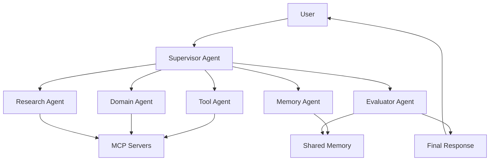

# Agent Engineering Roadmap

> Learn how to build production-ready AI Agents, MCP Servers, Memory Systems, Multi-Agent Workflows, and Agent Colonies.

[繁體中文](README_zh.md)

---

## What is Agent Engineering?

Agent Engineering is the discipline of designing, building, evaluating, and deploying AI agent systems that can reason, use tools, remember context, collaborate with other agents, and operate safely in real-world environments.

This roadmap is designed for builders who want to move beyond simple chatbots and build real agentic applications.

---

## What You Will Build

- Single AI Agents
- Tool-Using Agents
- MCP-enabled Agents
- Persistent Memory Systems
- Multi-Agent Workflows
- Supervisor-Worker Systems
- Shared-Memory Agent Colonies
- Healthcare and Finance Agent demos
- Production-ready Agent Applications

---

## Learning Path

```text
Level 0  AI & LLM Fundamentals
   ↓
Level 1  Single Agent
   ↓
Level 2  Tool Use
   ↓
Level 3  Model Context Protocol (MCP)
   ↓
Level 4  Agent Memory
   ↓
Level 5  Agent Workflow
   ↓
Level 6  Multi-Agent Systems
   ↓
Level 7  Agent Colony
   ↓
Level 8  Production, Evaluation & Safety
```

---

## Core Architecture



---

## Repository Structure

```text
agent-engineering-roadmap/
├── README.md
├── README_zh.md
├── roadmap/
├── examples/
├── architecture/
├── templates/
├── healthcare/
├── finance/
└── resources/
```

---

## Real-World Tracks

### Healthcare Agent Engineering

Build agent systems for care management, nutrition tracking, personal health memory, and healthcare workflow automation.

### Finance Agent Engineering

Build research agents, factor-analysis agents, portfolio agents, and trading workflow agents.

### Enterprise Agent Engineering

Build customer support agents, internal knowledge agents, document agents, and workflow automation agents.

---

## Project Status

This repository is currently in the initial roadmap stage.

- [ ] Complete bilingual roadmap
- [ ] Add minimal runnable examples
- [ ] Add MCP server templates
- [ ] Add memory system examples
- [ ] Add healthcare agent colony demo
- [ ] Add finance research agent demo
- [ ] Add evaluation and safety templates

---

## License

To be decided.
