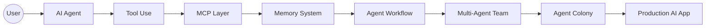
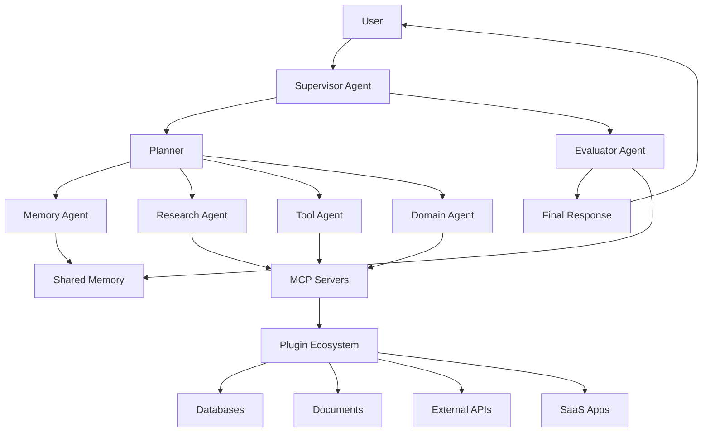

# Agent Engineering Roadmap

<p align="center">
  
</p>

<p align="center">
  <a href="README_zh.md"></a>
  <a href="README.md"></a>
  
  
  
</p>

<p align="center">
  
  
  
  
  
  
</p>

<p align="center">
  <b>A hands-on roadmap for building production-ready AI Agents, MCP Servers, Memory Systems, Multi-Agent Workflows, and Agent Colonies.</b>
</p>

<p align="center">
  <a href="README_zh.md">繁體中文</a> ·
  <a href="COURSE.md">Course</a> ·
  <a href="roadmap/level-0-ai-llm-fundamentals.md">Roadmap</a> ·
  <a href="examples/01-single-agent/README.md">Examples</a> ·
  <a href="showcases/README.md">Showcases</a> ·
  <a href="labs/README.md">Labs</a> ·
  <a href="teaching/README_zh.md">Teaching</a> ·
  <a href="templates/README.md">Templates</a> ·
  <a href="architecture/colony-architecture.md">Architecture</a> ·
  <a href="healthcare/healthcare-agent-colony.md">Healthcare</a> ·
  <a href="finance/finance-agent-colony.md">Finance</a>
</p>

---

<p align="center">
  
</p>

---



---

## Why this roadmap exists

Most AI tutorials stop at prompts, RAG, or simple tool calling.

Real agentic products require more than that:

- agents that can use tools safely
- MCP servers that connect agents to real systems
- memory layers that persist useful context
- workflows that are observable and controllable
- multi-agent teams that can specialize and collaborate
- evaluation, security, and production guardrails

This repository is a practical learning path for builders who want to move from chatbot demos to real agent engineering.

---

## Teaching approach

This roadmap teaches agents like an engineering course, not a tool catalog.

Each major topic follows the same pattern:

1. Start with the problem: what breaks if you only use a chatbot?
2. Build the intuition: what is the simplest mental model?
3. Open the box: what components are actually involved?
4. Run a minimal example: what can you inspect locally?
5. Add production judgment: what needs evaluation, observability, approval, or safety gates?

In one sentence: an agent is not magic. It is context, tools, memory, workflow, evaluation, and human judgment arranged around a useful task.

---

## What you will learn

| Level | Topic | Outcome |
|---|---|---|
| 0 | AI & LLM Fundamentals | Understand LLM apps, embeddings, RAG, and structured output |
| 1 | Single Agent | Build a task-focused agent with a clear role and output format |
| 2 | Tool Use | Connect agents to external tools and APIs |
| 3 | MCP | Build and use MCP clients, servers, tools, resources, and prompts |
| 4 | Agent Memory | Design short-term, episodic, semantic, user, and shared memory |
| 5 | Agent Workflow | Build reliable planning, execution, review, retry, and approval flows |
| 6 | Multi-Agent Systems | Coordinate specialized agents using supervisor, debate, and reflection patterns |
| 7 | Agent Colony | Build shared-memory colonies with domain agents and evaluation loops |
| 8 | Production & Safety | Deploy agents with observability, evaluation, security, and cost control |

---

## Course materials

| Section | Purpose |
|---|---|
| [Course](COURSE.md) | Complete syllabus and graduation criteria |
| [Curriculum](curriculum/README.md) | Concept chapters from foundations to production |
| [Visual Assets](assets/README.md) | SVG diagrams for teaching and slides |
| [Roadmap](roadmap/level-0-ai-llm-fundamentals.md) | Level-by-level learning milestones |
| [Examples](examples/01-single-agent/README.md) | Runnable minimal implementations |
| [Showcases](showcases/README.md) | Dependency-free demos for healthcare, finance, and enterprise workflows |
| [Labs](labs/README.md) | Guided exercises for each stage |
| [Teaching Layer](teaching/README_zh.md) | Teaching audit, misconceptions, deliverables, and module blueprint |
| [Lab Solution Guides](lab-solutions/README_zh.md) | Solution shapes and grading direction for hands-on labs |
| [Lesson Plans](lesson-plans/README.md) | Instructor-ready teaching plans for each module |
| [Patterns](patterns/README.md) | Reusable agent architecture patterns |
| [Templates](templates/README.md) | Agent specs, memory policies, evals, and safety gates |
| [Assessments](assessments/quiz-bank.md) | Quiz bank and rubrics |
| [Capstone](projects/capstone-agent-colony.md) | Final project for building a production-aware colony |
| [Capstone Starter](capstone-starter/README.md) | Runnable starter scaffold for the final project |
| [Glossary](glossary/agent-engineering-glossary.md) | Core terms and definitions |

---

## The learning path

```text
AI Fundamentals
      ↓
Single Agent
      ↓
Tool Use
      ↓
MCP Integration
      ↓
Agent Memory
      ↓
Agent Workflow
      ↓
Multi-Agent Systems
      ↓
Agent Colony
      ↓
Production, Evaluation & Safety
```

---

## Try it in 60 seconds

Run a showcase without API keys:

```bash
python showcases/enterprise-support-agent/main.py
python showcases/finance-research-agent/main.py
python showcases/healthcare-agent-colony/main.py
```

Then run the evaluation harness:

```bash
python examples/07-evaluation-harness/main.py
python examples/08-mini-rag/main.py
python scripts/verify_examples.py
```

---

## Showcase demos

| Demo | Shows |
|---|---|
| [Enterprise Support Agent](showcases/enterprise-support-agent/README.md) | Ticket routing, risk classification, approval gates |
| [Finance Research Agent](showcases/finance-research-agent/README.md) | Research support, assumptions, risk boundaries |
| [Healthcare Agent Colony](showcases/healthcare-agent-colony/README.md) | Safety boundaries, escalation, medical-advice avoidance |

## Runnable examples

| Example | Shows | No API key |
|---|---|---|
| [01 Single Agent](examples/01-single-agent/README.md) | Role, task boundary, structured output | Yes |
| [02 Tool-Using Agent](examples/02-tool-using-agent/README.md) | Local tool call and validation | Yes |
| [03 MCP-style Agent](examples/03-mcp-agent/README.md) | Client/server tool boundary | Yes |
| [04 Memory Agent](examples/04-memory-agent/README.md) | Memory write/retrieve policy | Yes |
| [05 Multi-Agent Workflow](examples/05-multi-agent-workflow/README.md) | Planner, researcher, writer, reviewer | Yes |
| [06 Agent Colony](examples/06-agent-colony/README.md) | Supervisor, domain agent, evaluator | Yes |
| [07 Evaluation Harness](examples/07-evaluation-harness/README.md) | Regression eval suite | Yes |
| [08 Mini RAG](examples/08-mini-rag/README.md) | Retrieval, grounded answer, RAG eval | Yes |
| [09 Graph Approval Agent](examples/09-graph-approval-agent/README.md) | Graph transitions, approval gate, production eval | Yes |
| [Capstone Starter](capstone-starter/README.md) | Starter colony demo and regression eval | Yes |

Run every dependency-free example with:

```bash
python scripts/verify_examples.py
```

---

## README widgets used

This README uses lightweight visual widgets commonly seen in popular GitHub projects:

- `capsule-render` for the top hero banner
- `shields.io` for stars, forks, language, status, and topic badges
- Mermaid for architecture diagrams

---

## Plugin ecosystem

Agent Engineering is not only about prompts. A production agent needs a plugin ecosystem around it.

| Category | Purpose | Example Plugins / Tools |
|---|---|---|
| MCP Servers | Standardized access to tools and data | filesystem, database, browser, GitHub, Slack, Google Drive |
| Memory | Persistent context and retrieval | Qdrant, LanceDB, Chroma, PostgreSQL, Redis |
| Orchestration | Workflow and multi-agent control | LangGraph, CrewAI, AutoGen, OpenAI Agents SDK |
| RAG | Knowledge retrieval and grounding | LlamaIndex, LangChain, Haystack |
| Observability | Tracing, debugging, monitoring | Langfuse, OpenTelemetry, Helicone, Phoenix |
| Evaluation | Quality and safety testing | DeepEval, RAGAS, promptfoo, custom eval suites |
| Guardrails | Safety and structured validation | Guardrails AI, Pydantic, JSON Schema, policy checkers |
| UI / App Layer | User-facing agent applications | Streamlit, Gradio, Next.js, FastAPI |
| Domain Tools | Industry-specific integrations | healthcare records, finance data, CRM, ERP, ticketing systems |

---

## Core architecture



---

## Repository structure

```text
agent-engineering-roadmap/
├── README.md
├── README_zh.md
├── COURSE.md
├── assets/           # Visual diagrams and teaching images
├── roadmap/          # Level 0-8 learning path
├── curriculum/       # Full course chapters
├── examples/         # Hands-on examples
├── showcases/        # Shareable demos with sample outputs
├── labs/             # Guided exercises
├── lesson-plans/     # Instructor-ready lesson plans
├── patterns/         # Architecture pattern catalog
├── architecture/     # System design patterns
├── templates/        # Reusable agent and MCP templates
├── assessments/      # Quiz bank and rubrics
├── projects/         # Capstone and portfolio projects
├── glossary/         # Agent engineering terms
├── healthcare/       # Healthcare agent engineering track
├── finance/          # Finance and quantitative research track
├── resources/        # Curated learning resources
├── docs/             # GitHub Pages site
└── launch-kit/       # Launch copy, topics, and checklist
```

---

## Real-world tracks

### Healthcare Agent Engineering

Build agent systems for care management, nutrition tracking, personal health memory, and healthcare workflow automation.

Example colony:

```text
Care Manager Agent
├── Nutrition Agent
├── Vital Sign Agent
├── Psychology Agent
├── Medication Agent
├── Memory Agent
└── Safety Evaluator Agent
```

### Finance Agent Engineering

Build research agents, factor-analysis agents, portfolio agents, risk agents, and trading research workflows.

Example colony:

```text
Research Agent
├── Market Data Agent
├── Factor Analysis Agent
├── Portfolio Agent
├── Risk Agent
└── Report Agent
```

### Enterprise Agent Engineering

Build customer support agents, internal knowledge agents, document agents, workflow automation agents, and evaluation pipelines.

---

## Design principles

1. Agents should be useful before they are autonomous.
2. Memory should be intentional, auditable, and safe.
3. MCP should be treated as an integration layer, not just a plugin mechanism.
4. Multi-agent systems should reduce complexity for users, not create complexity for developers.
5. Production agents need evaluation, observability, cost control, and human approval gates.

---

## Project roadmap

- [x] Initialize bilingual repository structure
- [x] Add Level 0-8 roadmap skeleton
- [x] Add architecture documents
- [x] Add healthcare and finance tracks
- [x] Add README badges and hero banner
- [x] Expand each roadmap level into handbook chapters
- [x] Add minimal runnable examples
- [x] Add MCP server templates
- [x] Add memory system examples
- [x] Add agent colony demo
- [x] Add evaluation and safety templates
- [x] Add full course syllabus
- [x] Add guided labs
- [x] Add instructor-ready lesson plans
- [x] Add pattern catalog
- [x] Add quiz bank, rubrics, glossary, and capstone
- [ ] Add full healthcare agent colony application
- [ ] Add full finance research agent application

---

## Who this is for

- AI engineers
- LLM application developers
- Startup builders
- Researchers building agent systems
- Product teams moving from chatbot demos to real workflows
- Developers interested in MCP, memory, and multi-agent systems

---

## License

No license has been selected yet. Choose a license before allowing reuse outside this repository.
