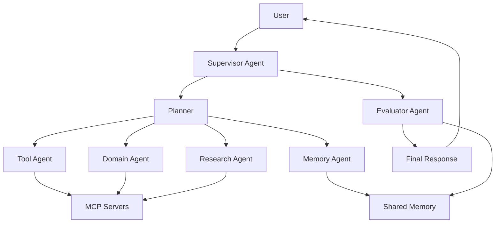

# Agent Engineering Roadmap

> A hands-on roadmap for building production-ready AI Agents, MCP Servers, Memory Systems, Multi-Agent Workflows, and Agent Colonies.

[繁體中文](README_zh.md) · Roadmap · Examples · Architecture · Healthcare · Finance

---

## Why this roadmap exists

Most AI tutorials stop at prompts, RAG, or simple tool calling.

Real agentic products require more than that:

- agents that can use tools safely
- MCP servers that connect agents to real systems
- memory layers that persist useful context
- workflows that are observable and controllable
- multi-agent teams that can specialize and collaborate
- evaluation, security, and production guardrails

This repository is a practical learning path for builders who want to move from chatbot demos to real agent engineering.

---

## What you will learn

| Level | Topic | Outcome |
|---|---|---|
| 0 | AI & LLM Fundamentals | Understand LLM apps, embeddings, RAG, and structured output |
| 1 | Single Agent | Build a task-focused agent with a clear role and output format |
| 2 | Tool Use | Connect agents to external tools and APIs |
| 3 | MCP | Build and use MCP clients, servers, tools, resources, and prompts |
| 4 | Agent Memory | Design short-term, episodic, semantic, user, and shared memory |
| 5 | Agent Workflow | Build reliable planning, execution, review, retry, and approval flows |
| 6 | Multi-Agent Systems | Coordinate specialized agents using supervisor, debate, and reflection patterns |
| 7 | Agent Colony | Build shared-memory colonies with domain agents and evaluation loops |
| 8 | Production & Safety | Deploy agents with observability, evaluation, security, and cost control |

---

## The learning path

```text
AI Fundamentals
      ↓
Single Agent
      ↓
Tool Use
      ↓
MCP Integration
      ↓
Agent Memory
      ↓
Agent Workflow
      ↓
Multi-Agent Systems
      ↓
Agent Colony
      ↓
Production, Evaluation & Safety
```

---

## Core architecture



---

## Repository structure

```text
agent-engineering-roadmap/
├── README.md
├── README_zh.md
├── roadmap/          # Level 0-8 learning path
├── examples/         # Hands-on examples
├── architecture/     # System design patterns
├── templates/        # Reusable agent and MCP templates
├── healthcare/       # Healthcare agent engineering track
├── finance/          # Finance and quantitative research track
└── resources/        # Curated learning resources
```

---

## Real-world tracks

### Healthcare Agent Engineering

Build agent systems for care management, nutrition tracking, personal health memory, and healthcare workflow automation.

Example colony:

```text
Care Manager Agent
├── Nutrition Agent
├── Vital Sign Agent
├── Psychology Agent
├── Medication Agent
├── Memory Agent
└── Safety Evaluator Agent
```

### Finance Agent Engineering

Build research agents, factor-analysis agents, portfolio agents, risk agents, and trading research workflows.

Example colony:

```text
Research Agent
├── Market Data Agent
├── Factor Analysis Agent
├── Portfolio Agent
├── Risk Agent
└── Report Agent
```

### Enterprise Agent Engineering

Build customer support agents, internal knowledge agents, document agents, workflow automation agents, and evaluation pipelines.

---

## Design principles

1. Agents should be useful before they are autonomous.
2. Memory should be intentional, auditable, and safe.
3. MCP should be treated as an integration layer, not just a plugin mechanism.
4. Multi-agent systems should reduce complexity for users, not create complexity for developers.
5. Production agents need evaluation, observability, cost control, and human approval gates.

---

## Project roadmap

- [x] Initialize bilingual repository structure
- [x] Add Level 0-8 roadmap skeleton
- [x] Add architecture documents
- [x] Add healthcare and finance tracks
- [ ] Expand each roadmap level into a full handbook chapter
- [ ] Add minimal runnable examples
- [ ] Add MCP server templates
- [ ] Add memory system examples
- [ ] Add healthcare agent colony demo
- [ ] Add finance research agent demo
- [ ] Add evaluation and safety templates

---

## Who this is for

- AI engineers
- LLM application developers
- Startup builders
- Researchers building agent systems
- Product teams moving from chatbot demos to real workflows
- Developers interested in MCP, memory, and multi-agent systems

---

## License

To be decided.
