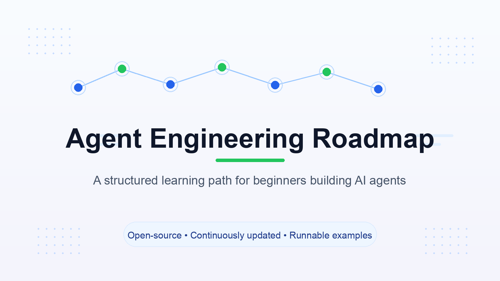
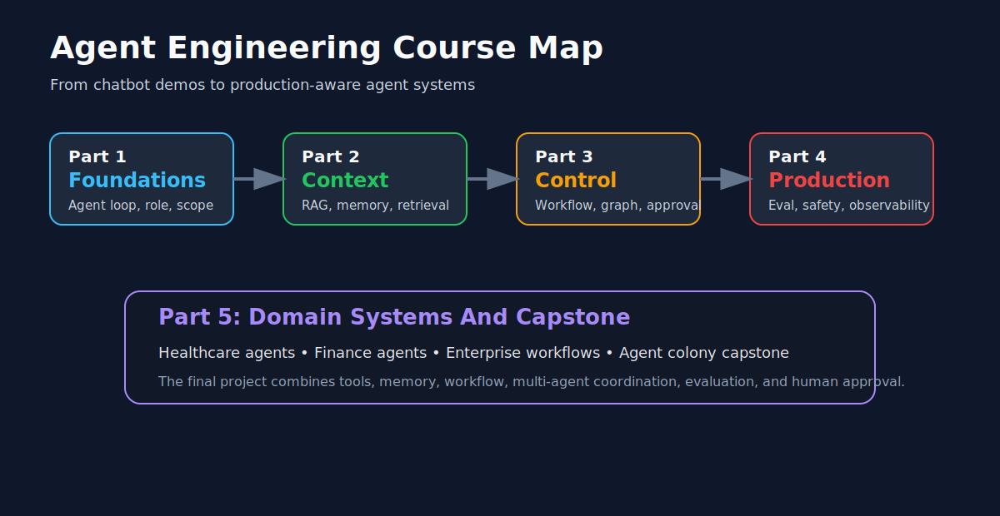
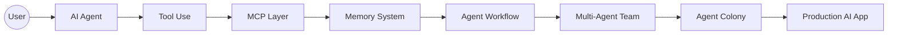
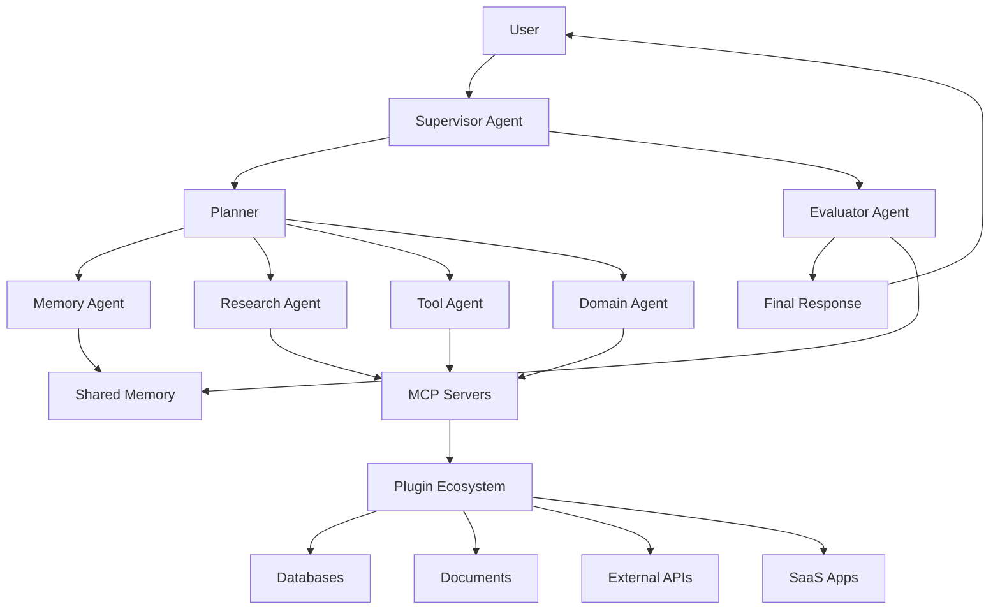

# Agent Engineering Roadmap

<p align="center">
  
</p>

<p align="center">
  <a href="README_zh.md"></a>
  <a href="README.md"></a>
  
  
  
  <a href="https://github.com/audi0417/agent-engineering-roadmap/actions/workflows/verify-examples.yml"></a>
</p>

<p align="center">
  
  
  
  
  
  
</p>

<p align="center">
  <b>一份實作導向的學習地圖，帶你打造生產級 AI Agent、MCP Server、Memory System、Multi-Agent Workflow 與 Agent Colony。</b>
</p>

<p align="center">
  <a href="README.md">English</a> ·
  <a href="https://audi0417.github.io/agent-engineering-roadmap/">Website</a> ·
  <a href="COURSE_zh.md">Course</a> ·
  <a href="roadmap/level-0-ai-llm-fundamentals.md">Roadmap</a> ·
  <a href="examples/01-single-agent/README.md">Examples</a> ·
  <a href="showcases/README.md">Showcases</a> ·
  <a href="benchmarks/README_zh.md">Benchmarks</a> ·
  <a href="labs/README.md">Labs</a> ·
  <a href="teaching/README_zh.md">Teaching</a> ·
  <a href="templates/README.md">Templates</a> ·
  <a href="architecture/colony-architecture.md">Architecture</a> ·
  <a href="healthcare/healthcare-agent-colony.md">Healthcare</a> ·
  <a href="finance/finance-agent-colony.md">Finance</a>
</p>

---

<p align="center">
  
</p>

---



---

## 為什麼需要這份 Roadmap？

大多數 AI 教學停留在 Prompt、RAG，或簡單的 Tool Calling。

但真正能落地的 Agentic Product 需要更多工程能力：

- Agent 要能安全地使用工具
- MCP Server 要能連接真實系統與資料
- Memory Layer 要能保留有價值的上下文
- Workflow 要可觀測、可控制、可重試
- Multi-Agent Team 要能分工、協作與互相檢查
- 生產環境需要 Evaluation、Security、Cost Control 與 Human Approval Gate

這份 Roadmap 是為了想從 Chatbot Demo 走向真實 Agent Engineering 的開發者與產品團隊而設計。

---

## 教學方式

這份 Roadmap 不是工具清單，而是一門工程課。

每個主題都會照著同一個節奏走：

1. 先講問題：如果只有 Chatbot，哪裡會壞掉？
2. 再講直覺：最小心智模型是什麼？
3. 打開黑盒子：裡面到底有哪些元件？
4. 跑最小範例：什麼東西可以在本機看得到？
5. 補生產判斷：什麼地方需要 evaluation、observability、approval 或 safety gate？

一言以蔽之：Agent 不是魔法。Agent 其實就是把 context、tools、memory、workflow、evaluation 和 human judgment，圍繞著一個有用任務組起來而已。

---

## 你會學到什麼？

| Level | 主題 | 目標 |
|---|---|---|
| 0 | AI 與 LLM 基礎 | 理解 LLM App、Embedding、RAG 與 Structured Output |
| 1 | Single Agent | 建立具備明確角色、任務邊界與輸出格式的 Agent |
| 2 | Tool Use | 讓 Agent 連接外部工具與 API |
| 3 | MCP | 建立與使用 MCP Client、Server、Tool、Resource、Prompt |
| 4 | Agent Memory | 設計短期記憶、事件記憶、語意記憶、使用者記憶與共享記憶 |
| 5 | Agent Workflow | 建立 Planning、Execution、Review、Retry 與 Approval Flow |
| 6 | Multi-Agent Systems | 使用 Supervisor、Debate、Reflection 等模式協調多個 Agent |
| 7 | Agent Colony | 建立具備共享記憶、Domain Agent 與 Evaluation Loop 的 Agent Colony |
| 8 | Production & Safety | 部署具備觀測、評估、安全與成本控制的 Agent 系統 |

---

## 課程材料

| 區塊 | 用途 |
|---|---|
| [Course](COURSE_zh.md) | 完整課綱與完課標準 |
| [Curriculum](curriculum/README_zh.md) | 從基礎到 production 的概念章節 |
| [Visual Assets](assets/README.md) | 可放進教學與投影片的 SVG diagrams |
| [Roadmap](roadmap/level-0-ai-llm-fundamentals.md) | Level-by-level 學習里程碑 |
| [Examples](examples/01-single-agent/README.md) | 可執行最小實作 |
| [Benchmarks](benchmarks/README_zh.md) | Tool use、RAG、workflow、security、observability 的輕量檢查 |
| [Showcases](showcases/README.md) | Healthcare、Finance、Enterprise 的免依賴展示 demo |
| [Domain Casebooks](domain-casebooks/README.md) | Healthcare、Finance、Enterprise 案例與 eval cases |
| [Labs](labs/README.md) | 每個階段的引導式練習 |
| [Teaching Layer](teaching/README_zh.md) | 教學 audit、常見誤解、交付成果與 module blueprint |
| [Lab Solution Guides](lab-solutions/README_zh.md) | Labs 的解題骨架與評分方向 |
| [Lesson Plans](lesson-plans/README.md) | 每個 module 可直接上課的教案 |
| [Study Group Kit](study-groups/README_zh.md) | 4 週、8 週與 workshop 讀書會格式 |
| [Patterns](patterns/README_zh.md) | 可重用 agent architecture patterns |
| [Templates](templates/README.md) | Agent spec、memory policy、eval、安全 gate |
| [Papers](papers/README_zh.md) | Agent 論文閱讀路線、大廠論文與工程導讀 |
| [Open Source Projects](resources/open-source-agent-projects.md) | Frameworks、MCP、RAG、evals、observability、ops 的開源生態導覽 |
| [Framework Selection Matrix](resources/agent-framework-selection-matrix.md) | 用工程取捨選 agent framework |
| [Open Source Reading Guide](resources/how-to-read-open-source-agent-repos.md) | 學會閱讀真實 agent 開源專案的架構 |
| [DeepEval And RAGAS](resources/eval-frameworks-deepeval-ragas.md) | LLM 與 RAG evaluation frameworks 實用導讀 |
| [Release Checklist](release/RELEASE_CHECKLIST.md) | v1 release verification 與 project hygiene |
| [Assessments](assessments/quiz-bank.md) | 題庫與評分規準 |
| [Capstone](projects/capstone-agent-colony.md) | 最終 production-aware colony 專案 |
| [Portfolio Projects](projects/portfolio-projects.md) | 可展示在 GitHub 的專案題庫、交付成果與評分標準 |
| [Capstone Starter](capstone-starter/README.md) | 可執行的 final project starter scaffold |
| [Glossary](glossary/agent-engineering-glossary_zh.md) | 核心術語與定義 |

---

## 學習路線

```text
AI Fundamentals
      ↓
Single Agent
      ↓
Tool Use
      ↓
MCP Integration
      ↓
Agent Memory
      ↓
Agent Workflow
      ↓
Multi-Agent Systems
      ↓
Agent Colony
      ↓
Production, Evaluation & Safety
```

---

## 60 秒試跑

不用 API key，直接跑 showcase：

```bash
python showcases/enterprise-support-agent/main.py
python showcases/finance-research-agent/main.py
python showcases/healthcare-agent-colony/main.py
```

再跑 evaluation harness：

```bash
python examples/07-evaluation-harness/main.py
python examples/08-mini-rag/main.py
python benchmarks/benchmark_runner.py
python scripts/verify_examples.py
```

## Production Readiness Artifacts

| Artifact | 用途 |
|---|---|
| [Agent Registry Template](templates/agent-registry-template.md) | 登記 owner、scopes、tools、data、evals、operations |
| [Risk Assessment Template](templates/risk-assessment-template.md) | Launch 前分類 Agent risk |
| [Deployment Review Template](templates/deployment-review-template.md) | 檢查 release gates 與 operational readiness |
| [Release Checklist](release/RELEASE_CHECKLIST.md) | 準備公開課程 release |
| [v1.0 Readiness](release/V1_READINESS.md) | 追蹤 stable release readiness |

---

## Showcase demos

| Demo | 展示重點 |
|---|---|
| [Enterprise Support Agent](showcases/enterprise-support-agent/README.md) | Ticket routing、risk classification、approval gates |
| [Finance Research Agent](showcases/finance-research-agent/README.md) | Research support、assumptions、risk boundaries |
| [Healthcare Agent Colony](showcases/healthcare-agent-colony/README.md) | Safety boundaries、escalation、避免醫療建議 |

## 可執行範例

| Example | 展示重點 | 不需要 API key |
|---|---|---|
| [01 Single Agent](examples/01-single-agent/README.md) | Role、task boundary、structured output | Yes |
| [02 Tool-Using Agent](examples/02-tool-using-agent/README.md) | Local tool call 與 validation | Yes |
| [03 MCP-style Agent](examples/03-mcp-agent/README.md) | Client/server tool boundary | Yes |
| [04 Memory Agent](examples/04-memory-agent/README.md) | Memory write/retrieve policy | Yes |
| [05 Multi-Agent Workflow](examples/05-multi-agent-workflow/README.md) | Planner、researcher、writer、reviewer | Yes |
| [06 Agent Colony](examples/06-agent-colony/README.md) | Supervisor、domain agent、evaluator | Yes |
| [07 Evaluation Harness](examples/07-evaluation-harness/README.md) | Regression eval suite | Yes |
| [08 Mini RAG](examples/08-mini-rag/README.md) | Retrieval、grounded answer、RAG eval | Yes |
| [09 Graph Approval Agent](examples/09-graph-approval-agent/README.md) | Graph transitions、approval gate、production eval | Yes |
| [10 Observable Agent](examples/10-observable-agent/README.md) | Trace events、guardrail logs、可 replay debugging | Yes |
| [11 Prompt Injection Defense](examples/11-prompt-injection-defense/README.md) | Untrusted retrieval filtering 與 security eval | Yes |
| [12 Cost-Aware Agent](examples/12-cost-aware-agent/README.md) | Model routing、budget、latency、fallback eval | Yes |
| [13 Durable Workflow Agent](examples/13-durable-workflow-agent/README.md) | Checkpoint、resume、durable workflow eval | Yes |
| [14 Modern MCP Gateway](examples/14-modern-mcp-gateway/README.md) | Tools、resources、prompts、auth、elicitation | Yes |
| [15 Memory Governance Agent](examples/15-memory-governance-agent/README.md) | Memory redaction、merge、decay、deletion、audit | Yes |
| [16 Agent Permission System](examples/16-agent-permission-system/README.md) | Agent identity、scopes、access review、audit | Yes |
| [17 Advanced Eval Harness](examples/17-advanced-eval-harness/README.md) | Regression、safety、adversarial、golden trace release gate | Yes |
| [Capstone Starter](capstone-starter/README.md) | Starter colony demo 與 regression eval | Yes |

一次驗證所有免依賴範例：

```bash
python scripts/verify_examples.py
```

---

## README 小組件

這份 README 使用熱門 GitHub 專案常見的輕量視覺小組件：

- `capsule-render`：頂部 Hero Banner
- `shields.io`：Stars、Forks、Language、Status 與主題徽章
- Mermaid：架構圖與流程圖

---

## Plugin Ecosystem

Agent Engineering 不只是 Prompt。生產級 Agent 需要一整套外部工具與插件生態。

| 類別 | 用途 | 範例 Plugins / Tools |
|---|---|---|
| MCP Servers | 標準化存取工具與資料 | filesystem, database, browser, GitHub, Slack, Google Drive |
| Memory | 長期記憶與檢索 | Qdrant, LanceDB, Chroma, PostgreSQL, Redis |
| Orchestration | Workflow 與 Multi-Agent 控制 | LangGraph, CrewAI, AutoGen, OpenAI Agents SDK |
| RAG | 知識檢索與 grounding | LlamaIndex, LangChain, Haystack |
| Observability | Trace、Debug、監控 | Langfuse, OpenTelemetry, Helicone, Phoenix |
| Evaluation | 品質與安全測試 | DeepEval, RAGAS, promptfoo, custom eval suites |
| Guardrails | 安全防護與結構化驗證 | Guardrails AI, Pydantic, JSON Schema, policy checkers |
| UI / App Layer | 使用者介面與應用層 | Streamlit, Gradio, Next.js, FastAPI |
| Domain Tools | 產業專用整合 | healthcare records, finance data, CRM, ERP, ticketing systems |

---

## 核心架構



---

## Repository Structure

```text
agent-engineering-roadmap/
├── README.md
├── README_zh.md
├── COURSE.md
├── assets/           # 視覺圖表與教學圖片
├── roadmap/          # Level 0-8 學習地圖
├── curriculum/       # 完整課程章節
├── examples/         # 實作範例
├── benchmarks/       # 輕量行為檢查
├── security/         # Prompt injection 與 Agent security labs
├── study-groups/     # Cohort 與 workshop 引導套件
├── showcases/        # 可分享 demo 與 sample outputs
├── labs/             # 引導式練習
├── lesson-plans/     # 可直接上課的教案
├── patterns/         # 架構 pattern catalog
├── architecture/     # 系統設計模式
├── templates/        # 可重用的 Agent 與 MCP Template
├── assessments/      # 題庫與 rubrics
├── projects/         # Capstone 與 portfolio projects
├── glossary/         # Agent Engineering 術語
├── healthcare/       # Healthcare Agent Engineering Track
├── finance/          # Finance / Quantitative Research Track
├── resources/        # 精選學習資源
├── docs/             # GitHub Pages site
└── launch-kit/       # Launch 文案、topics 與 checklist
```

---

## 真實應用 Track

### Healthcare Agent Engineering

建構照護管理、營養追蹤、個人健康記憶、醫療流程自動化相關的 Agent 系統。

範例 Colony：

```text
Care Manager Agent
├── Nutrition Agent
├── Vital Sign Agent
├── Psychology Agent
├── Medication Agent
├── Memory Agent
└── Safety Evaluator Agent
```

### Finance Agent Engineering

建構研究 Agent、因子分析 Agent、投資組合 Agent、風險 Agent 與交易研究流程。

範例 Colony：

```text
Research Agent
├── Market Data Agent
├── Factor Analysis Agent
├── Portfolio Agent
├── Risk Agent
└── Report Agent
```

### Enterprise Agent Engineering

建構客服 Agent、內部知識庫 Agent、文件處理 Agent、流程自動化 Agent 與 Evaluation Pipeline。

---

## 設計原則

1. Agent 應該先有用，再追求自主。
2. Memory 應該是有意圖、可稽核、可控管的。
3. MCP 應該被視為 Agentic System 的整合層，而不只是 Plugin 機制。
4. Multi-Agent System 應該替使用者降低複雜度，而不是替開發者增加混亂。
5. Production Agent 需要 Evaluation、Observability、Cost Control 與 Human Approval Gate。

---

## 專案 Roadmap

- [x] 建立雙語 Repository 架構
- [x] 加入 Level 0-8 Roadmap Skeleton
- [x] 加入 Architecture Documents
- [x] 加入 Healthcare 與 Finance Tracks
- [x] 加入 README badges 與 Hero Banner
- [x] 將每個 Roadmap Level 擴充成 Handbook Chapter
- [x] 加入最小可執行範例
- [x] 加入 MCP Server Templates
- [x] 加入 Memory System Examples
- [x] 加入 Agent Colony Demo
- [x] 加入 Evaluation and Safety Templates
- [x] 加入完整 Course Syllabus
- [x] 加入 Observable Agent 與 Prompt Injection Defense 範例
- [x] 加入 Benchmark Runner 與讀書會套件
- [x] 加入 Cost、Durable Runtime、Modern MCP Gateway 模組
- [x] 加入 Memory Governance、Identity Permission、Incident Response 模組
- [x] 加入 Advanced Eval、Product UX、Enterprise Operating Model 模組
- [x] 加入 Guided Labs
- [x] 加入 Instructor-ready Lesson Plans
- [x] 加入 Pattern Catalog
- [x] 加入 Quiz Bank、Rubrics、Glossary 與 Capstone
- [ ] 加入完整 Healthcare Agent Colony Application
- [ ] 加入完整 Finance Research Agent Application

---

## 適合誰？

- AI Engineer
- LLM Application Developer
- Startup Builder
- Agent System Researcher
- 想從 Chatbot Demo 走向真實 Workflow 的產品團隊
- 對 MCP、Memory、Multi-Agent System 有興趣的開發者

---

## License

尚未指定授權條款。若要允許他人重用本專案內容，請先選擇並加入正式 License。
