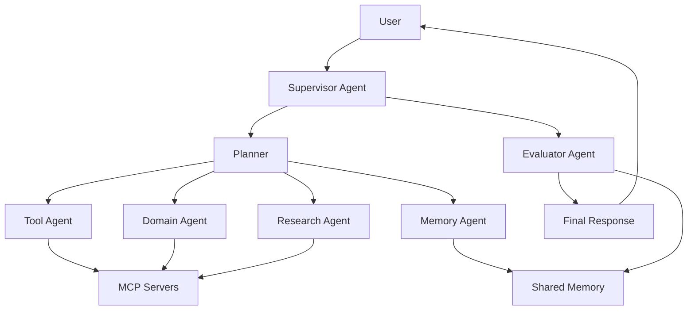

# Agent Engineering Roadmap

> 一份實作導向的學習地圖，帶你打造生產級 AI Agent、MCP Server、Memory System、Multi-Agent Workflow 與 Agent Colony。

[English](README.md) · Roadmap · Examples · Architecture · Healthcare · Finance

---

## 為什麼需要這份 Roadmap？

大多數 AI 教學停留在 Prompt、RAG，或簡單的 Tool Calling。

但真正能落地的 Agentic Product 需要更多工程能力：

- Agent 要能安全地使用工具
- MCP Server 要能連接真實系統與資料
- Memory Layer 要能保留有價值的上下文
- Workflow 要可觀測、可控制、可重試
- Multi-Agent Team 要能分工、協作與互相檢查
- 生產環境需要 Evaluation、Security、Cost Control 與 Human Approval Gate

這份 Roadmap 是為了想從 Chatbot Demo 走向真實 Agent Engineering 的開發者與產品團隊而設計。

---

## 你會學到什麼？

| Level | 主題 | 目標 |
|---|---|---|
| 0 | AI 與 LLM 基礎 | 理解 LLM App、Embedding、RAG 與 Structured Output |
| 1 | Single Agent | 建立具備明確角色、任務邊界與輸出格式的 Agent |
| 2 | Tool Use | 讓 Agent 連接外部工具與 API |
| 3 | MCP | 建立與使用 MCP Client、Server、Tool、Resource、Prompt |
| 4 | Agent Memory | 設計短期記憶、事件記憶、語意記憶、使用者記憶與共享記憶 |
| 5 | Agent Workflow | 建立 Planning、Execution、Review、Retry 與 Approval Flow |
| 6 | Multi-Agent Systems | 使用 Supervisor、Debate、Reflection 等模式協調多個 Agent |
| 7 | Agent Colony | 建立具備共享記憶、Domain Agent 與 Evaluation Loop 的 Agent Colony |
| 8 | Production & Safety | 部署具備觀測、評估、安全與成本控制的 Agent 系統 |

---

## 學習路線

```text
AI Fundamentals
      ↓
Single Agent
      ↓
Tool Use
      ↓
MCP Integration
      ↓
Agent Memory
      ↓
Agent Workflow
      ↓
Multi-Agent Systems
      ↓
Agent Colony
      ↓
Production, Evaluation & Safety
```

---

## 核心架構



---

## Repository Structure

```text
agent-engineering-roadmap/
├── README.md
├── README_zh.md
├── roadmap/          # Level 0-8 學習地圖
├── examples/         # 實作範例
├── architecture/     # 系統設計模式
├── templates/        # 可重用的 Agent 與 MCP Template
├── healthcare/       # Healthcare Agent Engineering Track
├── finance/          # Finance / Quantitative Research Track
└── resources/        # 精選學習資源
```

---

## 真實應用 Track

### Healthcare Agent Engineering

建構照護管理、營養追蹤、個人健康記憶、醫療流程自動化相關的 Agent 系統。

範例 Colony：

```text
Care Manager Agent
├── Nutrition Agent
├── Vital Sign Agent
├── Psychology Agent
├── Medication Agent
├── Memory Agent
└── Safety Evaluator Agent
```

### Finance Agent Engineering

建構研究 Agent、因子分析 Agent、投資組合 Agent、風險 Agent 與交易研究流程。

範例 Colony：

```text
Research Agent
├── Market Data Agent
├── Factor Analysis Agent
├── Portfolio Agent
├── Risk Agent
└── Report Agent
```

### Enterprise Agent Engineering

建構客服 Agent、內部知識庫 Agent、文件處理 Agent、流程自動化 Agent 與 Evaluation Pipeline。

---

## 設計原則

1. Agent 應該先有用，再追求自主。
2. Memory 應該是有意圖、可稽核、可控管的。
3. MCP 應該被視為 Agentic System 的整合層，而不只是 Plugin 機制。
4. Multi-Agent System 應該替使用者降低複雜度，而不是替開發者增加混亂。
5. Production Agent 需要 Evaluation、Observability、Cost Control 與 Human Approval Gate。

---

## 專案 Roadmap

- [x] 建立雙語 Repository 架構
- [x] 加入 Level 0-8 Roadmap Skeleton
- [x] 加入 Architecture Documents
- [x] 加入 Healthcare 與 Finance Tracks
- [ ] 將每個 Roadmap Level 擴充成完整 Handbook Chapter
- [ ] 加入最小可執行範例
- [ ] 加入 MCP Server Templates
- [ ] 加入 Memory System Examples
- [ ] 加入 Healthcare Agent Colony Demo
- [ ] 加入 Finance Research Agent Demo
- [ ] 加入 Evaluation and Safety Templates

---

## 適合誰？

- AI Engineer
- LLM Application Developer
- Startup Builder
- Agent System Researcher
- 想從 Chatbot Demo 走向真實 Workflow 的產品團隊
- 對 MCP、Memory、Multi-Agent System 有興趣的開發者

---

## License

To be decided.
