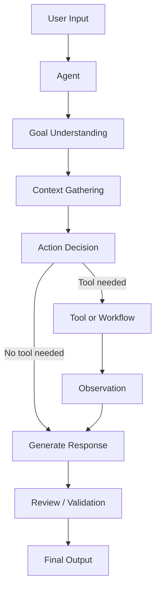

# Module 00 — Agent Foundations

[繁體中文](00-agent-foundations_zh.md)

## Goal

Understand what an AI agent is, how it differs from a chatbot, and why agent systems require engineering discipline.

This module introduces the smallest useful mental model for building agents:

```text
Goal + Context + Reasoning + Action + Feedback
```

---

## Why it matters

Many AI applications are called agents, but not all of them are truly agentic.

A chatbot mainly responds to messages. An agent is designed to pursue a goal, use context, decide whether actions are needed, interact with tools or workflows, and improve the result through feedback.

Understanding this difference prevents you from building systems that look impressive but fail in real workflows.

---

## Chatbot vs Agent

| Dimension | Chatbot | Agent |
|---|---|---|
| Primary behavior | Responds to user messages | Works toward a goal |
| Context | Usually conversation-only | Conversation, tools, memory, workflow state |
| Action | Generates text | May call tools, update state, or trigger workflows |
| Control | Mostly prompt-based | Prompt + tools + workflow + policy |
| Reliability need | Lower for casual use | Higher for production tasks |
| Evaluation | Response quality | Task success, tool correctness, safety, cost |

---

## Minimal Agent Loop

```text
Receive input
   ↓
Understand goal
   ↓
Check available context
   ↓
Decide whether action is needed
   ↓
Generate response or take action
   ↓
Review result
   ↓
Return output
```

This loop appears simple, but every step becomes an engineering decision in production systems.

---

## Core Concepts

### Goal

An agent needs a clear goal.

Weak goal:

```text
Help the user.
```

Better goal:

```text
Summarize the user's meeting notes into decisions, action items, risks, and next steps.
```

### Context

Context is the information the agent uses to make decisions.

Examples:

- current user message
- system prompt
- conversation history
- retrieved documents
- tool results
- user preferences
- workflow state

### Reasoning

Reasoning is the process of deciding what the input means and what should happen next.

In production, reasoning should often be constrained by workflows, schemas, and policies.

### Action

An action is anything beyond text generation.

Examples:

- call a calculator
- search a document
- query a database
- create a task
- write memory
- ask for human approval

### Feedback

Feedback helps the system improve or correct itself.

Examples:

- evaluator agent feedback
- user correction
- validation error
- tool failure
- human review

---

## Architecture Diagram



---

## What makes an agent reliable?

A reliable agent should have:

- a narrow role
- a clear task boundary
- explicit input and output formats
- tool access rules
- memory rules
- fallback behavior
- evaluation criteria

Reliability comes from system design, not from a longer prompt alone.

---

## Hands-on Exercise

Design three agents using this template:

```text
Agent name:
Goal:
Input:
Output:
Allowed actions:
Not allowed:
Failure behavior:
Evaluation criteria:
```

Suggested agents:

1. Research Summary Agent
2. Customer Support Triage Agent
3. Personal Health Note Organizer

---

## Checklist

You understand this module if you can:

- explain the difference between a chatbot and an agent
- describe the minimal agent loop
- define goal, context, reasoning, action, and feedback
- design a narrow agent role
- identify when an agent needs tools or workflows
- explain why production agents need evaluation

---

## Common Mistakes

- Calling every LLM app an agent
- Making the agent goal too broad
- Giving an agent tools before defining its role
- Assuming autonomy means reliability
- Ignoring fallback behavior
- Measuring only response quality instead of task success

---

## Outcome

After this module, you should be able to describe what an agent is and design a simple agent specification before writing code.

Next module: [Module 01 — Agent Architecture](01-agent-architecture.md)
