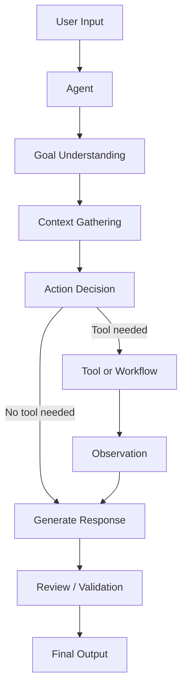

# Module 00 — Agent Foundations

[繁體中文](00-agent-foundations_zh.md)

## Goal

Understand what an AI agent is, how it differs from a chatbot, and why agent systems require engineering discipline.

This module introduces the smallest useful mental model for building agents:

```text
Goal + Context + Reasoning + Action + Feedback
```

---

## Why it matters

Many AI applications are called agents, but not all of them are truly agentic.

A chatbot mainly responds to messages. An agent is designed to pursue a goal, use context, decide whether actions are needed, interact with tools or workflows, and improve the result through feedback.

Understanding this difference prevents you from building systems that look impressive but fail in real workflows.

A useful agent should be judged by whether it completes a task safely and reliably, not only by whether its response sounds fluent.

---

## Chatbot vs Agent

| Dimension | Chatbot | Agent |
|---|---|---|
| Primary behavior | Responds to user messages | Works toward a goal |
| Context | Usually conversation-only | Conversation, tools, memory, workflow state |
| Action | Generates text | May call tools, update state, or trigger workflows |
| Control | Mostly prompt-based | Prompt + tools + workflow + policy |
| Reliability need | Lower for casual use | Higher for production tasks |
| Evaluation | Response quality | Task success, tool correctness, safety, cost |

---

## Minimal Agent Loop

```text
Receive input
   ↓
Understand goal
   ↓
Check available context
   ↓
Decide whether action is needed
   ↓
Generate response or take action
   ↓
Review result
   ↓
Return output
```

This loop appears simple, but every step becomes an engineering decision in production systems.

For example:

- goal understanding determines whether the agent solves the right problem
- context gathering determines whether the agent has enough information
- action decision determines whether tool use is necessary
- review determines whether the output is safe and useful

---

## Core Concepts

### Goal

An agent needs a clear goal.

Weak goal:

```text
Help the user.
```

Better goal:

```text
Summarize the user's meeting notes into decisions, action items, risks, and next steps.
```

A good goal should be:

- specific
- observable
- bounded
- evaluable

### Context

Context is the information the agent uses to make decisions.

Examples:

- current user message
- system prompt
- conversation history
- retrieved documents
- tool results
- user preferences
- workflow state

A common beginner mistake is treating context as unlimited. In real systems, context is expensive, limited, and can contain irrelevant or unsafe information.

### Reasoning

Reasoning is the process of deciding what the input means and what should happen next.

In production, reasoning should often be constrained by workflows, schemas, and policies.

Reasoning should answer questions such as:

```text
What is the user asking for?
What information is missing?
Is a tool required?
Is this action safe?
What output format is expected?
```

### Action

An action is anything beyond text generation.

Examples:

- call a calculator
- search a document
- query a database
- create a task
- write memory
- ask for human approval

Actions increase usefulness, but they also increase risk. A text mistake is usually reversible. A tool mistake may affect real data, money, users, or operations.

### Feedback

Feedback helps the system improve or correct itself.

Examples:

- evaluator agent feedback
- user correction
- validation error
- tool failure
- human review

Feedback can be immediate, such as schema validation, or delayed, such as user satisfaction and task success metrics.

---

## Architecture Diagram



---

## What makes an agent reliable?

A reliable agent should have:

- a narrow role
- a clear task boundary
- explicit input and output formats
- tool access rules
- memory rules
- fallback behavior
- evaluation criteria

Reliability comes from system design, not from a longer prompt alone.

---

## Agent Specification Template

Before writing code, describe the agent using this format:

```text
Agent name:
Goal:
Primary user:
Input:
Output:
Allowed actions:
Not allowed:
Tools:
Memory:
Human approval needed:
Failure behavior:
Evaluation criteria:
```

This template forces you to define the system boundary before adding model calls.

---

## Example Specification

```text
Agent name: Research Summary Agent
Goal: Convert messy notes into structured summaries.
Primary user: Researcher, founder, or student.
Input: Raw notes, meeting notes, copied text.
Output: Key points, action items, risks, next steps.
Allowed actions: Summarize, organize, identify uncertainty.
Not allowed: Invent facts or cite sources not provided.
Tools: None in the first version.
Memory: None in the first version.
Human approval needed: Not required for low-risk summaries.
Failure behavior: Ask for clearer input or mark uncertainty.
Evaluation criteria: Completeness, faithfulness, clarity, actionability.
```

---

## Evaluation

A beginner-friendly evaluation set can contain 10 to 20 tasks.

For each task, record:

```text
Input:
Expected behavior:
Must include:
Must not include:
Failure cases:
Score:
```

Suggested scoring dimensions:

| Dimension | Question |
|---|---|
| Task success | Did the agent complete the requested task? |
| Faithfulness | Did it avoid inventing unsupported facts? |
| Format | Did it follow the required output structure? |
| Safety | Did it avoid unsafe or forbidden behavior? |
| Usefulness | Would the output help the user take the next step? |

---

## Hands-on Exercise

Design three agents using this template:

```text
Agent name:
Goal:
Input:
Output:
Allowed actions:
Not allowed:
Failure behavior:
Evaluation criteria:
```

Suggested agents:

1. Research Summary Agent
2. Customer Support Triage Agent
3. Personal Health Note Organizer

Then create 5 evaluation tasks for one of them.

---

## Checklist

You understand this module if you can:

- explain the difference between a chatbot and an agent
- describe the minimal agent loop
- define goal, context, reasoning, action, and feedback
- design a narrow agent role
- identify when an agent needs tools or workflows
- explain why production agents need evaluation
- create a simple agent specification
- create basic evaluation tasks

---

## Common Mistakes

- Calling every LLM app an agent
- Making the agent goal too broad
- Giving an agent tools before defining its role
- Assuming autonomy means reliability
- Ignoring fallback behavior
- Measuring only response quality instead of task success
- Adding memory before defining what should be remembered

---

## References

- Yao et al. (2022), ReAct: Synergizing Reasoning and Acting in Language Models.
- Valmeekam et al. (2024), On the Brittle Foundations of ReAct Prompting for Agentic Large Language Models.
- See also: [References](../references/README.md)

---

## Outcome

After this module, you should be able to describe what an agent is and design a simple agent specification before writing code.

Next module: [Module 01 — Agent Architecture](01-agent-architecture.md)
