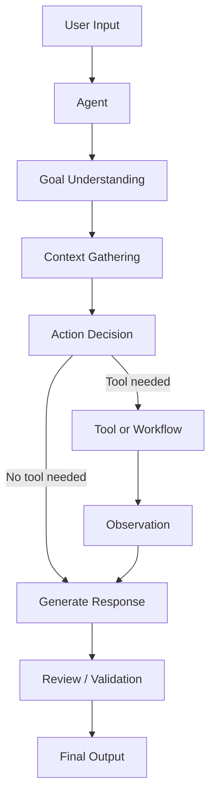

# Module 00 — Agent Foundations

[English](00-agent-foundations.md)

## 目標

理解什麼是 AI Agent、它和 Chatbot 的差異，以及為什麼 Agent 系統需要工程化設計。

本模組介紹建立 Agent 時最小可用的心智模型：

```text
目標 + 上下文 + 推理 + 行動 + 回饋
```

---

## 為什麼重要？

現在很多 AI 應用都被稱為 Agent，但並不是所有系統都真正具備 Agentic 能力。

Chatbot 主要是回應訊息；Agent 則是為了完成某個目標而設計，會使用上下文、判斷是否需要行動、連接工具或 workflow，並透過回饋改善結果。

理解這個差異，可以避免做出看起來很炫，但無法在真實工作流程中穩定運作的系統。

有用的 Agent 不應只看回答是否流暢，而要看它是否能安全、可靠地完成任務。

---

## Chatbot vs Agent

| 維度 | Chatbot | Agent |
|---|---|---|
| 主要行為 | 回應使用者訊息 | 朝明確目標完成任務 |
| 上下文 | 通常只有對話 | 對話、工具、記憶、workflow state |
| 行動 | 產生文字 | 可呼叫工具、更新狀態、觸發流程 |
| 控制方式 | 主要依靠 prompt | prompt + tools + workflow + policy |
| 可靠性需求 | 休閒情境較低 | 生產任務較高 |
| 評估方式 | 回答品質 | 任務成功率、工具正確性、安全性、成本 |

---

## 最小 Agent Loop

```text
接收輸入
   ↓
理解目標
   ↓
檢查可用上下文
   ↓
判斷是否需要行動
   ↓
產生回應或執行行動
   ↓
檢查結果
   ↓
回傳輸出
```

這個 loop 看起來簡單，但每一步在生產環境中都會變成工程決策。

例如：

- goal understanding 決定 Agent 是否解對問題
- context gathering 決定 Agent 是否擁有足夠資訊
- action decision 決定是否需要工具
- review 決定輸出是否安全且有用

---

## 核心概念

### Goal 目標

Agent 需要明確目標。

模糊目標：

```text
幫助使用者。
```

更好的目標：

```text
將使用者的會議筆記整理成決策、待辦事項、風險與下一步。
```

好的 goal 應該具備：

- specific
- observable
- bounded
- evaluable

### Context 上下文

Context 是 Agent 用來做判斷的資訊。

範例：

- 目前使用者訊息
- system prompt
- 對話歷史
- 檢索到的文件
- 工具結果
- 使用者偏好
- workflow state

初學者常見錯誤是把 context 當成無限資源。實際系統中，context 有成本、有限制，也可能包含無關或不安全資訊。

### Reasoning 推理

Reasoning 是 Agent 判斷輸入意圖與下一步行動的過程。

在生產環境中，推理通常應該被 workflow、schema 與 policy 約束。

Reasoning 應該回答：

```text
使用者真正想做什麼？
缺少哪些資訊？
是否需要工具？
這個行動安全嗎？
預期輸出格式是什麼？
```

### Action 行動

Action 是任何超出文字生成的動作。

範例：

- 呼叫計算工具
- 搜尋文件
- 查詢資料庫
- 建立任務
- 寫入記憶
- 請求人類審核

Action 會提高實用性，但也會提高風險。文字錯誤通常可逆；工具錯誤可能影響真實資料、金錢、使用者或營運流程。

### Feedback 回饋

Feedback 幫助系統修正或改善結果。

範例：

- evaluator agent feedback
- 使用者修正
- validation error
- tool failure
- human review

Feedback 可以是即時的，例如 schema validation；也可以是延遲的，例如使用者滿意度與任務成功率。

---

## 架構圖



---

## 什麼讓 Agent 可靠？

可靠的 Agent 應該具備：

- 清楚且窄的角色
- 明確任務邊界
- 明確輸入與輸出格式
- 工具使用規則
- 記憶規則
- fallback behavior
- evaluation criteria

可靠性來自系統設計，而不是只靠更長的 prompt。

---

## Agent Specification Template

寫程式前，先用這個格式描述 Agent：

```text
Agent name:
Goal:
Primary user:
Input:
Output:
Allowed actions:
Not allowed:
Tools:
Memory:
Human approval needed:
Failure behavior:
Evaluation criteria:
```

這個模板會強迫你在加入 model call 前先定義系統邊界。

---

## Example Specification

```text
Agent name: Research Summary Agent
Goal: Convert messy notes into structured summaries.
Primary user: Researcher, founder, or student.
Input: Raw notes, meeting notes, copied text.
Output: Key points, action items, risks, next steps.
Allowed actions: Summarize, organize, identify uncertainty.
Not allowed: Invent facts or cite sources not provided.
Tools: None in the first version.
Memory: None in the first version.
Human approval needed: Not required for low-risk summaries.
Failure behavior: Ask for clearer input or mark uncertainty.
Evaluation criteria: Completeness, faithfulness, clarity, actionability.
```

---

## Evaluation

初學者可以先建立 10 到 20 個任務作為 evaluation set。

每個任務記錄：

```text
Input:
Expected behavior:
Must include:
Must not include:
Failure cases:
Score:
```

建議評分維度：

| 維度 | 問題 |
|---|---|
| Task success | Agent 是否完成要求任務？ |
| Faithfulness | 是否避免編造未被支持的事實？ |
| Format | 是否遵守要求輸出格式？ |
| Safety | 是否避免不安全或禁止行為？ |
| Usefulness | 輸出是否能幫助使用者採取下一步？ |

---

## Hands-on Exercise

使用這個模板設計三個 Agent：

```text
Agent name:
Goal:
Input:
Output:
Allowed actions:
Not allowed:
Failure behavior:
Evaluation criteria:
```

建議 Agent：

1. Research Summary Agent
2. Customer Support Triage Agent
3. Personal Health Note Organizer

接著為其中一個 Agent 建立 5 個 evaluation tasks。

---

## Checklist

如果你能做到以下事項，就代表理解本模組：

- 解釋 Chatbot 和 Agent 的差異
- 描述最小 Agent Loop
- 定義 goal、context、reasoning、action、feedback
- 設計一個範圍清楚的 Agent role
- 判斷什麼時候 Agent 需要工具或 workflow
- 解釋為什麼 Production Agent 需要 evaluation
- 建立簡單 agent specification
- 建立基本 evaluation tasks

---

## 常見錯誤

- 把所有 LLM App 都叫做 Agent
- Agent 目標太廣
- 還沒定義角色就給工具
- 以為自主就等於可靠
- 忽略 fallback behavior
- 只看回答品質，不看任務是否成功
- 還沒定義哪些內容應該被記住，就加入 memory

---

## References

- Yao et al. (2022), ReAct: Synergizing Reasoning and Acting in Language Models.
- Valmeekam et al. (2024), On the Brittle Foundations of ReAct Prompting for Agentic Large Language Models.
- See also: [References](../references/README.md)

---

## Outcome

完成本模組後，你應該能說明什麼是 Agent，並在寫程式前設計出一個簡單 Agent specification。

下一個模組：[Module 01 — Agent Architecture](01-agent-architecture.md)
