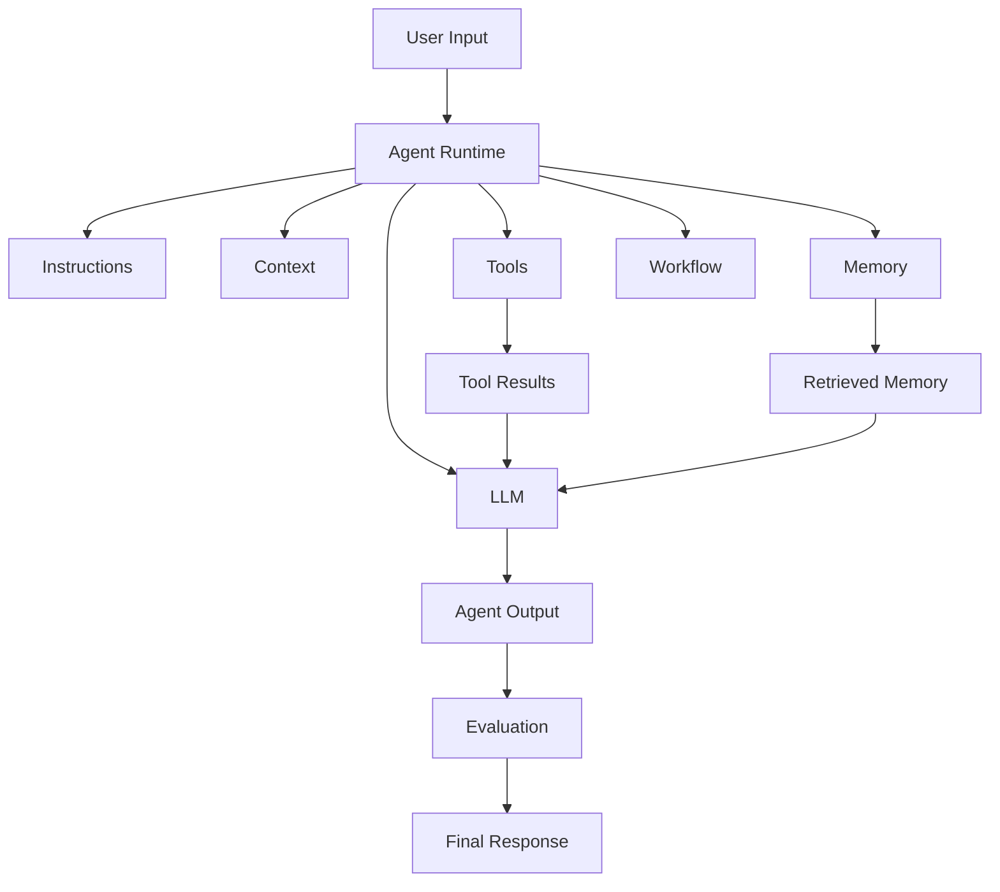

# Module 01 — Agent Architecture

[繁體中文](01-agent-architecture_zh.md)

## Goal

Understand the core components of an AI agent system and how they work together.

An agent is not just a prompt. A production agent is a system made of prompts, models, tools, memory, workflows, policies, and evaluation.

---

## Mental Model

```text
Agent = Model + Instructions + Context + Tools + Memory + Workflow + Evaluation
```

Each part has a different responsibility.

---

## Core Components

### Model

The LLM that performs language understanding, reasoning, generation, and tool-call planning.

### Instructions

The system prompt and developer instructions that define the agent's role, goals, limits, and output format.

### Context

The information available to the model during a task.

Context may include:

- user request
- conversation history
- retrieved documents
- tool results
- memory entries
- workflow state

### Tools

External functions or APIs the agent can call.

Examples:

- calculator
- search
- file reader
- database query
- task creation

### Memory

Information that persists across tasks or sessions.

Examples:

- user preferences
- completed tasks
- domain facts
- shared colony notes

### Workflow

The control structure that determines the steps of the task.

Examples:

- plan → execute → review
- classify → route → respond
- retrieve → summarize → validate

### Evaluation

The mechanism that checks output quality, safety, and task success.

---

## Architecture Diagram



---

## Design Exercise

Design an architecture for one agent:

```text
Agent name:
Model:
System prompt responsibility:
Input context:
Available tools:
Memory type:
Workflow steps:
Evaluation criteria:
Failure behavior:
```

---

## Checklist

You understand this module if you can:

- identify the components of an agent system
- explain why prompts alone are not enough
- separate model behavior from workflow control
- decide what belongs in context vs memory
- define basic evaluation criteria

---

## Common Mistakes

- Treating the LLM as the whole system
- Putting everything into the system prompt
- Giving tools without permission boundaries
- Adding memory without governance
- Skipping evaluation

---

## Outcome

After this module, you should be able to describe the architecture of a basic agent system and explain the role of each component.

Next module: [Module 02 — Tool Calling](02-tool-calling.md)
