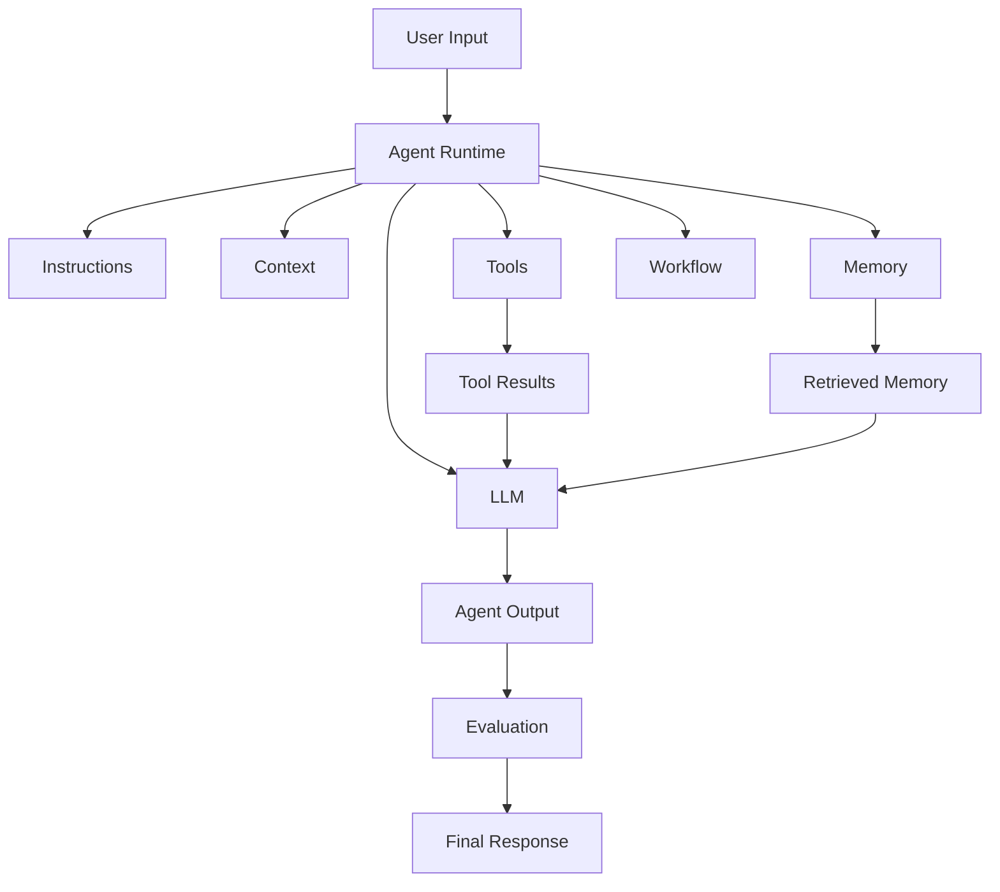

# Module 01 — Agent Architecture

[繁體中文](01-agent-architecture_zh.md)

## Goal

Understand the core components of an AI agent system and how they work together.

An agent is not just a prompt. A production agent is a system made of prompts, models, tools, memory, workflows, policies, and evaluation.

---

## Mental Model

```text
Agent = Model + Instructions + Context + Tools + Memory + Workflow + Evaluation
```

Each part has a different responsibility.

A reliable architecture separates these responsibilities instead of hiding everything inside one prompt.

---

## Core Components

### Model

The LLM that performs language understanding, reasoning, generation, and tool-call planning.

The model should not own business rules by itself. Business rules should be expressed through workflow, validation, policy, and tests.

### Instructions

The system prompt and developer instructions that define the agent's role, goals, limits, and output format.

Good instructions should define:

- role
- task boundary
- allowed behavior
- forbidden behavior
- output format
- uncertainty handling

### Context

The information available to the model during a task.

Context may include:

- user request
- conversation history
- retrieved documents
- tool results
- memory entries
- workflow state

Context should be selected intentionally. More context is not always better.

### Tools

External functions or APIs the agent can call.

Examples:

- calculator
- search
- file reader
- database query
- task creation

Tools should have schemas, validation, permission boundaries, and failure behavior.

### Memory

Information that persists across tasks or sessions.

Examples:

- user preferences
- completed tasks
- domain facts
- shared colony notes

Memory should have read/write rules. Without governance, memory can become noisy, stale, or unsafe.

### Workflow

The control structure that determines the steps of the task.

Examples:

- plan → execute → review
- classify → route → respond
- retrieve → summarize → validate

Workflow decides what happens next. The model should assist the workflow, not secretly replace it.

### Evaluation

The mechanism that checks output quality, safety, and task success.

Evaluation can happen before deployment, during runtime, and after user feedback.

---

## Architecture Diagram



---

## Data Flow

A typical agent request moves through these stages:

```text
User input
   ↓
Input validation
   ↓
Context selection
   ↓
Model reasoning
   ↓
Tool or memory access
   ↓
Observation handling
   ↓
Output generation
   ↓
Evaluation and safety review
   ↓
Final response
```

Each stage is a possible failure point and should be designed explicitly.

---

## Boundary Design

Agent architecture is mostly boundary design.

Important boundaries include:

| Boundary | Question |
|---|---|
| Model boundary | What is the model allowed to decide? |
| Tool boundary | What tools can be called, and with what permissions? |
| Memory boundary | What can be stored, read, updated, or deleted? |
| Workflow boundary | Which steps are controlled by code instead of the model? |
| Human boundary | Which actions require human approval? |
| Evaluation boundary | What must be checked before the output is trusted? |

---

## Architecture Patterns

### Simple Agent

```text
User → Model → Response
```

Best for low-risk text tasks.

### Tool-Using Agent

```text
User → Model → Tool → Observation → Model → Response
```

Best when external computation or data access is needed.

### Workflow Agent

```text
User → Router → Planner → Executor → Reviewer → Response
```

Best for multi-step tasks that need control and validation.

### Multi-Agent System

```text
User → Supervisor → Specialist Agents → Reviewer → Response
```

Best when role separation improves quality or safety.

---

## Design Exercise

Design an architecture for one agent:

```text
Agent name:
Model:
System prompt responsibility:
Input context:
Available tools:
Memory type:
Workflow steps:
Evaluation criteria:
Failure behavior:
```

Then answer:

```text
What should be controlled by code?
What can be decided by the model?
What requires human approval?
What must be logged?
```

---

## Checklist

You understand this module if you can:

- identify the components of an agent system
- explain why prompts alone are not enough
- separate model behavior from workflow control
- decide what belongs in context vs memory
- define basic evaluation criteria
- explain the main system boundaries
- choose a suitable architecture pattern for a use case

---

## Common Mistakes

- Treating the LLM as the whole system
- Putting everything into the system prompt
- Giving tools without permission boundaries
- Adding memory without governance
- Skipping evaluation
- Letting the model control high-risk workflow steps without review
- Logging too little to debug failures

---

## References

- Yao et al. (2022), ReAct: Synergizing Reasoning and Acting in Language Models.
- Anthropic, Model Context Protocol public documentation and ecosystem materials.
- See also: [References](../references/README.md)

---

## Outcome

After this module, you should be able to describe the architecture of a basic agent system and explain the role of each component.

Next module: [Module 02 — Tool Calling](02-tool-calling.md)
