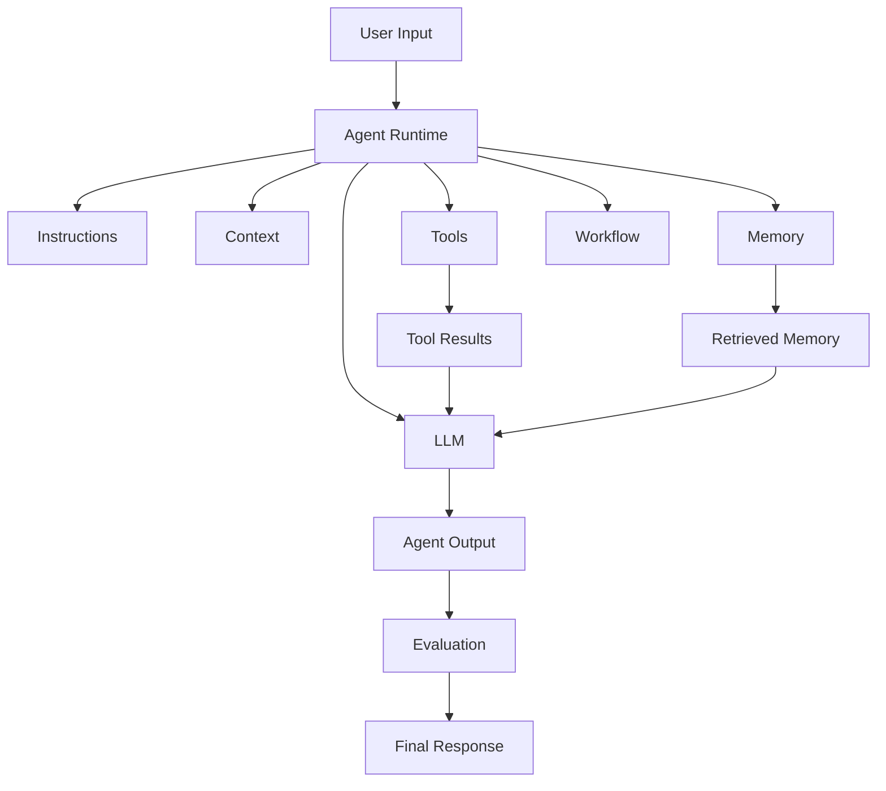

# Module 01 — Agent Architecture

[English](01-agent-architecture.md)

## 目標

理解 AI Agent 系統的核心組件，以及這些組件如何協作。

Agent 不只是一段 prompt。生產級 Agent 是由 prompt、model、tools、memory、workflow、policy 與 evaluation 組成的系統。

---

## 心智模型

```text
Agent = Model + Instructions + Context + Tools + Memory + Workflow + Evaluation
```

每個部分都有不同責任。

---

## 核心組件

### Model

負責語言理解、推理、生成與工具呼叫規劃的 LLM。

### Instructions

定義 Agent 角色、目標、限制與輸出格式的 system prompt 與 developer instructions。

### Context

模型在任務中可使用的資訊。

Context 可能包含：

- 使用者請求
- 對話歷史
- 檢索文件
- 工具結果
- 記憶項目
- workflow state

### Tools

Agent 可以呼叫的外部函式或 API。

範例：

- calculator
- search
- file reader
- database query
- task creation

### Memory

跨任務或跨 session 保留的資訊。

範例：

- 使用者偏好
- 已完成任務
- domain facts
- shared colony notes

### Workflow

控制任務步驟的結構。

範例：

- plan → execute → review
- classify → route → respond
- retrieve → summarize → validate

### Evaluation

檢查輸出品質、安全性與任務完成度的機制。

---

## 架構圖



---

## 設計練習

設計一個 Agent 架構：

```text
Agent name:
Model:
System prompt responsibility:
Input context:
Available tools:
Memory type:
Workflow steps:
Evaluation criteria:
Failure behavior:
```

---

## Checklist

如果你能做到以下事項，就代表理解本模組：

- 辨識 Agent 系統的核心組件
- 解釋為什麼只有 prompt 不夠
- 區分 model behavior 與 workflow control
- 判斷哪些資訊該放 context，哪些該放 memory
- 定義基本 evaluation criteria

---

## 常見錯誤

- 把 LLM 當成整個系統
- 把所有東西都塞進 system prompt
- 給工具但沒有權限邊界
- 加入 memory 但沒有治理規則
- 跳過 evaluation

---

## Outcome

完成本模組後，你應該能描述基本 Agent 系統架構，並說明每個組件的角色。

下一個模組：[Module 02 — Tool Calling](02-tool-calling.md)
