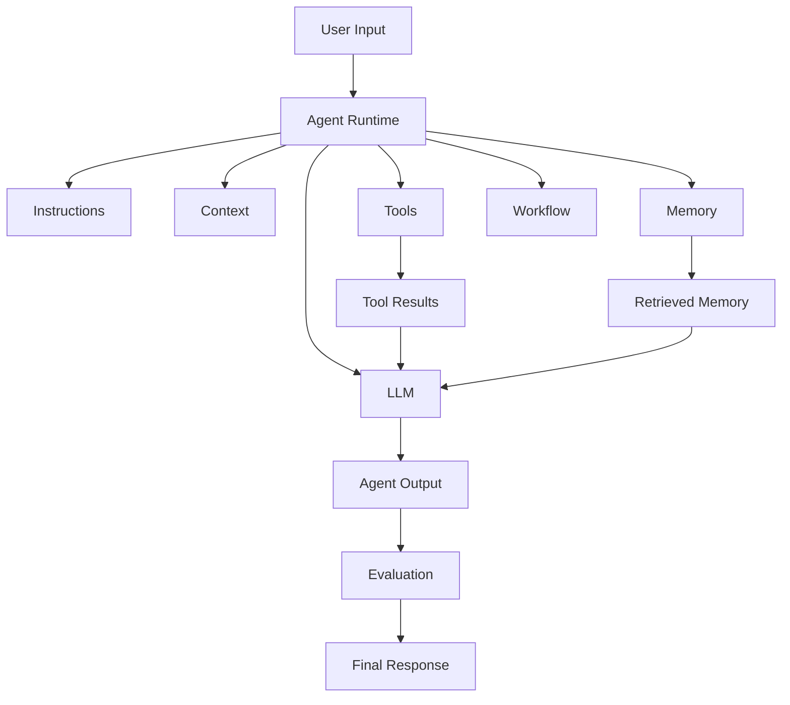

# Module 01 — Agent Architecture

[English](01-agent-architecture.md)

## 目標

理解 AI Agent 系統的核心組件，以及這些組件如何協作。

Agent 不只是一段 prompt。生產級 Agent 是由 prompt、model、tools、memory、workflow、policy 與 evaluation 組成的系統。

---

## 心智模型

```text
Agent = Model + Instructions + Context + Tools + Memory + Workflow + Evaluation
```

每個部分都有不同責任。

可靠的架構會把這些責任分開，而不是把所有東西都藏在一段 prompt 裡。

---

## 核心組件

### Model

負責語言理解、推理、生成與工具呼叫規劃的 LLM。

Model 不應該單獨承擔所有 business rules。Business rules 應該透過 workflow、validation、policy 與 tests 表達。

### Instructions

定義 Agent 角色、目標、限制與輸出格式的 system prompt 與 developer instructions。

好的 instructions 應定義：

- role
- task boundary
- allowed behavior
- forbidden behavior
- output format
- uncertainty handling

### Context

模型在任務中可使用的資訊。

Context 可能包含：

- 使用者請求
- 對話歷史
- 檢索文件
- 工具結果
- 記憶項目
- workflow state

Context 應該被有意識地選擇。更多 context 不一定更好。

### Tools

Agent 可以呼叫的外部函式或 API。

範例：

- calculator
- search
- file reader
- database query
- task creation

Tools 應該具備 schema、validation、permission boundaries 與 failure behavior。

### Memory

跨任務或跨 session 保留的資訊。

範例：

- 使用者偏好
- 已完成任務
- domain facts
- shared colony notes

Memory 應該有 read / write rules。沒有治理的 memory 可能變得混亂、過時或不安全。

### Workflow

控制任務步驟的結構。

範例：

- plan → execute → review
- classify → route → respond
- retrieve → summarize → validate

Workflow 決定下一步發生什麼。Model 應該協助 workflow，而不是偷偷取代 workflow。

### Evaluation

檢查輸出品質、安全性與任務完成度的機制。

Evaluation 可以發生在部署前、runtime 中，也可以來自使用者回饋後的分析。

---

## 架構圖



---

## Data Flow

典型 Agent request 會經過這些階段：

```text
User input
   ↓
Input validation
   ↓
Context selection
   ↓
Model reasoning
   ↓
Tool or memory access
   ↓
Observation handling
   ↓
Output generation
   ↓
Evaluation and safety review
   ↓
Final response
```

每個階段都是可能失敗的地方，因此應該被明確設計。

---

## Boundary Design

Agent architecture 很大一部分其實是 boundary design。

重要邊界包括：

| Boundary | Question |
|---|---|
| Model boundary | Model 被允許決定什麼？ |
| Tool boundary | 哪些 tools 可以被呼叫？具備什麼權限？ |
| Memory boundary | 什麼可以被儲存、讀取、更新或刪除？ |
| Workflow boundary | 哪些步驟由程式控制，而不是由 model 決定？ |
| Human boundary | 哪些行動需要 human approval？ |
| Evaluation boundary | 輸出被信任前必須檢查什麼？ |

---

## Architecture Patterns

### Simple Agent

```text
User → Model → Response
```

適合低風險文字任務。

### Tool-Using Agent

```text
User → Model → Tool → Observation → Model → Response
```

適合需要外部計算或資料存取的任務。

### Workflow Agent

```text
User → Router → Planner → Executor → Reviewer → Response
```

適合需要控制與驗證的多步驟任務。

### Multi-Agent System

```text
User → Supervisor → Specialist Agents → Reviewer → Response
```

適合角色分工能提升品質或安全性的任務。

---

## 設計練習

設計一個 Agent 架構：

```text
Agent name:
Model:
System prompt responsibility:
Input context:
Available tools:
Memory type:
Workflow steps:
Evaluation criteria:
Failure behavior:
```

接著回答：

```text
What should be controlled by code?
What can be decided by the model?
What requires human approval?
What must be logged?
```

---

## Checklist

如果你能做到以下事項，就代表理解本模組：

- 辨識 Agent 系統的核心組件
- 解釋為什麼只有 prompt 不夠
- 區分 model behavior 與 workflow control
- 判斷哪些資訊該放 context，哪些該放 memory
- 定義基本 evaluation criteria
- 解釋主要 system boundaries
- 為 use case 選擇合適 architecture pattern

---

## 常見錯誤

- 把 LLM 當成整個系統
- 把所有東西都塞進 system prompt
- 給 tools 但沒有 permission boundaries
- 加入 memory 但沒有治理規則
- 跳過 evaluation
- 讓 model 在沒有 review 的情況下控制高風險 workflow steps
- logs 太少，導致無法 debug failures

---

## References

- Yao et al. (2022), ReAct: Synergizing Reasoning and Acting in Language Models.
- Anthropic, Model Context Protocol public documentation and ecosystem materials.
- See also: [References](../references/README.md)

---

## Outcome

完成本模組後，你應該能描述基本 Agent 系統架構，並說明每個組件的角色。

下一個模組：[Module 02 — Tool Calling](02-tool-calling.md)
