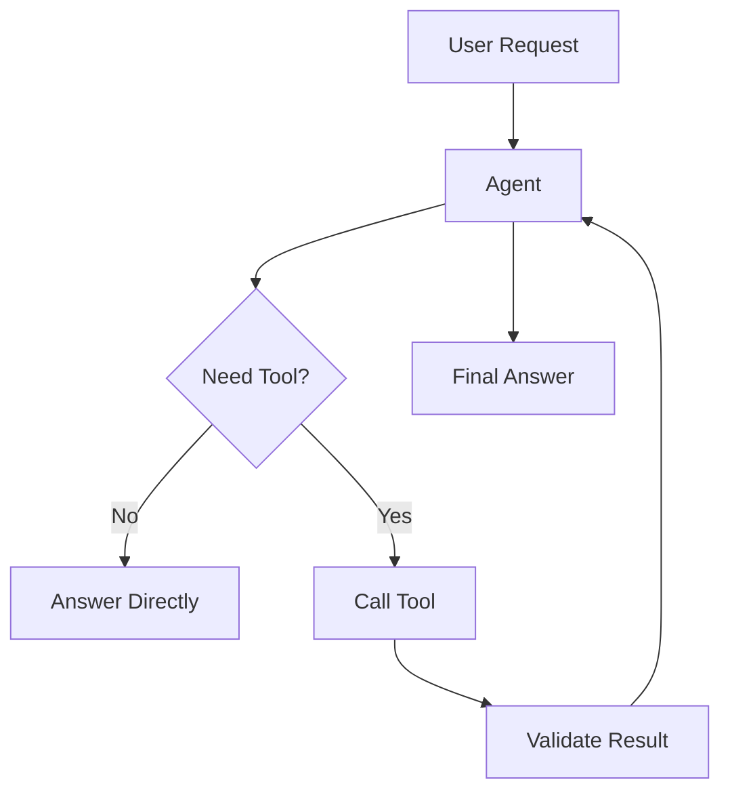

# Module 02 — Tool Calling

[繁體中文](02-tool-calling_zh.md)

## Goal

Teach agents how to call external tools safely and reliably.

Tool calling turns an LLM from a text generator into an agent that can interact with real systems.

---

## Mental Model

```text
User request → Agent decision → Tool call → Observation → Final answer
```

---

## Core Concepts

### Tool Schema

A tool schema defines what the tool does, what arguments it accepts, and what output it returns.

### Tool Selection

The agent must decide whether a tool is needed and which tool is appropriate.

### Tool Arguments

Arguments should be structured, validated, and narrow.

### Observation

The tool result should be treated as an observation, not as the final answer.

### Safety Boundary

Tools that read data are lower risk than tools that modify real-world state.

---

## Architecture Diagram



---

## Hands-on Exercise

Design three tools:

```text
Tool name:
Purpose:
Inputs:
Output:
Read-only or write:
Risk level:
Requires approval:
Failure behavior:
```

Suggested tools:

1. calculator
2. document_search
3. create_task

---

## Checklist

You understand this module if you can:

- define a clear tool schema
- explain when a tool is needed
- validate tool arguments
- classify tool risk
- define human approval rules

---

## Common Mistakes

- Giving agents overly broad tools
- Skipping argument validation
- Returning raw tool results to users
- Allowing write actions without approval
- Letting the model invent tool outputs

---

## Outcome

After this module, you should be able to design safe tools for an agent.

Next module: [Module 03 — Memory Systems](03-memory-systems.md)
