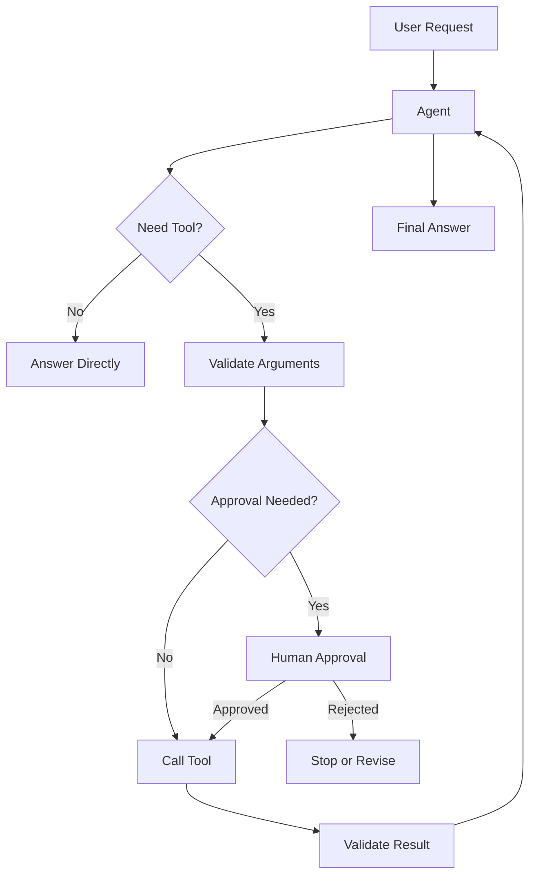

# Module 02 — Tool Calling

[繁體中文](02-tool-calling_zh.md)

## Goal

Teach agents how to call external tools safely and reliably.

Tool calling turns an LLM from a text generator into an agent that can interact with real systems.

---

## Why it matters

Most useful agents need access to capabilities outside the model.

Examples:

- calculations
- search
- file reading
- database queries
- calendar actions
- email drafting
- memory updates
- workflow triggers

Tool calling makes agents powerful, but it also creates risk. A wrong text response is usually harmless. A wrong tool call can modify files, send messages, expose private data, or trigger real-world actions.

---

## Mental Model

```text
User request → Agent decision → Tool call → Observation → Final answer
```

A tool call should not be treated as magic. It is a structured request that must be validated, executed, observed, and reviewed.

---

## Core Concepts

### Tool Schema

A tool schema defines what the tool does, what arguments it accepts, and what output it returns.

A good tool schema should include:

- clear name
- narrow purpose
- argument types
- required fields
- validation rules
- side-effect description
- error behavior

Example:

```json
{
  "name": "search_documents",
  "description": "Search approved documents for relevant passages.",
  "parameters": {
    "query": "string",
    "top_k": "integer"
  }
}
```

### Tool Selection

The agent must decide whether a tool is needed and which tool is appropriate.

Good tool selection asks:

```text
Can I answer from the provided context?
Do I need external data?
Which tool has the least risk?
Is human approval required?
```

### Tool Arguments

Arguments should be structured, validated, and narrow.

Bad argument:

```text
Do whatever is necessary.
```

Better argument:

```json
{
  "query": "memory policy",
  "top_k": 3
}
```

### Observation

The tool result should be treated as an observation, not as the final answer.

The agent should read the observation, explain it, and decide whether another step is needed.

### Safety Boundary

Tools that read data are usually lower risk than tools that modify real-world state.

A production agent should classify tools by risk before exposing them to the model.

---

## Tool Risk Levels

| Risk level | Example | Approval needed? |
|---|---|---|
| Low | calculator, word count | Usually no |
| Medium | document search, database read | Depends on data sensitivity |
| High | send email, update database, create payment | Usually yes |
| Critical | delete data, execute shell command, modify permissions | Always yes or disallow |

---

## Architecture Diagram



---

## Tool Design Template

Use this template before implementing a tool:

```text
Tool name:
Purpose:
Input schema:
Output schema:
Read or write:
Side effects:
Risk level:
Requires approval:
Allowed callers:
Validation rules:
Failure behavior:
Audit fields:
```

---

## Error Handling

Every tool should define what happens when something fails.

Common failures:

- missing required argument
- invalid argument type
- permission denied
- no matching data
- external API timeout
- unsafe request
- unexpected server error

The agent should not hide tool failures. It should explain what failed and provide a safe next step.

---

## Hands-on Exercise

Design three tools:

```text
Tool name:
Purpose:
Inputs:
Output:
Read-only or write:
Risk level:
Requires approval:
Failure behavior:
```

Suggested tools:

1. calculator
2. document_search
3. create_task

Then classify each tool by risk level and define whether human approval is required.

---

## Evaluation

Create test cases for tool use:

```text
User request:
Expected tool:
Expected arguments:
Expected tool result behavior:
Expected final answer behavior:
Should not call:
Risk level:
```

Evaluation dimensions:

| Dimension | Question |
|---|---|
| Tool selection | Did the agent choose the correct tool? |
| Argument quality | Were the tool arguments valid and minimal? |
| Safety | Did the agent avoid risky or forbidden actions? |
| Observation use | Did the agent use the tool result accurately? |
| Failure handling | Did the agent handle tool errors clearly? |

---

## Checklist

You understand this module if you can:

- define a clear tool schema
- explain when a tool is needed
- validate tool arguments
- classify tool risk
- define human approval rules
- design tool failure behavior
- create tool-use evaluation cases

---

## Common Mistakes

- Giving agents overly broad tools
- Skipping argument validation
- Returning raw tool results to users
- Allowing write actions without approval
- Letting the model invent tool outputs
- Exposing tools with unclear side effects
- Treating all tools as equal risk

---

## References

- Yao et al. (2022), ReAct: Synergizing Reasoning and Acting in Language Models.
- Anthropic, Model Context Protocol public documentation and ecosystem materials.
- See also: [References](../references/README.md)

---

## Outcome

After this module, you should be able to design safe tools for an agent.

Next module: [Module 03 — Memory Systems](03-memory-systems.md)
