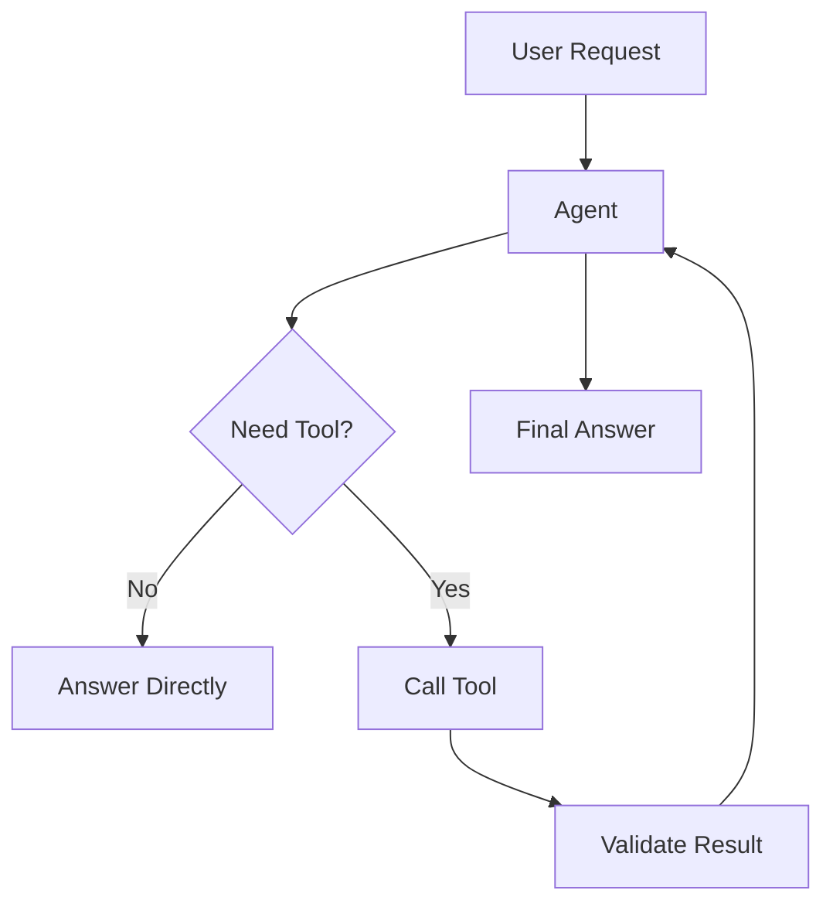

# Module 02 — Tool Calling

[English](02-tool-calling.md)

## 目標

教 Agent 如何安全且可靠地呼叫外部工具。

Tool Calling 讓 LLM 從文字生成器，變成能與真實系統互動的 Agent。

---

## 心智模型

```text
使用者請求 → Agent 判斷 → Tool call → Observation → Final answer
```

---

## 核心概念

### Tool Schema

Tool schema 定義工具用途、可接受參數與回傳格式。

### Tool Selection

Agent 必須判斷是否需要工具，以及哪個工具最適合。

### Tool Arguments

參數應該是結構化、可驗證且範圍明確的。

### Observation

工具結果應該被視為 observation，而不是直接當成 final answer。

### Safety Boundary

讀取資料的工具風險較低；會改變真實狀態的工具風險較高。

---

## 架構圖



---

## Hands-on Exercise

設計三個工具：

```text
Tool name:
Purpose:
Inputs:
Output:
Read-only or write:
Risk level:
Requires approval:
Failure behavior:
```

建議工具：

1. calculator
2. document_search
3. create_task

---

## Checklist

如果你能做到以下事項，就代表理解本模組：

- 定義清楚的 tool schema
- 解釋什麼時候需要工具
- 驗證 tool arguments
- 分類工具風險
- 定義 human approval rules

---

## 常見錯誤

- 給 Agent 過於寬泛的工具
- 跳過參數驗證
- 直接把 raw tool result 回傳給使用者
- 允許 write action 但沒有 approval
- 讓 model 編造工具結果

---

## Outcome

完成本模組後，你應該能為 Agent 設計安全工具。

下一個模組：[Module 03 — Memory Systems](03-memory-systems.md)
