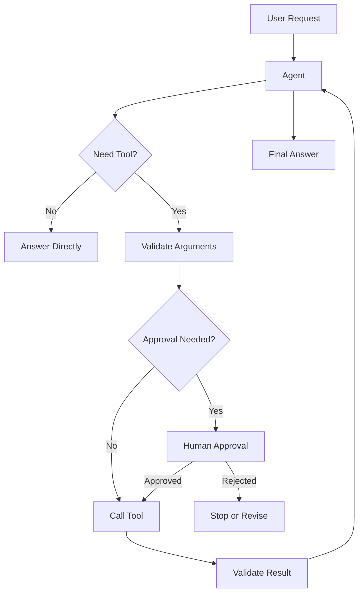

# Module 02 — Tool Calling

[English](02-tool-calling.md)

## 目標

教 Agent 如何安全且可靠地呼叫外部工具。

Tool Calling 讓 LLM 從文字生成器，變成能與真實系統互動的 Agent。

---

## 為什麼重要？

大多數實用 Agent 都需要模型外部的能力。

範例：

- calculations
- search
- file reading
- database queries
- calendar actions
- email drafting
- memory updates
- workflow triggers

Tool calling 讓 Agent 變得強大，但也帶來風險。錯誤文字通常還好；錯誤工具呼叫可能修改檔案、寄出訊息、暴露私密資料或觸發真實世界行動。

---

## 心智模型

```text
使用者請求 → Agent 判斷 → Tool call → Observation → Final answer
```

Tool call 不應被視為魔法，而是一個必須被驗證、執行、觀察與審查的結構化請求。

---

## 核心概念

### Tool Schema

Tool schema 定義工具用途、可接受參數與回傳格式。

好的 tool schema 應包含：

- clear name
- narrow purpose
- argument types
- required fields
- validation rules
- side-effect description
- error behavior

範例：

```json
{
  "name": "search_documents",
  "description": "Search approved documents for relevant passages.",
  "parameters": {
    "query": "string",
    "top_k": "integer"
  }
}
```

### Tool Selection

Agent 必須判斷是否需要工具，以及哪個工具最適合。

好的 tool selection 會問：

```text
我能從既有 context 回答嗎？
我需要外部資料嗎？
哪個工具風險最低？
是否需要 human approval？
```

### Tool Arguments

參數應該是結構化、可驗證且範圍明確的。

不好的 argument：

```text
Do whatever is necessary.
```

較好的 argument：

```json
{
  "query": "memory policy",
  "top_k": 3
}
```

### Observation

工具結果應該被視為 observation，而不是直接當成 final answer。

Agent 應該閱讀 observation、解釋結果，並判斷是否需要下一步。

### Safety Boundary

讀取資料的工具通常風險較低；會改變真實狀態的工具風險較高。

Production Agent 應該在把工具暴露給模型前，先進行風險分類。

---

## Tool Risk Levels

| Risk level | Example | Approval needed? |
|---|---|---|
| Low | calculator, word count | 通常不需要 |
| Medium | document search, database read | 取決於資料敏感性 |
| High | send email, update database, create payment | 通常需要 |
| Critical | delete data, execute shell command, modify permissions | 一律需要，或直接禁止 |

---

## 架構圖



---

## Tool Design Template

實作工具前，先使用這個模板：

```text
Tool name:
Purpose:
Input schema:
Output schema:
Read or write:
Side effects:
Risk level:
Requires approval:
Allowed callers:
Validation rules:
Failure behavior:
Audit fields:
```

---

## Error Handling

每個工具都應該定義失敗時的處理方式。

常見失敗：

- missing required argument
- invalid argument type
- permission denied
- no matching data
- external API timeout
- unsafe request
- unexpected server error

Agent 不應隱藏工具失敗。它應該清楚說明失敗原因，並提供安全的下一步。

---

## Hands-on Exercise

設計三個工具：

```text
Tool name:
Purpose:
Inputs:
Output:
Read-only or write:
Risk level:
Requires approval:
Failure behavior:
```

建議工具：

1. calculator
2. document_search
3. create_task

接著為每個工具分類風險等級，並定義是否需要 human approval。

---

## Evaluation

建立 tool use 測試案例：

```text
User request:
Expected tool:
Expected arguments:
Expected tool result behavior:
Expected final answer behavior:
Should not call:
Risk level:
```

評估維度：

| Dimension | Question |
|---|---|
| Tool selection | Agent 是否選對工具？ |
| Argument quality | 工具參數是否有效且最小化？ |
| Safety | Agent 是否避免高風險或禁止行動？ |
| Observation use | Agent 是否正確使用工具結果？ |
| Failure handling | Agent 是否清楚處理工具錯誤？ |

---

## Checklist

如果你能做到以下事項，就代表理解本模組：

- 定義清楚的 tool schema
- 解釋什麼時候需要工具
- 驗證 tool arguments
- 分類工具風險
- 定義 human approval rules
- 設計 tool failure behavior
- 建立 tool-use evaluation cases

---

## 常見錯誤

- 給 Agent 過於寬泛的工具
- 跳過參數驗證
- 直接把 raw tool result 回傳給使用者
- 允許 write action 但沒有 approval
- 讓 model 編造工具結果
- 暴露 side effects 不清楚的 tools
- 把所有 tools 視為相同風險

---

## References

- Yao et al. (2022), ReAct: Synergizing Reasoning and Acting in Language Models.
- Anthropic, Model Context Protocol public documentation and ecosystem materials.
- See also: [References](../references/README.md)

---

## Outcome

完成本模組後，你應該能為 Agent 設計安全工具。

下一個模組：[Module 03 — Memory Systems](03-memory-systems.md)
