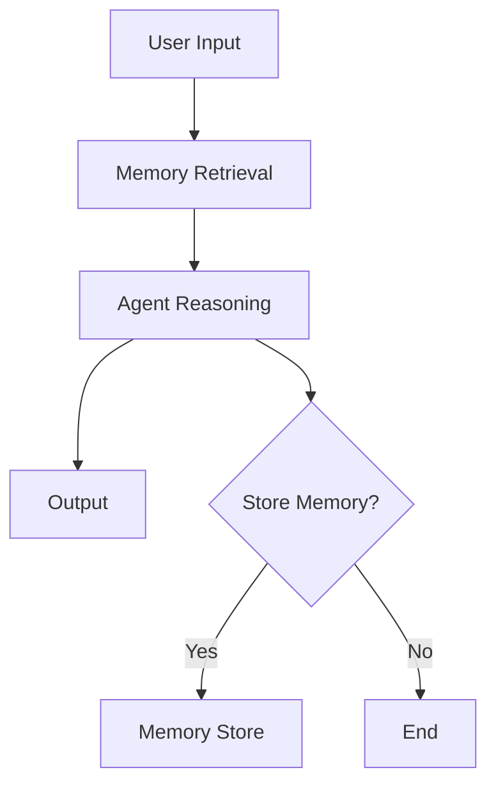

# Module 03 — Memory Systems

[繁體中文](03-memory-systems_zh.md)

## Goal

Learn how to design memory systems for agents.

Memory allows agents to retain useful context across tasks, users, and sessions.

---

## Mental Model

```text
Input → Retrieve Memory → Reason → Act → Decide What to Store
```

---

## Core Concepts

### Short-term Memory

Temporary context used during the current task.

### Episodic Memory

Records of past events, tasks, and interactions.

### Semantic Memory

Reusable knowledge and facts.

### User Memory

Preferences, profile information, and long-term user constraints.

### Shared Memory

Memory shared across multiple agents in a team or colony.

---

## Architecture Diagram



---

## Hands-on Exercise

Design a memory policy:

```text
What should be stored?
What should not be stored?
Who can read memory?
Who can write memory?
How is memory updated?
How is memory deleted?
```

---

## Checklist

You understand this module if you can:

- explain different memory types
- separate context from memory
- design a memory write policy
- identify sensitive memory risks
- explain memory retrieval and ranking

---

## Common Mistakes

- Storing everything
- Using vector search as the entire memory system
- Saving sensitive data without consent
- Not auditing memory writes
- Retrieving irrelevant memories

---

## Outcome

After this module, you should be able to design safe and useful memory systems.

Next module: [Module 04 — RAG and Embeddings](04-rag-and-embeddings.md)
