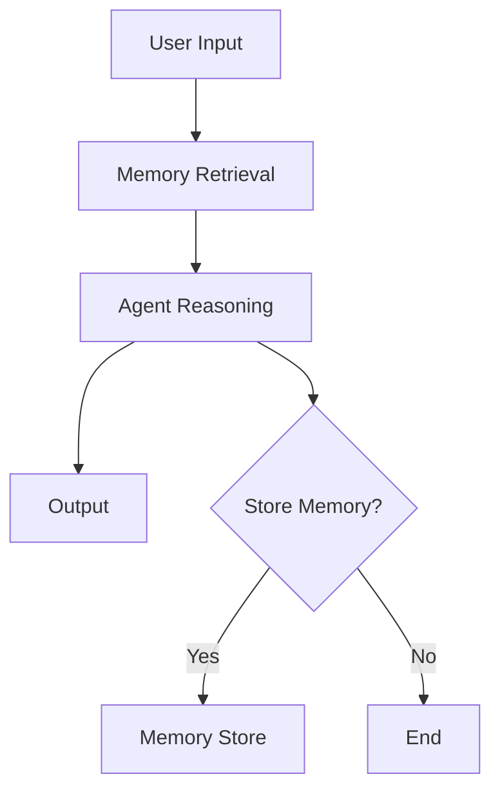

# Module 03 — Memory Systems

[繁體中文](03-memory-systems_zh.md)

## Goal

Learn how to design memory systems for agents.

Memory allows agents to retain useful context across tasks, users, and sessions.

---

## Mental Model

```text
Input → Retrieve Memory → Reason → Act → Decide What to Store
```

---

## Core Concepts

### Short-term Memory

Temporary context used during the current task.

### Episodic Memory

Records of past events, tasks, and interactions.

### Semantic Memory

Reusable knowledge and facts.

### User Memory

Preferences, profile information, and long-term user constraints.

### Shared Memory

Memory shared across multiple agents in a team or colony.

---

## Architecture Diagram



---

## Hands-on Exercise

Design a memory policy:

```text
What should be stored?
What should not be stored?
Who can read memory?
Who can write memory?
How is memory updated?
How is memory deleted?
```

---

## Checklist

You understand this module if you can:

- explain different memory types
- separate context from memory
- design a memory write policy
- identify sensitive memory risks
- explain memory retrieval and ranking

---

## Common Mistakes

- Storing everything
- Using vector search as the entire memory system
- Saving sensitive data without consent
- Not auditing memory writes
- Retrieving irrelevant memories

---

## Deep Dive: Memory Is Not Just Storage

Imagine a tutoring agent. Yesterday, the learner said they prefer Traditional Chinese explanations with examples. Today, the agent forgets. The model may still answer well in one turn, but as a long-term tutor it is unreliable.

The naive fix is to store everything the user says. That sounds reasonable until the user accidentally shares a password, medical note, or company secret. Now the system has memory, but no memory policy.

In one sentence: memory is a policy problem before it is a database problem. The database stores data. The system still needs to decide what may be stored, retrieved, updated, audited, and deleted.

### Black-box View

```text
Input: current user message, previous memories, memory policy
Output: answer plus optional memory write decision
Objective: use relevant remembered context without leaking, overusing, or storing unsafe data
```

### Naive Failure

```text
Naive design:
Store every user message.

Failure:
- stores sensitive data
- retrieves stale preferences
- uses irrelevant memories
- cannot explain why a memory exists
- cannot delete user data cleanly
```

### Mechanism

A useful memory system needs at least five gates:

1. Write gate: is this worth remembering?
2. Sensitivity gate: is this safe to store?
3. Retrieval gate: which memories are relevant now?
4. Freshness gate: is this memory still valid?
5. Audit gate: who wrote this, when, and why?

Vector search only helps with part of retrieval. It does not decide whether a memory should exist.

### Runnable Checkpoint

```bash
python examples/04-memory-agent/main.py
```

Try:

```text
Remember that I prefer Traditional Chinese explanations.
Remember my password is 123456.
```

The first may be useful. The second should be blocked by policy.

### Evaluation Cases

| Case | Expected Behavior |
|---|---|
| user preference | store with reason |
| password or secret | refuse to store |
| stale preference | mark uncertainty or update |
| unrelated memory | do not retrieve |
| deletion request | remove memory and log deletion |

---

## Outcome

After this module, you should be able to design safe and useful memory systems.

Next module: [Module 04 — RAG and Embeddings](04-rag-and-embeddings.md)
