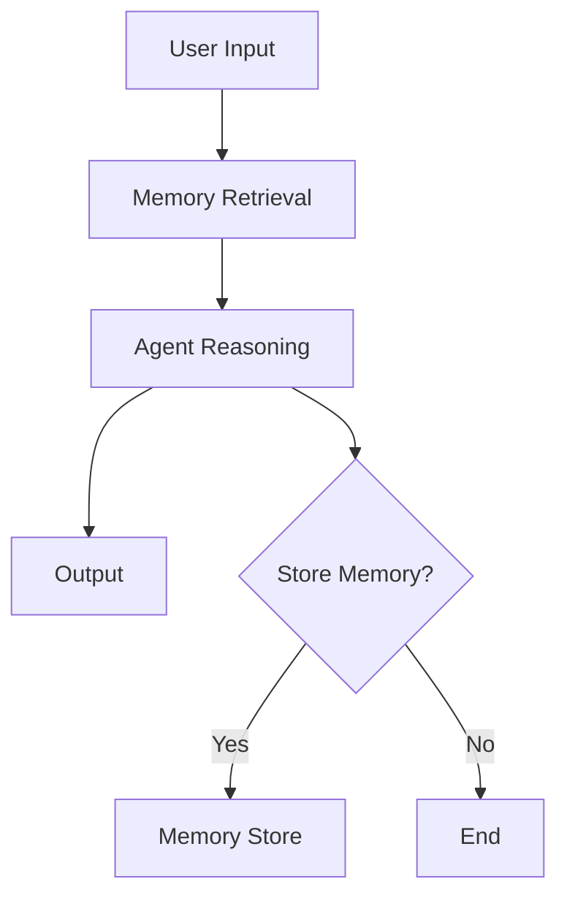

# Module 03 — Memory Systems

[English](03-memory-systems.md)

## 目標

學習如何為 Agent 設計記憶系統。

Memory 讓 Agent 能在跨任務、跨使用者、跨 session 的情境中保留有用上下文。

---

## 心智模型

```text
Input → Retrieve Memory → Reason → Act → Decide What to Store
```

---

## 核心概念

### Short-term Memory

目前任務中使用的暫時上下文。

### Episodic Memory

過去事件、任務與互動紀錄。

### Semantic Memory

可重用的知識與事實。

### User Memory

使用者偏好、profile 資訊與長期限制。

### Shared Memory

多個 Agent 在 team 或 colony 中共享的記憶。

---

## 架構圖



---

## Hands-on Exercise

設計一個 memory policy：

```text
What should be stored?
What should not be stored?
Who can read memory?
Who can write memory?
How is memory updated?
How is memory deleted?
```

---

## Checklist

如果你能做到以下事項，就代表理解本模組：

- 解釋不同記憶類型
- 區分 context 與 memory
- 設計 memory write policy
- 辨識敏感記憶風險
- 解釋 memory retrieval 與 ranking

---

## 常見錯誤

- 什麼都存
- 把 vector search 當成完整 memory system
- 未經同意儲存敏感資料
- 沒有 audit memory writes
- 檢索到不相關記憶

---

## Outcome

完成本模組後，你應該能設計安全且有用的記憶系統。

下一個模組：[Module 04 — RAG and Embeddings](04-rag-and-embeddings.md)
