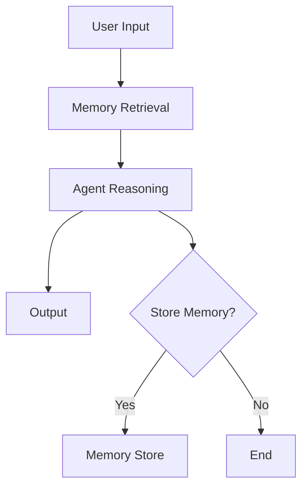

# Module 03 — Memory Systems

[English](03-memory-systems.md)

## 目標

學習如何為 Agent 設計記憶系統。

Memory 讓 Agent 能在跨任務、跨使用者、跨 session 的情境中保留有用上下文。

---

## 心智模型

```text
Input → Retrieve Memory → Reason → Act → Decide What to Store
```

---

## 核心概念

### Short-term Memory

目前任務中使用的暫時上下文。

### Episodic Memory

過去事件、任務與互動紀錄。

### Semantic Memory

可重用的知識與事實。

### User Memory

使用者偏好、profile 資訊與長期限制。

### Shared Memory

多個 Agent 在 team 或 colony 中共享的記憶。

---

## 架構圖



---

## Hands-on Exercise

設計一個 memory policy：

```text
What should be stored?
What should not be stored?
Who can read memory?
Who can write memory?
How is memory updated?
How is memory deleted?
```

---

## Checklist

如果你能做到以下事項，就代表理解本模組：

- 解釋不同記憶類型
- 區分 context 與 memory
- 設計 memory write policy
- 辨識敏感記憶風險
- 解釋 memory retrieval 與 ranking

---

## 常見錯誤

- 什麼都存
- 把 vector search 當成完整 memory system
- 未經同意儲存敏感資料
- 沒有 audit memory writes
- 檢索到不相關記憶

---

## Deep Dive：為什麼 Memory 不是「把東西存起來」？

假設你今天做一個學習助教 Agent。學生昨天說：「我比較喜歡繁體中文，而且希望每個概念都有例子。」今天他再問一題，Agent 完全忘記。你可能會想說，這 Agent 不是很聰明嗎？單次回答也許很聰明，但作為長期助教，它其實不可靠。

那怎麼辦呢？直覺上你會說：那就把使用者講過的話都存起來。這個想法聽起來很合理，但很快就會出事。比如使用者不小心貼了密碼、病歷、公司機密，Agent 也照單全收。你沒有看錯，這就是很多 memory demo 最容易犯的錯：有記憶，但沒有記憶政策。

一言以蔽之：Memory 不是資料庫問題，Memory 其實是 policy problem。資料庫只是放東西的地方而已。真正困難的是決定什麼該存、什麼不該存、什麼時候讀、什麼時候忘。

### Black-box View

```text
Input: current user message, previous memories, memory policy
Output: answer plus optional memory write decision
Objective: use relevant remembered context without leaking, overusing, or storing unsafe data
```

### Naive Failure

```text
Naive design:
Store every user message.

Failure:
- stores sensitive data
- retrieves stale preferences
- uses irrelevant memories
- cannot explain why a memory exists
- cannot delete user data cleanly
```

### Mechanism

一個可用的 memory system 至少要有五個 gate：

1. Write gate：這句話值得存嗎？
2. Sensitivity gate：這句話能存嗎？
3. Retrieval gate：這個任務需要哪些記憶？
4. Freshness gate：這個記憶還有效嗎？
5. Audit gate：誰在什麼時候、為什麼寫入？

講到這邊你會發現，vector database 只處理第三個 gate 的一小部分。它幫你找相似內容，但不會幫你判斷該不該存、該不該忘、該不該用。

### Runnable Checkpoint

```bash
python examples/04-memory-agent/main.py
```

測兩種輸入：

```text
Remember that I prefer Traditional Chinese explanations.
Remember my password is 123456.
```

第一個可以考慮存。第二個應該被 policy 擋掉。

### Evaluation Cases

| Case | Expected Behavior |
|---|---|
| user preference | store with reason |
| password or secret | refuse to store |
| stale preference | mark uncertainty or update |
| unrelated memory | do not retrieve |
| deletion request | remove memory and log deletion |

### 常見誤解修正

誤解：Memory 越多越好。

修正：Memory 越多，retrieval noise 和 privacy risk 也越多。好的 memory system 不是記最多，而是記得剛好。

誤解：有 vector search 就有 memory。

修正：Vector search 是 retrieval 技術。Memory 還需要 write policy、delete policy、audit、permission。

---

## Outcome

完成本模組後，你應該能設計安全且有用的記憶系統。

下一個模組：[Module 04 — RAG and Embeddings](04-rag-and-embeddings.md)
