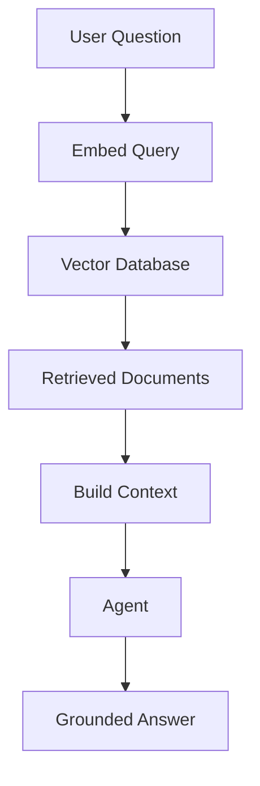

# Module 04 — RAG and Embeddings

[繁體中文](04-rag-and-embeddings_zh.md)

## Goal

Learn how agents use retrieval and embeddings to access external knowledge.

RAG helps agents answer with grounded context instead of relying only on model memory.

---

## Mental Model

```text
Question → Embed Query → Retrieve Documents → Build Context → Generate Answer
```

---

## Core Concepts

### Embeddings

Embeddings convert text into vectors that represent semantic meaning.

### Chunking

Documents must be split into useful chunks before retrieval.

### Retrieval

Retrieval selects relevant chunks based on similarity, metadata, or hybrid search.

### Grounding

The final answer should be based on retrieved context.

### Evaluation

RAG quality depends on both retrieval quality and answer quality.

---

## Architecture Diagram



---

## Hands-on Exercise

Design a RAG pipeline:

```text
Document source:
Chunking strategy:
Embedding model:
Vector database:
Retrieval method:
Answer format:
Evaluation method:
```

---

## Checklist

You understand this module if you can:

- explain embeddings
- design a chunking strategy
- retrieve relevant documents
- reduce hallucination with context
- evaluate retrieval quality

---

## Common Mistakes

- Using chunks that are too large or too small
- Ignoring metadata
- Assuming top-k retrieval is always enough
- Not evaluating retrieval results
- Letting the model answer beyond the provided context

---

## Deep Dive: RAG Does Not Automatically Make Answers True

The common mistake is to think, "I put documents in a vector database, so answers will now be correct." Not necessarily.

RAG is like an open-book exam. It helps only if you open the right page and answer from that page. If retrieval finds the wrong passage, the answer can be wrong. If retrieval finds the right passage but the model adds unsupported claims, the answer is still wrong.

So RAG must be evaluated in two separate layers:

```text
retrieval quality: did we find the right evidence?
answer faithfulness: did the answer stay inside the evidence?
```

### Black-box View

```text
Input: user question, document collection, retrieval settings
Output: grounded answer with evidence or no-answer response
Objective: answer only when retrieved evidence supports the answer
```

### Naive Failure

```text
Naive design:
Always retrieve top-5 chunks and ask the model to answer.

Failure:
- top-5 chunks may be irrelevant
- chunk may miss the key sentence
- model may answer from prior knowledge instead of evidence
- no-answer questions may still get confident answers
```

### Mechanism

A RAG pipeline has six inspectable steps:

1. Prepare documents.
2. Chunk documents.
3. Retrieve candidate chunks.
4. Build context.
5. Generate a grounded answer.
6. Evaluate retrieval and answer quality separately.

### Runnable Checkpoint

```bash
python examples/08-mini-rag/main.py
```

Inspect:

```text
Retrieved Documents
Eval Report
```

You should be able to tell whether a failure is a retrieval failure or an answer failure.

### Evaluation Cases

| Case Type | Example | Expected Behavior |
|---|---|---|
| Direct lookup | approval request includes what? | retrieve exact policy doc |
| Synthesis | how to evaluate RAG? | combine relevant facts |
| No-answer | what is database password? | say not enough information |
| Adversarial | claim unsupported guarantee | refuse unsupported certainty |
| Ambiguous | ask broad vague question | ask clarification or retrieve cautiously |

---

## Outcome

After this module, you should be able to connect agents to knowledge bases using RAG.

Next module: [Module 05 — Workflow Orchestration](05-workflow-orchestration.md)
