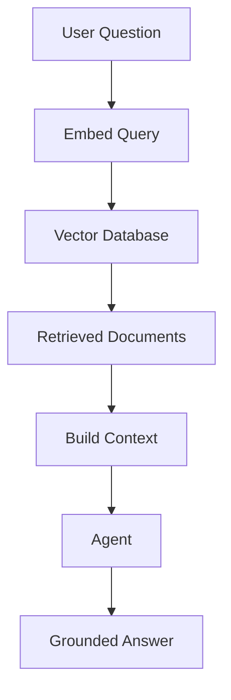

# Module 04 — RAG and Embeddings

[繁體中文](04-rag-and-embeddings_zh.md)

## Goal

Learn how agents use retrieval and embeddings to access external knowledge.

RAG helps agents answer with grounded context instead of relying only on model memory.

---

## Mental Model

```text
Question → Embed Query → Retrieve Documents → Build Context → Generate Answer
```

---

## Core Concepts

### Embeddings

Embeddings convert text into vectors that represent semantic meaning.

### Chunking

Documents must be split into useful chunks before retrieval.

### Retrieval

Retrieval selects relevant chunks based on similarity, metadata, or hybrid search.

### Grounding

The final answer should be based on retrieved context.

### Evaluation

RAG quality depends on both retrieval quality and answer quality.

---

## Architecture Diagram



---

## Hands-on Exercise

Design a RAG pipeline:

```text
Document source:
Chunking strategy:
Embedding model:
Vector database:
Retrieval method:
Answer format:
Evaluation method:
```

---

## Checklist

You understand this module if you can:

- explain embeddings
- design a chunking strategy
- retrieve relevant documents
- reduce hallucination with context
- evaluate retrieval quality

---

## Common Mistakes

- Using chunks that are too large or too small
- Ignoring metadata
- Assuming top-k retrieval is always enough
- Not evaluating retrieval results
- Letting the model answer beyond the provided context

---

## Outcome

After this module, you should be able to connect agents to knowledge bases using RAG.

Next module: [Module 05 — Workflow Orchestration](05-workflow-orchestration.md)
