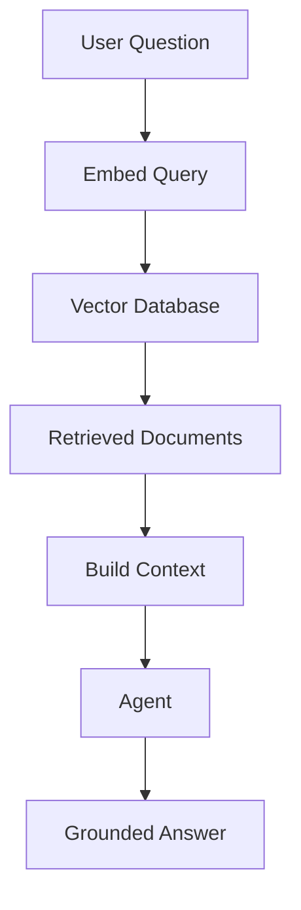

# Module 04 — RAG and Embeddings

[English](04-rag-and-embeddings.md)

## 目標

學習 Agent 如何使用 retrieval 與 embeddings 存取外部知識。

RAG 讓 Agent 可以根據外部上下文回答，而不是只依賴模型自身記憶。

---

## 心智模型

```text
Question → Embed Query → Retrieve Documents → Build Context → Generate Answer
```

---

## 核心概念

### Embeddings

Embeddings 會將文字轉換成代表語意的向量。

### Chunking

文件需要先切成有用的 chunks，才能有效檢索。

### Retrieval

Retrieval 會根據 similarity、metadata 或 hybrid search 選出相關 chunks。

### Grounding

最終回答應該根據檢索到的 context 產生。

### Evaluation

RAG 品質取決於 retrieval quality 與 answer quality。

---

## 架構圖



---

## Hands-on Exercise

設計一個 RAG pipeline：

```text
Document source:
Chunking strategy:
Embedding model:
Vector database:
Retrieval method:
Answer format:
Evaluation method:
```

---

## Checklist

如果你能做到以下事項，就代表理解本模組：

- 解釋 embeddings
- 設計 chunking strategy
- 檢索相關文件
- 用 context 降低 hallucination
- 評估 retrieval quality

---

## 常見錯誤

- chunk 太大或太小
- 忽略 metadata
- 以為 top-k retrieval 永遠足夠
- 沒有評估 retrieval results
- 讓模型回答超出 context 的內容

---

## Outcome

完成本模組後，你應該能用 RAG 將 Agent 連接到知識庫。

下一個模組：[Module 05 — Workflow Orchestration](05-workflow-orchestration.md)
