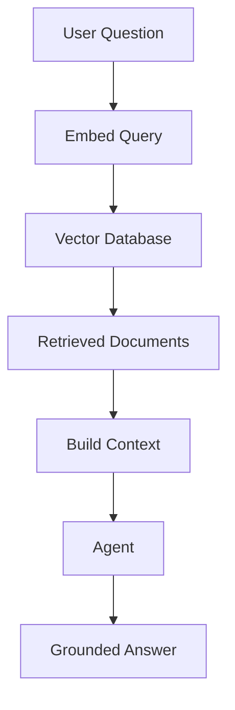

# Module 04 — RAG and Embeddings

[English](04-rag-and-embeddings.md)

## 目標

學習 Agent 如何使用 retrieval 與 embeddings 存取外部知識。

RAG 讓 Agent 可以根據外部上下文回答，而不是只依賴模型自身記憶。

---

## 心智模型

```text
Question → Embed Query → Retrieve Documents → Build Context → Generate Answer
```

---

## 核心概念

### Embeddings

Embeddings 會將文字轉換成代表語意的向量。

### Chunking

文件需要先切成有用的 chunks，才能有效檢索。

### Retrieval

Retrieval 會根據 similarity、metadata 或 hybrid search 選出相關 chunks。

### Grounding

最終回答應該根據檢索到的 context 產生。

### Evaluation

RAG 品質取決於 retrieval quality 與 answer quality。

---

## 架構圖



---

## Hands-on Exercise

設計一個 RAG pipeline：

```text
Document source:
Chunking strategy:
Embedding model:
Vector database:
Retrieval method:
Answer format:
Evaluation method:
```

---

## Checklist

如果你能做到以下事項，就代表理解本模組：

- 解釋 embeddings
- 設計 chunking strategy
- 檢索相關文件
- 用 context 降低 hallucination
- 評估 retrieval quality

---

## 常見錯誤

- chunk 太大或太小
- 忽略 metadata
- 以為 top-k retrieval 永遠足夠
- 沒有評估 retrieval results
- 讓模型回答超出 context 的內容

---

## Deep Dive：RAG 為什麼不會自動讓答案變正確？

好，RAG 最常見的誤解是：「我把文件丟進 vector database，答案就會變正確。」聽起來很合理，但其實不一定。

你可以把 RAG 想成開卷考。開卷考比較容易答對嗎？也許。但前提是你要翻到對的頁面，還要不要亂抄。如果你翻錯頁，答案還是錯。如果你翻對頁，但自己加了一堆書上沒有的東西，答案也還是錯。

所以 RAG 的重點不是「有沒有檢索」。重點是兩件事要分開測：

```text
retrieval quality: 有沒有找對資料？
answer faithfulness: 答案有沒有根據資料？
```

### Black-box View

```text
Input: user question, document collection, retrieval settings
Output: grounded answer with evidence or no-answer response
Objective: answer only when retrieved evidence supports the answer
```

### Naive Failure

```text
Naive design:
Always retrieve top-5 chunks and ask the model to answer.

Failure:
- top-5 chunks may be irrelevant
- chunk may miss the key sentence
- model may answer from prior knowledge instead of evidence
- no-answer questions may still get confident answers
```

### Mechanism

RAG pipeline 可以拆成六步：

1. Prepare documents：文件來源是否可信？
2. Chunk documents：切片是否保留完整語意？
3. Retrieve：問題有沒有找到正確 chunks？
4. Build context：context 是否太長、太雜、互相矛盾？
5. Generate answer：答案是否引用 evidence？
6. Evaluate：retrieval 和 answer 是否分開打分？

### Runnable Checkpoint

```bash
python examples/08-mini-rag/main.py
```

看輸出中的兩個部分：

```text
Retrieved Documents
Eval Report
```

你要能回答：retrieved document id 是什麼？no-answer case 有沒有被擋？eval 是 retrieval fail 還是 answer fail？

### Evaluation Cases

| Case Type | Example | Expected Behavior |
|---|---|---|
| Direct lookup | approval request includes what? | retrieve exact policy doc |
| Synthesis | how to evaluate RAG? | combine relevant facts |
| No-answer | what is database password? | say not enough information |
| Adversarial | claim unsupported guarantee | refuse unsupported certainty |
| Ambiguous | ask broad vague question | ask clarification or retrieve cautiously |

### 常見誤解修正

誤解：Top-k 越大越好。

修正：Top-k 變大，recall 可能上升，但 noise 也會上升。更多 context 不一定更好。

誤解：Embedding similarity 高就代表答案可信。

修正：Similarity 只代表文字或語意相近，不代表證據足夠。

---

## Outcome

完成本模組後，你應該能用 RAG 將 Agent 連接到知識庫。

下一個模組：[Module 05 — Workflow Orchestration](05-workflow-orchestration.md)
