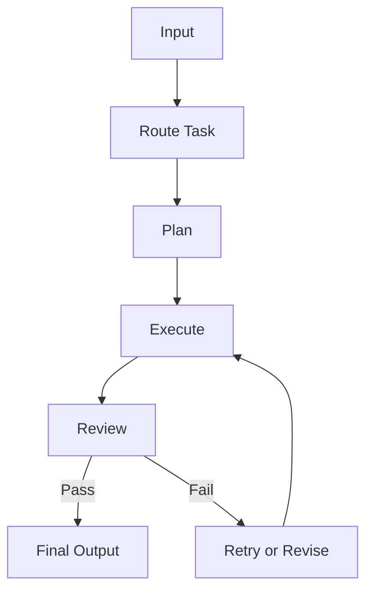

# Module 05 — Workflow Orchestration

[繁體中文](05-workflow-orchestration_zh.md)

## Goal

Learn how to control agent behavior with workflows instead of relying on one large prompt.

Workflows make agent systems more predictable, observable, and easier to debug.

---

## Mental Model

```text
Input → Route → Plan → Execute → Review → Final Output
```

---

## Core Concepts

### State

The current position of the workflow.

### Transition

The rule that moves the workflow from one state to another.

### Routing

Choosing the right workflow path based on the input.

### Retry

Repeating a failed step with corrected input or fallback behavior.

### Review

Checking whether the output meets the required quality standard.

---

## Architecture Diagram



---

## Hands-on Exercise

Design a workflow:

```text
Workflow name:
States:
Transitions:
Tools used:
Review criteria:
Retry policy:
Human approval needed:
```

---

## Checklist

You understand this module if you can:

- define workflow states
- design task routing
- add retry and fallback behavior
- separate planning, execution, and review
- identify where human approval is needed

---

## Common Mistakes

- Letting the model decide every step
- No retry path
- No review step
- No logs or traces
- Mixing all workflow logic into one prompt

---

## Deep Dive: Why Workflow Beats One Giant Prompt

Suppose an agent receives a support ticket. With one large prompt, the model may classify, research, draft, and review in one response. It may also skip steps while sounding confident.

The problem is not that the model cannot reason. The problem is that failures become invisible. If the result is wrong, was classification wrong? Was evidence missing? Did review fail? You cannot tell.

Workflow turns one blob of intelligence into observable steps.

### Black-box View

```text
Input: user task, workflow state, available actions
Output: final artifact after planned, executed, reviewed steps
Objective: make multi-step behavior observable, controllable, and recoverable
```

### Naive Failure

```text
Naive design:
Ask the model to solve the whole task in one response.

Failure:
- no intermediate artifacts
- no retry point
- no review gate
- no clear owner for each step
- hard to reproduce failure
```

### Mechanism

A basic workflow usually has:

1. Router
2. Planner
3. Executor
4. Reviewer
5. Retry or fallback
6. Finalizer

The reviewer must use a rubric. "Looks good" is not a review system.

### Runnable Checkpoint

```bash
python examples/05-multi-agent-workflow/main.py
```

Check that the output exposes the plan, review, and final draft.

### Evaluation Cases

| Case | Expected Behavior |
|---|---|
| happy path | pass review |
| missing required section | reviewer returns feedback |
| unsafe domain advice | route to safety fallback |
| tool failure | retry or explain failure |
| max rounds reached | stop with honest limitation |

---

## Outcome

After this module, you should be able to design controllable workflows for agents.

Next module: [Module 06 — Graph-based Agents](06-graph-based-agents.md)
