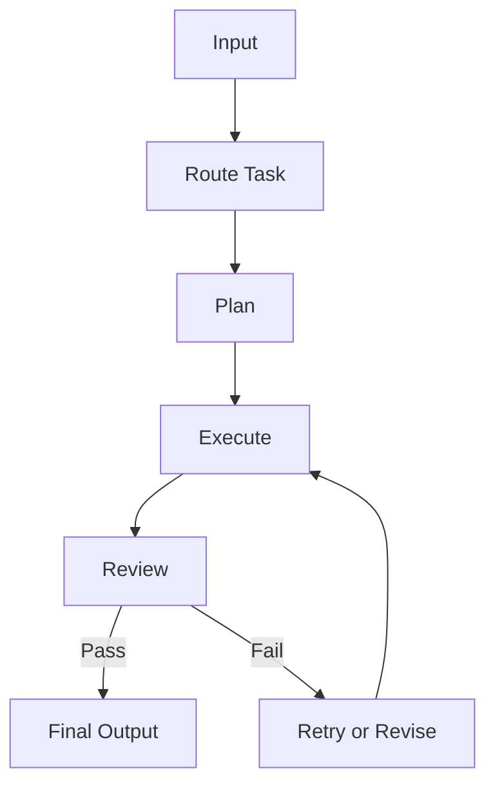

# Module 05 — Workflow Orchestration

[繁體中文](05-workflow-orchestration_zh.md)

## Goal

Learn how to control agent behavior with workflows instead of relying on one large prompt.

Workflows make agent systems more predictable, observable, and easier to debug.

---

## Mental Model

```text
Input → Route → Plan → Execute → Review → Final Output
```

---

## Core Concepts

### State

The current position of the workflow.

### Transition

The rule that moves the workflow from one state to another.

### Routing

Choosing the right workflow path based on the input.

### Retry

Repeating a failed step with corrected input or fallback behavior.

### Review

Checking whether the output meets the required quality standard.

---

## Architecture Diagram



---

## Hands-on Exercise

Design a workflow:

```text
Workflow name:
States:
Transitions:
Tools used:
Review criteria:
Retry policy:
Human approval needed:
```

---

## Checklist

You understand this module if you can:

- define workflow states
- design task routing
- add retry and fallback behavior
- separate planning, execution, and review
- identify where human approval is needed

---

## Common Mistakes

- Letting the model decide every step
- No retry path
- No review step
- No logs or traces
- Mixing all workflow logic into one prompt

---

## Outcome

After this module, you should be able to design controllable workflows for agents.

Next module: [Module 06 — Graph-based Agents](06-graph-based-agents.md)
