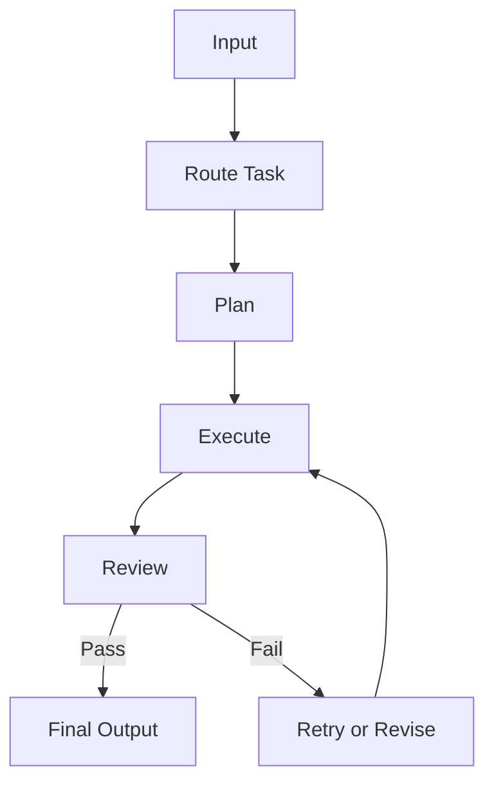

# Module 05 — Workflow Orchestration

[English](05-workflow-orchestration.md)

## 目標

學習如何用 workflow 控制 Agent 行為，而不是依賴一大段 prompt。

Workflow 能讓 Agent 系統更可預測、可觀測，也更容易 debug。

---

## 心智模型

```text
Input → Route → Plan → Execute → Review → Final Output
```

---

## 核心概念

### State

Workflow 目前所在的位置。

### Transition

讓 workflow 從一個 state 移動到另一個 state 的規則。

### Routing

根據輸入選擇正確 workflow 路徑。

### Retry

當步驟失敗時，用修正後的輸入或 fallback behavior 重試。

### Review

檢查輸出是否符合品質標準。

---

## 架構圖



---

## Hands-on Exercise

設計一個 workflow：

```text
Workflow name:
States:
Transitions:
Tools used:
Review criteria:
Retry policy:
Human approval needed:
```

---

## Checklist

如果你能做到以下事項，就代表理解本模組：

- 定義 workflow states
- 設計 task routing
- 加入 retry 與 fallback behavior
- 分離 planning、execution、review
- 判斷哪裡需要 human approval

---

## 常見錯誤

- 讓 model 決定每一步
- 沒有 retry path
- 沒有 review step
- 沒有 logs 或 traces
- 把所有 workflow logic 都塞進同一個 prompt

---

## Outcome

完成本模組後，你應該能為 Agent 設計可控 workflow。

下一個模組：[Module 06 — Graph-based Agents](06-graph-based-agents.md)
