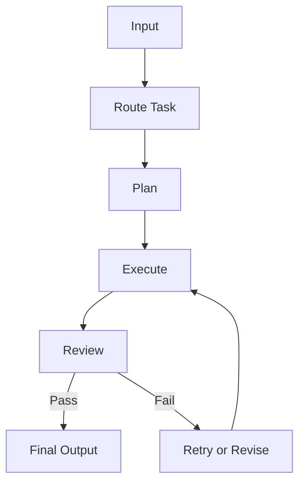

# Module 05 — Workflow Orchestration

[English](05-workflow-orchestration.md)

## 目標

學習如何用 workflow 控制 Agent 行為，而不是依賴一大段 prompt。

Workflow 能讓 Agent 系統更可預測、可觀測，也更容易 debug。

---

## 心智模型

```text
Input → Route → Plan → Execute → Review → Final Output
```

---

## 核心概念

### State

Workflow 目前所在的位置。

### Transition

讓 workflow 從一個 state 移動到另一個 state 的規則。

### Routing

根據輸入選擇正確 workflow 路徑。

### Retry

當步驟失敗時，用修正後的輸入或 fallback behavior 重試。

### Review

檢查輸出是否符合品質標準。

---

## 架構圖



---

## Hands-on Exercise

設計一個 workflow：

```text
Workflow name:
States:
Transitions:
Tools used:
Review criteria:
Retry policy:
Human approval needed:
```

---

## Checklist

如果你能做到以下事項，就代表理解本模組：

- 定義 workflow states
- 設計 task routing
- 加入 retry 與 fallback behavior
- 分離 planning、execution、review
- 判斷哪裡需要 human approval

---

## 常見錯誤

- 讓 model 決定每一步
- 沒有 retry path
- 沒有 review step
- 沒有 logs 或 traces
- 把所有 workflow logic 都塞進同一個 prompt

---

## Deep Dive：為什麼 Workflow 比「請模型自己規劃」可靠？

假設你叫一個 Agent：「幫我處理這張客訴 ticket。」如果你只有一段 prompt，模型可能會先分類、再查資料、再寫回覆，也可能直接寫一段聽起來很合理的回覆。你可能會想說，模型自己會想，這樣不是更彈性嗎？

彈性是有代價的。當結果錯了，你不知道是哪一步錯。是分類錯？資料沒查？風險沒判斷？還是 reviewer 沒擋？全部混在一段文字裡，就很難 debug。

Workflow 的目的，就是把「一坨聰明」拆成可觀測步驟。

一言以蔽之：Workflow 不是讓 Agent 變笨，而是讓 Agent 的自由度出現在該出現的地方。

### Black-box View

```text
Input: user task, workflow state, available actions
Output: final artifact after planned, executed, reviewed steps
Objective: make multi-step behavior observable, controllable, and recoverable
```

### Naive Failure

```text
Naive design:
Ask the model to solve the whole task in one response.

Failure:
- no intermediate artifacts
- no retry point
- no review gate
- no clear owner for each step
- hard to reproduce failure
```

### Mechanism

一個基本 workflow 通常包含：

1. Router：這是哪一類任務？
2. Planner：要做哪些步驟？
3. Executor：執行某一步並產生 artifact。
4. Reviewer：檢查 artifact 是否合格。
5. Retry / fallback：失敗時怎麼辦？
6. Finalizer：整理成使用者可讀輸出。

注意，reviewer 不應該只說「looks good」。它要有 rubric。比如是否包含 missing context、risk、next action。

### Runnable Checkpoint

```bash
python examples/05-multi-agent-workflow/main.py
```

檢查輸出是否有 Plan、Review、Final Draft。如果你看不到中間 artifact，這個 workflow 就還不夠可觀測。

### Evaluation Cases

| Case | Expected Behavior |
|---|---|
| happy path | pass review |
| missing required section | reviewer returns feedback |
| unsafe domain advice | route to safety fallback |
| tool failure | retry or explain failure |
| max rounds reached | stop with honest limitation |

### 常見誤解修正

誤解：Workflow 會限制模型能力。

修正：Workflow 限制的是混亂，不是能力。模型仍然可以在每個步驟裡做 reasoning。

誤解：Retry 越多越好。

修正：Retry 沒上限會變成 runaway loop。Production workflow 一定要有 max rounds。

---

## Outcome

完成本模組後，你應該能為 Agent 設計可控 workflow。

下一個模組：[Module 06 — Graph-based Agents](06-graph-based-agents.md)
