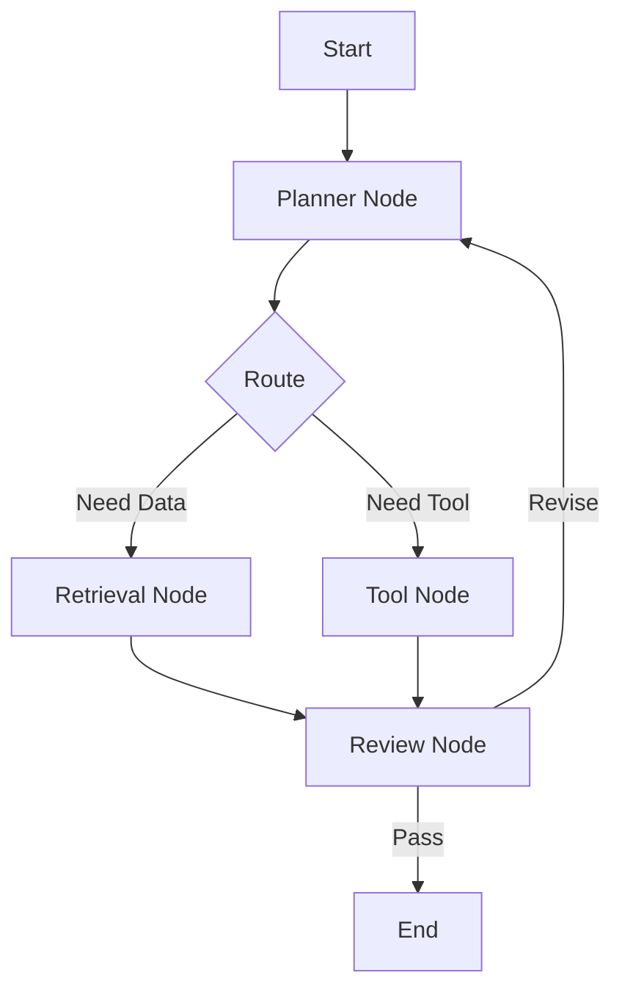

# Module 06 — Graph-based Agents

[繁體中文](06-graph-based-agents_zh.md)

## Goal

Learn how to model agent workflows as graphs and state machines.

Graph-based design helps developers build controllable, inspectable, and reusable agent workflows.

---

## Mental Model

```text
Node = step
Edge = transition
State = shared workflow data
```

---

## Core Concepts

### Node

A node represents one step in the workflow, such as planning, retrieval, tool use, or review.

### Edge

An edge defines how the workflow moves between nodes.

### State

State stores shared workflow data such as user input, intermediate outputs, tool results, and review status.

### Conditional Routing

The graph can choose different paths based on state.

### Checkpointing

Checkpointing allows the workflow to pause, resume, or recover.

---

## Architecture Diagram



---

## Hands-on Exercise

Design a graph workflow:

```text
Workflow goal:
Nodes:
Edges:
State fields:
Conditional routes:
Checkpoint strategy:
Failure behavior:
```

---

## Checklist

You understand this module if you can:

- explain nodes, edges, and state
- design conditional routing
- separate workflow state from model output
- explain why checkpointing matters
- convert a linear workflow into a graph

---

## Common Mistakes

- Making the graph too complex too early
- Storing unclear state
- No failure path
- No checkpoint strategy
- Treating graph design as visual decoration instead of control logic

---

## Deep Dive: What Does a Graph Add?

If a task is a straight line, a graph may be overkill. A summarizer can be input → summarize → output. Adding graph machinery there only adds noise.

Graphs become useful when the agent needs branches, retries, approvals, tool-error paths, or multiple terminal states. A graph makes "where do we go next?" explicit.

### Black-box View

```text
Input: current state, event, transition rules
Output: next state and updated artifact
Objective: make branching agent behavior explicit and testable
```

### Naive Failure

```text
Naive design:
Keep current step in plain text and ask the model what to do next.

Failure:
- hidden state
- inconsistent transitions
- missing failure path
- hard to test edge cases
```

### Mechanism

Graph-based agents use:

1. State
2. Node
3. Edge
4. Condition
5. Terminal state
6. Error state

Design the happy path and at least two failure paths before adding more nodes.

### Design Checkpoint

```text
START → classify → retrieve → answer → review → END

retrieve fail → ask clarification
review fail → revise or stop
```

### Evaluation Cases

| Case | Expected Transition |
|---|---|
| complete input | classify → execute → review → end |
| missing context | classify → ask_clarification |
| unsafe action | classify → approval_or_refusal |
| tool error | execute → retry_or_fallback |
| review fail | review → revise |

---

## Outcome

After this module, you should be able to design graph-based agent workflows.

Next module: [Module 07 — Multi-Agent Systems](07-multi-agent-systems.md)
