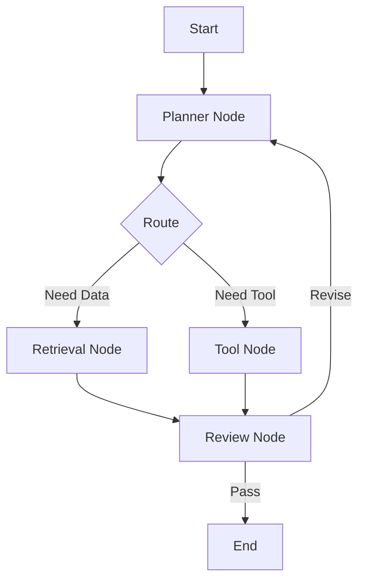

# Module 06 — Graph-based Agents

[English](06-graph-based-agents.md)

## 目標

學習如何將 Agent Workflow 建模成 graph 與 state machine。

Graph-based design 能幫助開發者建立可控、可檢查、可重用的 Agent workflow。

---

## 心智模型

```text
Node = step
Edge = transition
State = shared workflow data
```

---

## 核心概念

### Node

Node 代表 workflow 中的一個步驟，例如 planning、retrieval、tool use 或 review。

### Edge

Edge 定義 workflow 如何在 nodes 之間移動。

### State

State 儲存共享 workflow data，例如 user input、intermediate outputs、tool results 與 review status。

### Conditional Routing

Graph 可以根據 state 選擇不同路徑。

### Checkpointing

Checkpointing 讓 workflow 可以暫停、恢復或復原。

---

## 架構圖



---

## Hands-on Exercise

設計一個 graph workflow：

```text
Workflow goal:
Nodes:
Edges:
State fields:
Conditional routes:
Checkpoint strategy:
Failure behavior:
```

---

## Checklist

如果你能做到以下事項，就代表理解本模組：

- 解釋 nodes、edges 與 state
- 設計 conditional routing
- 區分 workflow state 與 model output
- 解釋為什麼 checkpointing 重要
- 將 linear workflow 轉成 graph

---

## 常見錯誤

- 太早把 graph 做得過度複雜
- state 定義不清楚
- 沒有 failure path
- 沒有 checkpoint strategy
- 把 graph design 當成視覺裝飾，而不是 control logic

---

## Deep Dive：Graph Agent 到底多了什麼？

Workflow 已經可以 plan、execute、review，為什麼還要 graph？這個問題很好。

如果流程永遠是直線，graph 可能是 overkill。比如 summarizer：input → summarize → output，就結束了。你硬加 graph，只是讓簡單事情變複雜而已。

但如果任務有分支、重試、人工審核、工具失敗、不同路由，那 graph 就很有用。Graph 其實就是把「下一步去哪裡」寫清楚。

### Black-box View

```text
Input: current state, event, transition rules
Output: next state and updated artifact
Objective: make branching agent behavior explicit and testable
```

### Naive Failure

```text
Naive design:
Keep current step in plain text and ask the model what to do next.

Failure:
- hidden state
- inconsistent transitions
- missing failure path
- hard to test edge cases
```

### Mechanism

Graph-based agent 的核心元件：

1. State：目前流程資料與位置。
2. Node：一個可執行步驟。
3. Edge：從一個 node 到另一個 node 的 transition。
4. Condition：什麼情況走哪條 edge。
5. Terminal state：何時停止。
6. Error state：失敗怎麼處理。

你可以想像它像捷運圖。每一站是 node，線是 edge，轉乘規則是 condition。類比到這裡就好，因為真實 agent graph 還會帶資料、錯誤與權限。

### Design Checkpoint

為任務畫出：

```text
START → classify → retrieve → answer → review → END
```

再加上兩條 failure path：

```text
retrieve fail → ask clarification
review fail → revise or stop
```

如果你的 graph 只有 happy path，那它還不是 production-ready graph。

### Evaluation Cases

| Case | Expected Transition |
|---|---|
| complete input | classify → execute → review → end |
| missing context | classify → ask_clarification |
| unsafe action | classify → approval_or_refusal |
| tool error | execute → retry_or_fallback |
| review fail | review → revise |

### 常見誤解修正

誤解：Graph 越大越工程化。

修正：Graph 越大，維護成本越高。只有當 branching 和 failure paths 真的需要被顯式管理時，才值得用 graph。

---

## Outcome

完成本模組後，你應該能設計 graph-based agent workflows。

下一個模組：[Module 07 — Multi-Agent Systems](07-multi-agent-systems.md)
