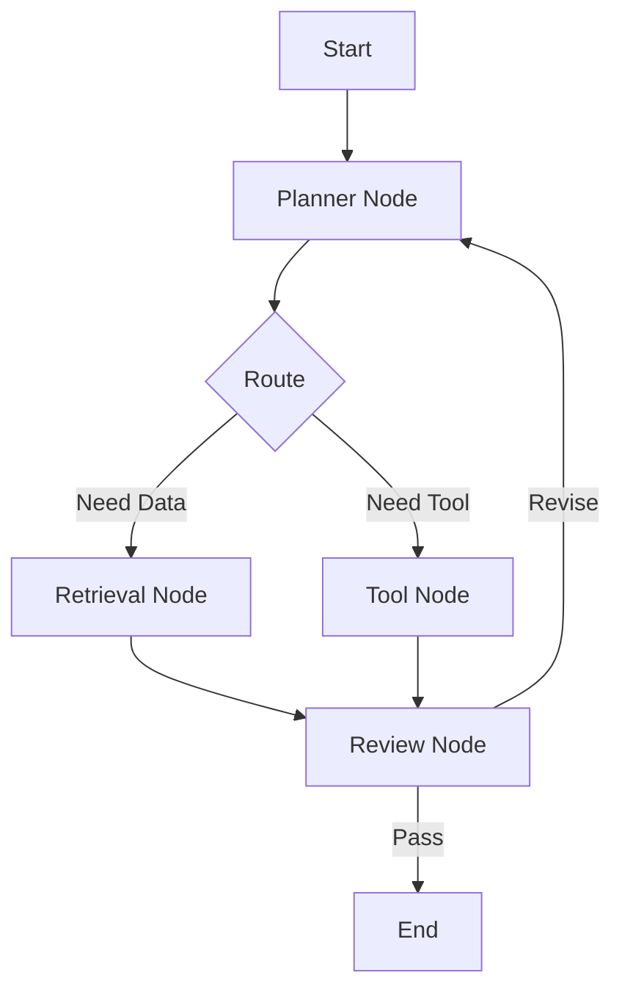

# Module 06 — Graph-based Agents

[English](06-graph-based-agents.md)

## 目標

學習如何將 Agent Workflow 建模成 graph 與 state machine。

Graph-based design 能幫助開發者建立可控、可檢查、可重用的 Agent workflow。

---

## 心智模型

```text
Node = step
Edge = transition
State = shared workflow data
```

---

## 核心概念

### Node

Node 代表 workflow 中的一個步驟，例如 planning、retrieval、tool use 或 review。

### Edge

Edge 定義 workflow 如何在 nodes 之間移動。

### State

State 儲存共享 workflow data，例如 user input、intermediate outputs、tool results 與 review status。

### Conditional Routing

Graph 可以根據 state 選擇不同路徑。

### Checkpointing

Checkpointing 讓 workflow 可以暫停、恢復或復原。

---

## 架構圖



---

## Hands-on Exercise

設計一個 graph workflow：

```text
Workflow goal:
Nodes:
Edges:
State fields:
Conditional routes:
Checkpoint strategy:
Failure behavior:
```

---

## Checklist

如果你能做到以下事項，就代表理解本模組：

- 解釋 nodes、edges 與 state
- 設計 conditional routing
- 區分 workflow state 與 model output
- 解釋為什麼 checkpointing 重要
- 將 linear workflow 轉成 graph

---

## 常見錯誤

- 太早把 graph 做得過度複雜
- state 定義不清楚
- 沒有 failure path
- 沒有 checkpoint strategy
- 把 graph design 當成視覺裝飾，而不是 control logic

---

## Outcome

完成本模組後，你應該能設計 graph-based agent workflows。

下一個模組：[Module 07 — Multi-Agent Systems](07-multi-agent-systems.md)
