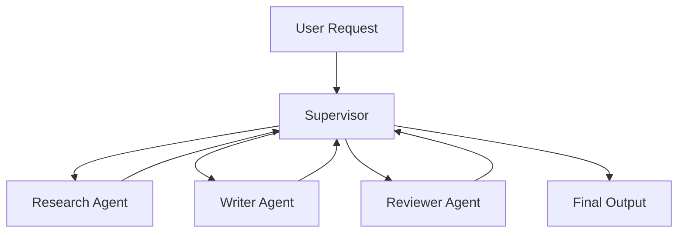

# Module 07 — Multi-Agent Systems

[繁體中文](07-multi-agent-systems_zh.md)

## Goal

Learn how to coordinate multiple specialized agents.

Multi-agent systems are useful when a task benefits from role separation, independent review, or parallel work.

---

## Mental Model

```text
Supervisor → Specialist Agents → Review → Final Output
```

---

## Core Concepts

### Supervisor

Coordinates task decomposition, routing, and final synthesis.

### Specialist Agent

Handles one responsibility or domain.

### Structured Handoff

Agents should pass structured messages rather than vague text.

### Conflict Resolution

The system needs rules for resolving disagreement.

### Final Authority

One component should own the final answer.

---

## Architecture Diagram



---

## Hands-on Exercise

Design a multi-agent team:

```text
Team goal:
Supervisor role:
Agents:
Agent responsibilities:
Handoff format:
Conflict resolution:
Final authority:
```

---

## Checklist

You understand this module if you can:

- explain when multiple agents are useful
- define clear agent roles
- design structured handoffs
- assign tool access by role
- define final authority

---

## Common Mistakes

- Creating too many agents
- Giving agents overlapping roles
- No structured handoff
- No final decision owner
- Using multi-agent design when one workflow is enough

---

## Deep Dive: Multi-Agent Is Not "More Models Equals Smarter"

The tempting idea is simple: if one agent is useful, five agents must be better. Add a planner, researcher, writer, reviewer, and critic. It looks impressive.

But activity is not coordination. Without roles, handoffs, shared state rules, and final authority, multiple agents can duplicate work, disagree silently, or produce an answer nobody owns.

In one sentence: multi-agent design is about coordination contracts, not agent count.

### Black-box View

```text
Input: user task, agent roles, shared state
Output: integrated result after specialist contributions and review
Objective: use specialization without losing control
```

### Naive Failure

```text
Naive design:
Ask several agents to discuss and produce an answer.

Failure:
- duplicated work
- inconsistent assumptions
- no final owner
- conflict unresolved
- shared memory polluted
```

### Mechanism

A reliable multi-agent system defines:

1. Supervisor
2. Specialist roles
3. Artifact contract
4. Shared state
5. Conflict policy
6. Reviewer or evaluator

### Runnable Checkpoint

```bash
python examples/06-agent-colony/main.py
```

Check routing, shared memory, evaluator output, and domain boundary.

### Evaluation Cases

| Case | Expected Behavior |
|---|---|
| finance task | route to finance specialist |
| healthcare task | route to healthcare specialist |
| unknown task | ask clarification or route to general |
| conflicting specialists | supervisor resolves with reason |
| high-risk domain | add disclaimer and human review gate |

---

## Outcome

After this module, you should be able to design a clear multi-agent workflow.

Next module: [Module 08 — Human-in-the-loop](08-human-in-the-loop.md)
