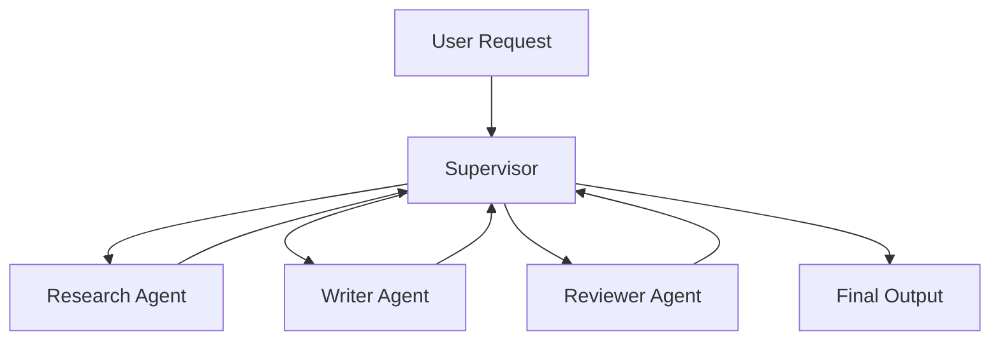

# Module 07 — Multi-Agent Systems

[繁體中文](07-multi-agent-systems_zh.md)

## Goal

Learn how to coordinate multiple specialized agents.

Multi-agent systems are useful when a task benefits from role separation, independent review, or parallel work.

---

## Mental Model

```text
Supervisor → Specialist Agents → Review → Final Output
```

---

## Core Concepts

### Supervisor

Coordinates task decomposition, routing, and final synthesis.

### Specialist Agent

Handles one responsibility or domain.

### Structured Handoff

Agents should pass structured messages rather than vague text.

### Conflict Resolution

The system needs rules for resolving disagreement.

### Final Authority

One component should own the final answer.

---

## Architecture Diagram



---

## Hands-on Exercise

Design a multi-agent team:

```text
Team goal:
Supervisor role:
Agents:
Agent responsibilities:
Handoff format:
Conflict resolution:
Final authority:
```

---

## Checklist

You understand this module if you can:

- explain when multiple agents are useful
- define clear agent roles
- design structured handoffs
- assign tool access by role
- define final authority

---

## Common Mistakes

- Creating too many agents
- Giving agents overlapping roles
- No structured handoff
- No final decision owner
- Using multi-agent design when one workflow is enough

---

## Outcome

After this module, you should be able to design a clear multi-agent workflow.

Next module: [Module 08 — Human-in-the-loop](08-human-in-the-loop.md)
