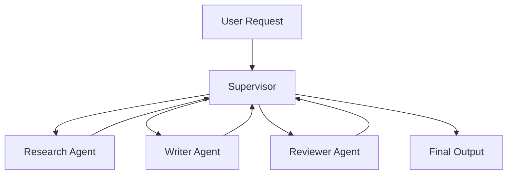

# Module 07 — Multi-Agent Systems

[English](07-multi-agent-systems.md)

## 目標

學習如何協調多個專門化 Agent。

當任務需要角色分工、獨立審查或平行處理時，Multi-Agent Systems 會很有價值。

---

## 心智模型

```text
Supervisor → Specialist Agents → Review → Final Output
```

---

## 核心概念

### Supervisor

負責任務拆解、路由與最終整合。

### Specialist Agent

負責單一職責或領域。

### Structured Handoff

Agent 之間應傳遞結構化訊息，而不是模糊文字。

### Conflict Resolution

系統需要規則處理 Agent 之間的分歧。

### Final Authority

必須有一個組件負責最終答案。

---

## 架構圖



---

## Hands-on Exercise

設計一個 multi-agent team：

```text
Team goal:
Supervisor role:
Agents:
Agent responsibilities:
Handoff format:
Conflict resolution:
Final authority:
```

---

## Checklist

如果你能做到以下事項，就代表理解本模組：

- 解釋什麼時候需要 multiple agents
- 定義清楚的 agent roles
- 設計 structured handoffs
- 依角色分配 tool access
- 定義 final authority

---

## 常見錯誤

- 建立太多 Agent
- Agent 角色重疊
- 沒有 structured handoff
- 沒有 final decision owner
- 一個 workflow 就能解決，卻硬用 multi-agent design

---

## Outcome

完成本模組後，你應該能設計清楚的 multi-agent workflow。

下一個模組：[Module 08 — Human-in-the-loop](08-human-in-the-loop.md)
