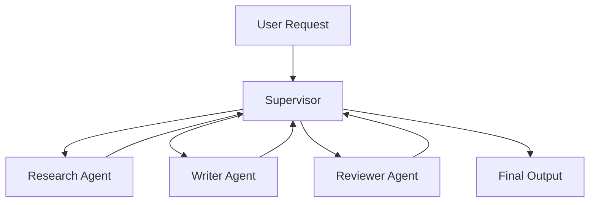

# Module 07 — Multi-Agent Systems

[English](07-multi-agent-systems.md)

## 目標

學習如何協調多個專門化 Agent。

當任務需要角色分工、獨立審查或平行處理時，Multi-Agent Systems 會很有價值。

---

## 心智模型

```text
Supervisor → Specialist Agents → Review → Final Output
```

---

## 核心概念

### Supervisor

負責任務拆解、路由與最終整合。

### Specialist Agent

負責單一職責或領域。

### Structured Handoff

Agent 之間應傳遞結構化訊息，而不是模糊文字。

### Conflict Resolution

系統需要規則處理 Agent 之間的分歧。

### Final Authority

必須有一個組件負責最終答案。

---

## 架構圖



---

## Hands-on Exercise

設計一個 multi-agent team：

```text
Team goal:
Supervisor role:
Agents:
Agent responsibilities:
Handoff format:
Conflict resolution:
Final authority:
```

---

## Checklist

如果你能做到以下事項，就代表理解本模組：

- 解釋什麼時候需要 multiple agents
- 定義清楚的 agent roles
- 設計 structured handoffs
- 依角色分配 tool access
- 定義 final authority

---

## 常見錯誤

- 建立太多 Agent
- Agent 角色重疊
- 沒有 structured handoff
- 沒有 final decision owner
- 一個 workflow 就能解決，卻硬用 multi-agent design

---

## Deep Dive：Multi-Agent 不是「多開幾個模型」

很多人第一次看到 multi-agent，會有一個很自然的想法：一個 Agent 不夠，那開五個不就更聰明？比如 planner、researcher、writer、reviewer、critic 全部開起來。看起來很熱鬧。

但熱鬧不等於可靠。

如果沒有分工、交接、驗收，很多 agent 只是在同一個房間同時講話。你沒有看錯，這就是很多 multi-agent demo 的本質。很像會議開很久，但沒有人寫 action item。

一言以蔽之：Multi-agent 的重點不是 agent 數量，而是 coordination contract。

### Black-box View

```text
Input: user task, agent roles, shared state
Output: integrated result after specialist contributions and review
Objective: use specialization without losing control
```

### Naive Failure

```text
Naive design:
Ask several agents to discuss and produce an answer.

Failure:
- duplicated work
- inconsistent assumptions
- no final owner
- conflict unresolved
- shared memory polluted
```

### Mechanism

可靠 multi-agent system 至少要定義：

1. Supervisor：誰決定路由？
2. Specialist roles：每個 agent 負責什麼？
3. Artifact contract：每個 agent 交什麼格式？
4. Shared state：哪些資訊共用？
5. Conflict policy：意見衝突誰決定？
6. Reviewer / evaluator：誰驗收？

### Runnable Checkpoint

```bash
python examples/06-agent-colony/main.py
```

檢查 supervisor routing 是否可解釋、shared memory 記了什麼、evaluator 是否真的檢查 output、domain disclaimer 是否存在。

### Evaluation Cases

| Case | Expected Behavior |
|---|---|
| finance task | route to finance specialist |
| healthcare task | route to healthcare specialist |
| unknown task | ask clarification or route to general |
| conflicting specialists | supervisor resolves with reason |
| high-risk domain | add disclaimer and human review gate |

### 常見誤解修正

誤解：加 reviewer agent 就一定安全。

修正：Reviewer 沒 rubric，就只是另一個會講話的模型。Reviewer 必須有明確 pass/fail criteria。

誤解：Shared memory 讓 agents 更合作。

修正：沒有 write policy 的 shared memory 會變成共享垃圾桶。大家都能丟，最後沒人知道哪個可信。

---

## Outcome

完成本模組後，你應該能設計清楚的 multi-agent workflow。

下一個模組：[Module 08 — Human-in-the-loop](08-human-in-the-loop.md)
