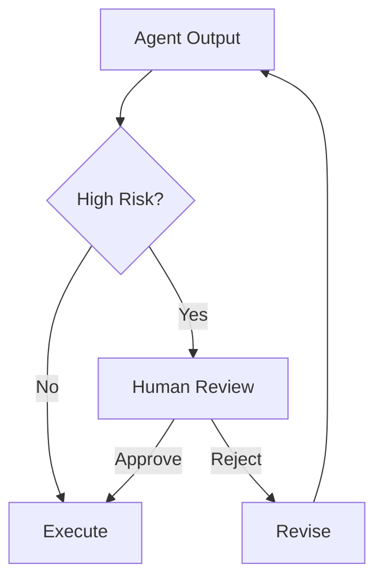

# Module 08 — Human-in-the-loop

[繁體中文](08-human-in-the-loop_zh.md)

## Goal

Learn how to add human approval, feedback, and escalation to agent systems.

Human-in-the-loop design makes agents safer and more practical for real workflows.

---

## Mental Model

```text
Agent proposes → Human reviews → System executes or revises
```

---

## Core Concepts

### Approval Gate

A step where human confirmation is required before action.

### Feedback Loop

A mechanism for humans to correct or improve agent output.

### Escalation

A path for routing uncertain or risky cases to a human.

### Review Queue

A structured queue for pending human decisions.

### Audit Trail

A record of what the agent proposed and what the human approved.

---

## Architecture Diagram



---

## Hands-on Exercise

Design an approval workflow:

```text
Action:
Risk level:
Approval required:
Reviewer role:
Review criteria:
Audit fields:
Fallback behavior:
```

---

## Checklist

You understand this module if you can:

- identify high-risk actions
- design approval gates
- collect human feedback
- define escalation rules
- create an audit trail

---

## Common Mistakes

- Making everything fully autonomous
- Asking for approval too often
- No audit record
- No escalation path
- Treating human review as an afterthought

---

## Outcome

After this module, you should be able to design agent workflows with human oversight.

Next module: [Module 09 — Production Agent Systems](09-production-agent-systems.md)
