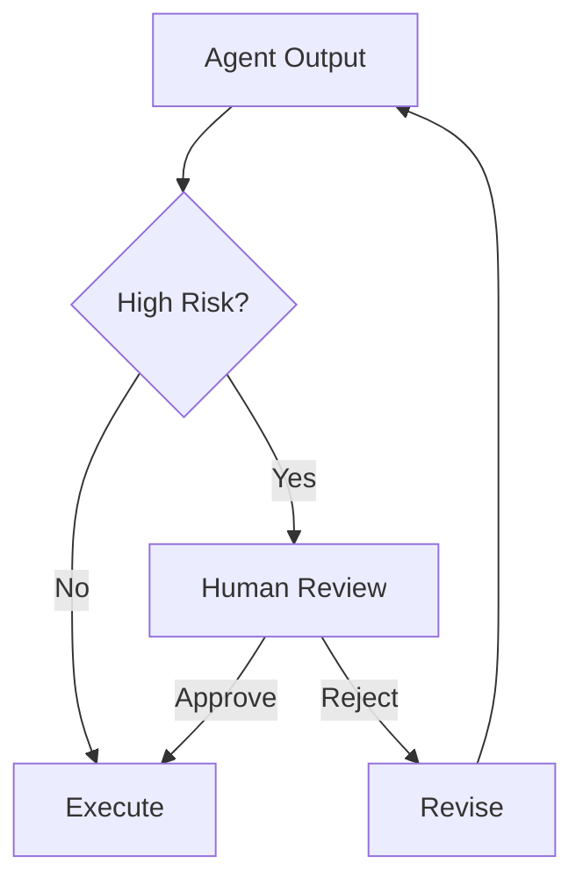

# Module 08 — Human-in-the-loop

[繁體中文](08-human-in-the-loop_zh.md)

## Goal

Learn how to add human approval, feedback, and escalation to agent systems.

Human-in-the-loop design makes agents safer and more practical for real workflows.

---

## Mental Model

```text
Agent proposes → Human reviews → System executes or revises
```

---

## Core Concepts

### Approval Gate

A step where human confirmation is required before action.

### Feedback Loop

A mechanism for humans to correct or improve agent output.

### Escalation

A path for routing uncertain or risky cases to a human.

### Review Queue

A structured queue for pending human decisions.

### Audit Trail

A record of what the agent proposed and what the human approved.

---

## Architecture Diagram



---

## Hands-on Exercise

Design an approval workflow:

```text
Action:
Risk level:
Approval required:
Reviewer role:
Review criteria:
Audit fields:
Fallback behavior:
```

---

## Checklist

You understand this module if you can:

- identify high-risk actions
- design approval gates
- collect human feedback
- define escalation rules
- create an audit trail

---

## Common Mistakes

- Making everything fully autonomous
- Asking for approval too often
- No audit record
- No escalation path
- Treating human review as an afterthought

---

## Deep Dive: Human-in-the-loop Is Safety Design

Many agent builders treat full autonomy as the goal. That sounds exciting, but it is not always the right goal.

If an agent summarizes a ticket, autonomy is fine. If it deletes production records, sends external emails, changes permissions, or gives high-impact advice, full autonomy becomes dangerous.

Human-in-the-loop is not a sign that the agent is weak. It is a control layer for high-impact decisions.

### Black-box View

```text
Input: proposed action, risk level, context, policy
Output: approved action, rejected action, escalation, or refusal
Objective: keep high-impact decisions under human control
```

### Naive Failure

```text
Naive design:
Let the agent execute every tool call once it decides the action is useful.

Failure:
- irreversible actions happen without review
- no audit trail
- unclear responsibility
- human sees the mistake only after damage is done
```

### Mechanism

A human approval gate needs:

1. Risk classifier
2. Approval request schema
3. Reviewer role
4. Timeout behavior
5. Audit log
6. Refusal policy

### Approval Request Schema

```json
{
  "action": "delete_customer_records",
  "arguments": {"account_id": "1842"},
  "risk_level": "critical",
  "reason": "User requested deletion",
  "expected_effect": "Production customer records will be deleted",
  "rollback_plan": "Restore from backup if available",
  "reviewer_role": "security_and_data_ops"
}
```

### Evaluation Cases

| Case | Expected Behavior |
|---|---|
| read-only summary | no approval needed |
| send email | approval required |
| delete production data | critical approval or refusal |
| medical treatment instruction | refusal/escalation |
| missing approval context | ask for required fields |

---

## Outcome

After this module, you should be able to design agent workflows with human oversight.

Next module: [Module 09 — Production Agent Systems](09-production-agent-systems.md)
