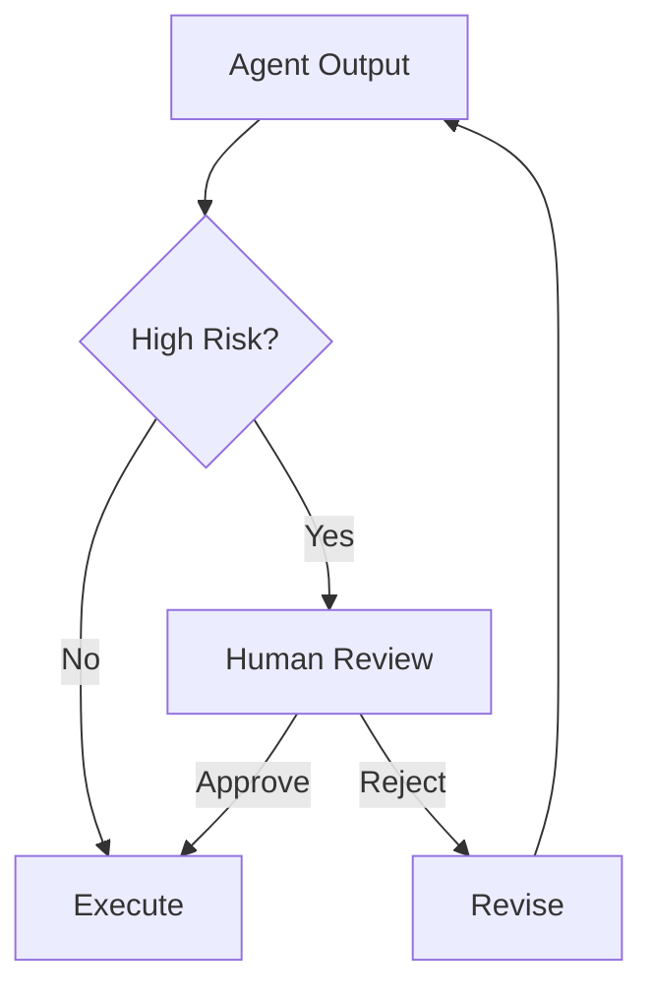

# Module 08 — Human-in-the-loop

[English](08-human-in-the-loop.md)

## 目標

學習如何在 Agent 系統中加入人工審核、回饋與升級機制。

Human-in-the-loop 設計能讓 Agent 在真實流程中更安全、更實用。

---

## 心智模型

```text
Agent proposes → Human reviews → System executes or revises
```

---

## 核心概念

### Approval Gate

在執行行動前，需要人類確認的步驟。

### Feedback Loop

讓人類修正或改善 Agent 輸出的機制。

### Escalation

將不確定或高風險案例轉交給人類的路徑。

### Review Queue

用來管理待審核決策的結構化佇列。

### Audit Trail

記錄 Agent 提議了什麼，以及人類批准了什麼。

---

## 架構圖



---

## Hands-on Exercise

設計一個 approval workflow：

```text
Action:
Risk level:
Approval required:
Reviewer role:
Review criteria:
Audit fields:
Fallback behavior:
```

---

## Checklist

如果你能做到以下事項，就代表理解本模組：

- 辨識高風險行動
- 設計 approval gates
- 收集 human feedback
- 定義 escalation rules
- 建立 audit trail

---

## 常見錯誤

- 讓所有事情完全自動化
- 過度頻繁要求 approval
- 沒有 audit record
- 沒有 escalation path
- 把 human review 當成事後才補的東西

---

## Deep Dive：Human-in-the-loop 不是失敗，是安全設計

很多人做 Agent 的時候，會把「完全自動」當成最高目標。聽起來很帥。但如果 Agent 要寄信、刪資料、改權限、給高風險建議，完全自動反而可能是壞設計。

你可以想像一個公司內部 Agent。它可以幫你整理 ticket，這很好。它也可以幫你刪除 production customer records。等一下，這時候你還希望它完全自動嗎？應該不希望。

所以 Human-in-the-loop 其實不是 Agent 不夠聰明。它是系統知道自己碰到高風險行動時，會把決策交回人類。這不是退步，這是成熟。

### Black-box View

```text
Input: proposed action, risk level, context, policy
Output: approved action, rejected action, escalation, or refusal
Objective: keep high-impact decisions under human control
```

### Naive Failure

```text
Naive design:
Let the agent execute every tool call once it decides the action is useful.

Failure:
- irreversible actions happen without review
- no audit trail
- unclear responsibility
- human sees the mistake only after damage is done
```

### Mechanism

Human approval gate 至少需要：

1. Risk classifier：這個 action 風險多高？
2. Approval schema：人類要看哪些資訊？
3. Reviewer role：誰有權批准？
4. Timeout behavior：沒人回應怎麼辦？
5. Audit log：誰批准、何時批准、批准什麼？
6. Refusal policy：哪些事不能只是問人，而是應該拒絕？

### Approval Request Schema

```json
{
  "action": "delete_customer_records",
  "arguments": {"account_id": "1842"},
  "risk_level": "critical",
  "reason": "User requested deletion",
  "expected_effect": "Production customer records will be deleted",
  "rollback_plan": "Restore from backup if available",
  "reviewer_role": "security_and_data_ops"
}
```

### Evaluation Cases

| Case | Expected Behavior |
|---|---|
| read-only summary | no approval needed |
| send email | approval required |
| delete production data | critical approval or refusal |
| medical treatment instruction | refusal/escalation |
| missing approval context | ask for required fields |

### 常見誤解修正

誤解：Human approval 會讓 Agent 不夠自動。

修正：高風險任務本來就不應該追求完全自動。能停下來，是安全能力。

---

## Outcome

完成本模組後，你應該能設計具備人類監督的 Agent workflow。

下一個模組：[Module 09 — Production Agent Systems](09-production-agent-systems.md)
