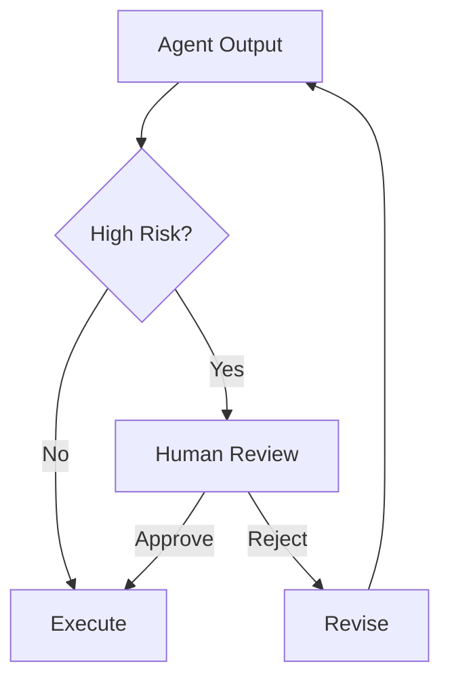

# Module 08 — Human-in-the-loop

[English](08-human-in-the-loop.md)

## 目標

學習如何在 Agent 系統中加入人工審核、回饋與升級機制。

Human-in-the-loop 設計能讓 Agent 在真實流程中更安全、更實用。

---

## 心智模型

```text
Agent proposes → Human reviews → System executes or revises
```

---

## 核心概念

### Approval Gate

在執行行動前，需要人類確認的步驟。

### Feedback Loop

讓人類修正或改善 Agent 輸出的機制。

### Escalation

將不確定或高風險案例轉交給人類的路徑。

### Review Queue

用來管理待審核決策的結構化佇列。

### Audit Trail

記錄 Agent 提議了什麼，以及人類批准了什麼。

---

## 架構圖



---

## Hands-on Exercise

設計一個 approval workflow：

```text
Action:
Risk level:
Approval required:
Reviewer role:
Review criteria:
Audit fields:
Fallback behavior:
```

---

## Checklist

如果你能做到以下事項，就代表理解本模組：

- 辨識高風險行動
- 設計 approval gates
- 收集 human feedback
- 定義 escalation rules
- 建立 audit trail

---

## 常見錯誤

- 讓所有事情完全自動化
- 過度頻繁要求 approval
- 沒有 audit record
- 沒有 escalation path
- 把 human review 當成事後才補的東西

---

## Outcome

完成本模組後，你應該能設計具備人類監督的 Agent workflow。

下一個模組：[Module 09 — Production Agent Systems](09-production-agent-systems.md)
