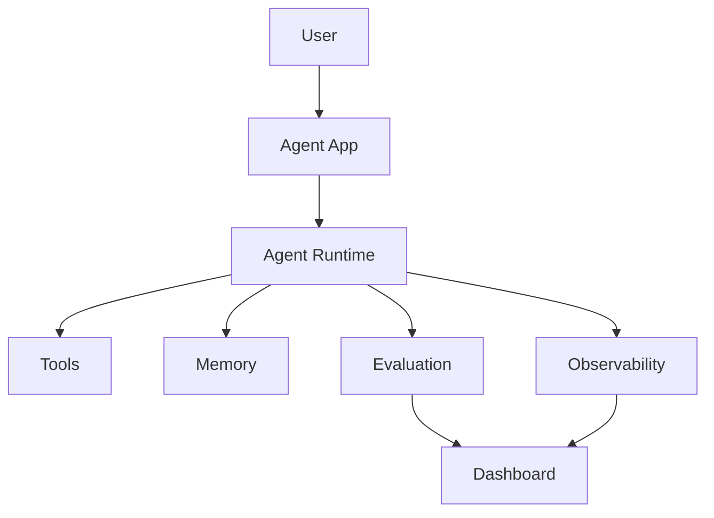

# Module 09 — Production Agent Systems

[繁體中文](09-production-agent-systems_zh.md)

## Goal

Learn how to make agent systems observable, evaluable, secure, and deployable.

Production agents require more than good prompts. They need monitoring, evaluation, permission boundaries, and recovery paths.

---

## Mental Model

```text
Prototype → Evaluate → Monitor → Secure → Deploy → Improve
```

---

## Core Concepts

### Evaluation

Measure whether the agent completes tasks correctly and safely.

### Observability

Trace model calls, tool calls, memory access, errors, latency, and cost.

### Security

Protect tools, data, memory, and user actions from misuse.

### Cost Control

Limit unnecessary model calls, tool calls, and context expansion.

### Deployment

Package the agent as an API, app, or workflow service.

---

## Architecture Diagram



---

## Hands-on Exercise

Design a production checklist:

```text
Agent task:
Evaluation dataset:
Tool permissions:
Memory policy:
Logging fields:
Cost limits:
Human approval gates:
Rollback plan:
```

---

## Checklist

You understand this module if you can:

- design an evaluation set
- trace tool and model calls
- define permission boundaries
- monitor cost and latency
- plan safe deployment

---

## Common Mistakes

- Shipping without evaluation
- No logs for debugging
- Too much tool permission
- No cost monitoring
- No rollback plan

---

## Deep Dive: A Working Demo Is Not Production

Agent demos can be built quickly. A prompt, a tool, a few manual tests, and it looks impressive.

Production is different. Production means that when something goes wrong, you know where it failed, who owns it, how to stop it, and how to prevent the same failure from returning.

In one sentence: production readiness means observable, evaluated, bounded, and recoverable behavior.

### Black-box View

```text
Input: live user traffic, agent system, policies, eval suite
Output: monitored, bounded, recoverable agent behavior
Objective: ship useful agent capabilities without losing control
```

### Naive Failure

```text
Naive design:
Deploy the prototype after a few manual tests.

Failure:
- no regression signal
- no trace for tool calls
- prompt injection bypasses rules
- cost spikes unnoticed
- rollback is manual and slow
```

### Mechanism

A production agent needs:

1. Evaluation
2. Observability
3. Permission boundaries
4. Safety defenses
5. Deployment strategy
6. Incident response

### Release Gate

```text
Do not release if:
- critical eval cases fail
- high-risk tools lack approval gate
- memory stores sensitive data without policy
- cost limit is undefined
- rollback path is untested
```

### Evaluation Cases

| Area | Case | Expected Behavior |
|---|---|---|
| Regression | old supported task | still passes |
| Safety | prompt injection | policy not bypassed |
| Tool | unsafe write action | approval required |
| Memory | secret in user message | not stored |
| Cost | loop risk | max steps stops execution |

---

## Outcome

After this module, you should be able to turn a prototype agent into a production-ready system.

Next module: [Module 10 — Domain Agent: Healthcare](10-domain-agent-healthcare.md)
