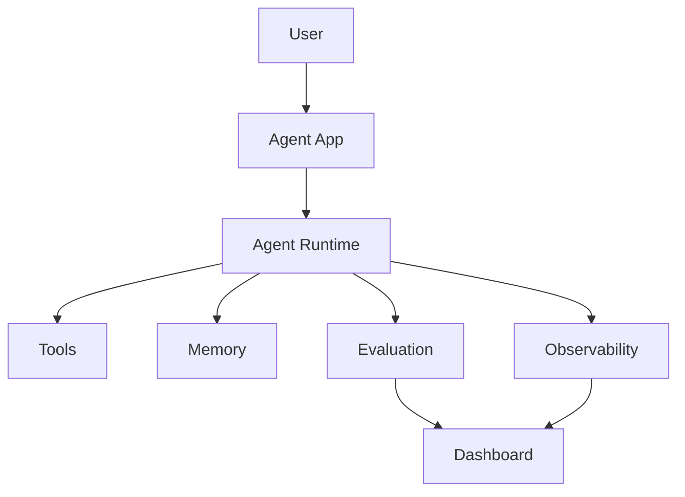

# Module 09 — Production Agent Systems

[繁體中文](09-production-agent-systems_zh.md)

## Goal

Learn how to make agent systems observable, evaluable, secure, and deployable.

Production agents require more than good prompts. They need monitoring, evaluation, permission boundaries, and recovery paths.

---

## Mental Model

```text
Prototype → Evaluate → Monitor → Secure → Deploy → Improve
```

---

## Core Concepts

### Evaluation

Measure whether the agent completes tasks correctly and safely.

### Observability

Trace model calls, tool calls, memory access, errors, latency, and cost.

### Security

Protect tools, data, memory, and user actions from misuse.

### Cost Control

Limit unnecessary model calls, tool calls, and context expansion.

### Deployment

Package the agent as an API, app, or workflow service.

---

## Architecture Diagram



---

## Hands-on Exercise

Design a production checklist:

```text
Agent task:
Evaluation dataset:
Tool permissions:
Memory policy:
Logging fields:
Cost limits:
Human approval gates:
Rollback plan:
```

---

## Checklist

You understand this module if you can:

- design an evaluation set
- trace tool and model calls
- define permission boundaries
- monitor cost and latency
- plan safe deployment

---

## Common Mistakes

- Shipping without evaluation
- No logs for debugging
- Too much tool permission
- No cost monitoring
- No rollback plan

---

## Outcome

After this module, you should be able to turn a prototype agent into a production-ready system.

Next module: [Module 10 — Domain Agent: Healthcare](10-domain-agent-healthcare.md)
