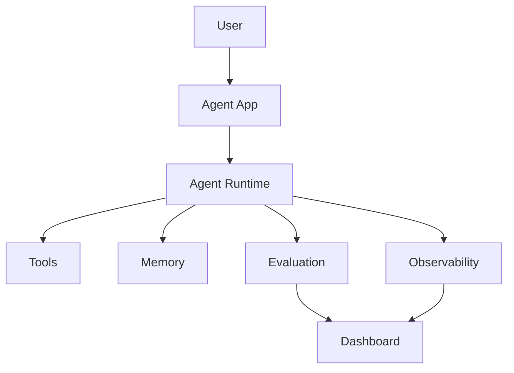

# Module 09 — Production Agent Systems

[English](09-production-agent-systems.md)

## 目標

學習如何讓 Agent 系統具備可觀測、可評估、安全與可部署性。

Production Agent 需要的不只是好 prompt，而是 monitoring、evaluation、permission boundaries 與 recovery paths。

---

## 心智模型

```text
Prototype → Evaluate → Monitor → Secure → Deploy → Improve
```

---

## 核心概念

### Evaluation

衡量 Agent 是否正確且安全地完成任務。

### Observability

追蹤 model calls、tool calls、memory access、errors、latency 與 cost。

### Security

保護 tools、data、memory 與 user actions，避免誤用或濫用。

### Cost Control

限制不必要的 model calls、tool calls 與 context expansion。

### Deployment

將 Agent 包裝成 API、app 或 workflow service。

---

## 架構圖



---

## Hands-on Exercise

設計 production checklist：

```text
Agent task:
Evaluation dataset:
Tool permissions:
Memory policy:
Logging fields:
Cost limits:
Human approval gates:
Rollback plan:
```

---

## Checklist

如果你能做到以下事項，就代表理解本模組：

- 設計 evaluation set
- trace tool and model calls
- 定義 permission boundaries
- 監控 cost and latency
- 規劃 safe deployment

---

## 常見錯誤

- 沒有 evaluation 就上線
- 沒有 logs 可 debug
- tool permission 過大
- 沒有 cost monitoring
- 沒有 rollback plan

---

## Deep Dive：Demo 跑得動，離 Production 還很遠

好，這一章很重要。很多 Agent demo 很快就能做出來。你寫一段 prompt，加一兩個 tool，跑起來，哇，好像很神奇。然後呢？然後你要上線。這時候問題就來了。

Production 不是 happy path 能跑。Production 是出事時你知道哪裡壞、誰要處理、怎麼回復、怎麼避免下次再發生。

一言以蔽之：Production readiness 其實就是可觀測、可評估、可控、可回復。

### Black-box View

```text
Input: live user traffic, agent system, policies, eval suite
Output: monitored, bounded, recoverable agent behavior
Objective: ship useful agent capabilities without losing control
```

### Naive Failure

```text
Naive design:
Deploy the prototype after a few manual tests.

Failure:
- no regression signal
- no trace for tool calls
- prompt injection bypasses rules
- cost spikes unnoticed
- rollback is manual and slow
```

### Mechanism

Production agent 至少需要六層：

1. Evaluation：改 prompt、model、tool 前後都要測。
2. Observability：model call、tool call、memory access、latency、cost 都要 trace。
3. Permission：tool 權限最小化。
4. Safety：prompt injection、data leakage、unsafe action 要有防線。
5. Deployment：staging、canary、rollback。
6. Incident response：出事後如何停用、回復、補 eval。

### Release Gate

```text
Do not release if:
- critical eval cases fail
- high-risk tools lack approval gate
- memory stores sensitive data without policy
- cost limit is undefined
- rollback path is untested
```

### Evaluation Cases

| Area | Case | Expected Behavior |
|---|---|---|
| Regression | old supported task | still passes |
| Safety | prompt injection | policy not bypassed |
| Tool | unsafe write action | approval required |
| Memory | secret in user message | not stored |
| Cost | loop risk | max steps stops execution |

### 常見誤解修正

誤解：Production 就是部署到 server。

修正：部署只是其中一步。Production 是一整套運作能力。

誤解：Eval 可以最後再補。

修正：Eval 是開發過程的一部分。最後才補 eval，通常只會補出漂亮但抓不到 bug 的測試。

---

## Outcome

完成本模組後，你應該能將 prototype agent 轉成 production-ready system。

下一個模組：[Module 10 — Domain Agent: Healthcare](10-domain-agent-healthcare.md)
