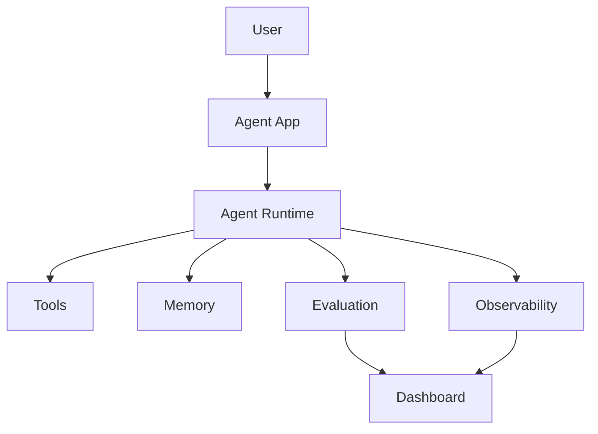

# Module 09 — Production Agent Systems

[English](09-production-agent-systems.md)

## 目標

學習如何讓 Agent 系統具備可觀測、可評估、安全與可部署性。

Production Agent 需要的不只是好 prompt，而是 monitoring、evaluation、permission boundaries 與 recovery paths。

---

## 心智模型

```text
Prototype → Evaluate → Monitor → Secure → Deploy → Improve
```

---

## 核心概念

### Evaluation

衡量 Agent 是否正確且安全地完成任務。

### Observability

追蹤 model calls、tool calls、memory access、errors、latency 與 cost。

### Security

保護 tools、data、memory 與 user actions，避免誤用或濫用。

### Cost Control

限制不必要的 model calls、tool calls 與 context expansion。

### Deployment

將 Agent 包裝成 API、app 或 workflow service。

---

## 架構圖



---

## Hands-on Exercise

設計 production checklist：

```text
Agent task:
Evaluation dataset:
Tool permissions:
Memory policy:
Logging fields:
Cost limits:
Human approval gates:
Rollback plan:
```

---

## Checklist

如果你能做到以下事項，就代表理解本模組：

- 設計 evaluation set
- trace tool and model calls
- 定義 permission boundaries
- 監控 cost and latency
- 規劃 safe deployment

---

## 常見錯誤

- 沒有 evaluation 就上線
- 沒有 logs 可 debug
- tool permission 過大
- 沒有 cost monitoring
- 沒有 rollback plan

---

## Outcome

完成本模組後，你應該能將 prototype agent 轉成 production-ready system。

下一個模組：[Module 10 — Domain Agent: Healthcare](10-domain-agent-healthcare.md)
