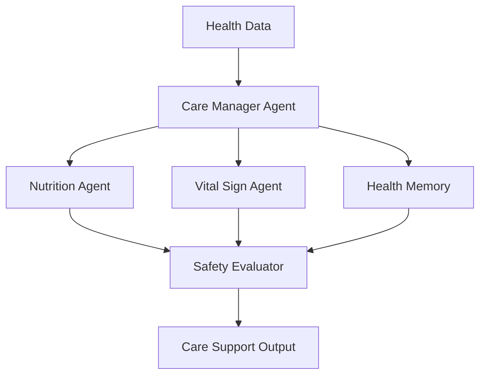

# Module 10 — Domain Agent: Healthcare

[繁體中文](10-domain-agent-healthcare_zh.md)

## Goal

Learn how to design healthcare-oriented agent workflows with safety boundaries.

Healthcare agents should support care workflows, not replace clinicians.

---

## Mental Model

```text
Health Data → Domain Agents → Safety Review → Care Support Output
```

---

## Core Concepts

### Care Context

Healthcare agents need longitudinal context such as notes, nutrition logs, vital signs, and follow-up history.

### Domain Specialists

Different agents can focus on nutrition, vital signs, medication, mental health, or care coordination.

### Safety Boundary

The system should avoid autonomous diagnosis or treatment decisions.

### Human Review

High-risk outputs should be reviewed by qualified professionals.

### Privacy

Health data requires strict access control and audit logs.

---

## Architecture Diagram



---

## Hands-on Exercise

Design a healthcare agent workflow:

```text
Use case:
Input data:
Agent roles:
Allowed outputs:
Forbidden outputs:
Safety review:
Human approval:
Privacy controls:
```

---

## Checklist

You understand this module if you can:

- define safe healthcare agent boundaries
- separate support from diagnosis
- design privacy-aware memory
- add human review gates
- write safety-aware outputs

---

## Common Mistakes

- Making medical decisions autonomously
- Ignoring privacy and consent
- No clinician review path
- Mixing wellness support with diagnosis
- Overstating agent confidence

---

## Outcome

After this module, you should be able to design safe healthcare agent workflows.

Next module: [Module 11 — Domain Agent: Finance](11-domain-agent-finance.md)
