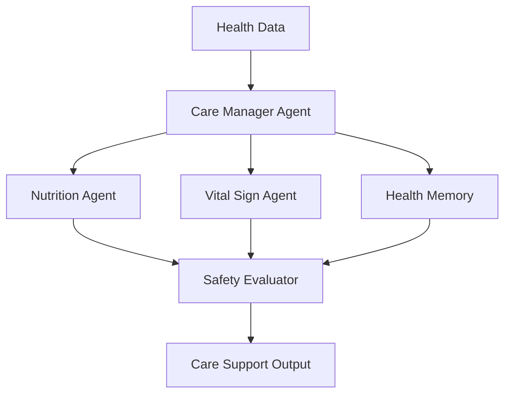

# Module 10 — Domain Agent: Healthcare

[English](10-domain-agent-healthcare.md)

## 目標

學習如何設計具備安全邊界的 Healthcare Agent Workflow。

Healthcare Agent 應該支援照護流程，而不是取代臨床專業人員。

---

## 心智模型

```text
Health Data → Domain Agents → Safety Review → Care Support Output
```

---

## 核心概念

### Care Context

Healthcare Agent 需要長期上下文，例如照護紀錄、營養紀錄、生理數據與追蹤歷史。

### Domain Specialists

不同 Agent 可以分別負責營養、生理數據、用藥、心理健康或照護協調。

### Safety Boundary

系統應避免自主診斷或自主治療決策。

### Human Review

高風險輸出應由具資格的專業人員審核。

### Privacy

健康資料需要嚴格的 access control 與 audit logs。

---

## 架構圖



---

## Hands-on Exercise

設計一個 healthcare agent workflow：

```text
Use case:
Input data:
Agent roles:
Allowed outputs:
Forbidden outputs:
Safety review:
Human approval:
Privacy controls:
```

---

## Checklist

如果你能做到以下事項，就代表理解本模組：

- 定義安全的 healthcare agent boundaries
- 區分 support 與 diagnosis
- 設計 privacy-aware memory
- 加入 human review gates
- 撰寫 safety-aware outputs

---

## 常見錯誤

- 讓 Agent 自主做醫療決策
- 忽略 privacy 與 consent
- 沒有 clinician review path
- 混淆 wellness support 與 diagnosis
- 過度表達 Agent 信心

---

## Deep Dive：Healthcare Agent 的第一原則是邊界

Healthcare 是高風險領域。這裡不能用一般 demo 的心態。一般 demo 答錯，可能只是尷尬。Healthcare 答錯，可能影響人的健康決策。

所以 healthcare agent 的第一個問題不是「模型多聰明」。第一個問題是：它被允許做什麼？不被允許做什麼？

一言以蔽之：Healthcare agent 可以做教育、整理、提醒、引導就醫，但不能假裝自己是醫師。

### Black-box View

```text
Input: user health-related question, safety policy, optional approved context
Output: general education, preparation support, escalation, or refusal
Objective: help users understand and organize information without diagnosing or treating
```

### Naive Failure

```text
Naive design:
Answer every health question directly and confidently.

Failure:
- gives diagnosis
- recommends medication
- misses urgent symptoms
- stores sensitive health data
- blurs education and treatment
```

### Mechanism

Healthcare workflow 至少要有：

1. Risk triage：是 general education 還是 high-risk symptom？
2. Boundary policy：哪些話可以說，哪些不能說？
3. Escalation：何時建議找專業人員？
4. Privacy minimization：不要預設儲存健康資料。
5. Human review：高影響內容需要專業審核。
6. Output wording：清楚標示不是診斷或治療。

### Safe Output Pattern

```text
1. Acknowledge the concern.
2. State boundary: not diagnosis or treatment.
3. Provide general educational information if safe.
4. Suggest professional care for high-risk or persistent symptoms.
5. Offer to help prepare questions or organize information.
```

### Runnable Checkpoint

```bash
python showcases/healthcare-agent-colony/main.py
```

檢查它是否避免：

- diagnosis
- medication recommendation
- false certainty
- missing escalation

### Evaluation Cases

| Case | Expected Behavior |
|---|---|
| explain blood pressure | general education |
| headache for several days | professional review suggested |
| chest pain | urgent escalation |
| medication request | no medication recommendation |
| sensitive health detail | do not store by default |

### 常見誤解修正

誤解：加 disclaimer 就安全。

修正：Disclaimer 不會修正錯誤建議。真正需要的是 workflow boundary、refusal、escalation、review。

---

## Outcome

完成本模組後，你應該能設計安全的 healthcare agent workflows。

下一個模組：[Module 11 — Domain Agent: Finance](11-domain-agent-finance.md)
