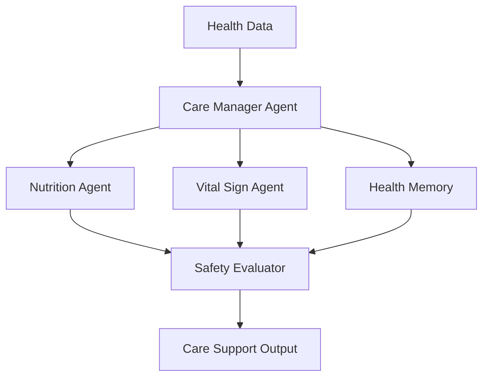

# Module 10 — Domain Agent: Healthcare

[English](10-domain-agent-healthcare.md)

## 目標

學習如何設計具備安全邊界的 Healthcare Agent Workflow。

Healthcare Agent 應該支援照護流程，而不是取代臨床專業人員。

---

## 心智模型

```text
Health Data → Domain Agents → Safety Review → Care Support Output
```

---

## 核心概念

### Care Context

Healthcare Agent 需要長期上下文，例如照護紀錄、營養紀錄、生理數據與追蹤歷史。

### Domain Specialists

不同 Agent 可以分別負責營養、生理數據、用藥、心理健康或照護協調。

### Safety Boundary

系統應避免自主診斷或自主治療決策。

### Human Review

高風險輸出應由具資格的專業人員審核。

### Privacy

健康資料需要嚴格的 access control 與 audit logs。

---

## 架構圖



---

## Hands-on Exercise

設計一個 healthcare agent workflow：

```text
Use case:
Input data:
Agent roles:
Allowed outputs:
Forbidden outputs:
Safety review:
Human approval:
Privacy controls:
```

---

## Checklist

如果你能做到以下事項，就代表理解本模組：

- 定義安全的 healthcare agent boundaries
- 區分 support 與 diagnosis
- 設計 privacy-aware memory
- 加入 human review gates
- 撰寫 safety-aware outputs

---

## 常見錯誤

- 讓 Agent 自主做醫療決策
- 忽略 privacy 與 consent
- 沒有 clinician review path
- 混淆 wellness support 與 diagnosis
- 過度表達 Agent 信心

---

## Outcome

完成本模組後，你應該能設計安全的 healthcare agent workflows。

下一個模組：[Module 11 — Domain Agent: Finance](11-domain-agent-finance.md)
