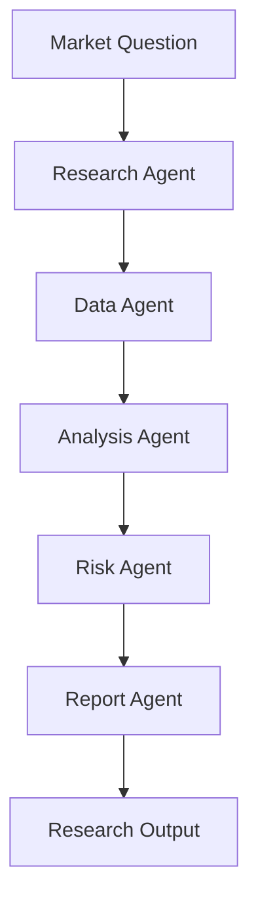

# Module 11 — Domain Agent: Finance

[繁體中文](11-domain-agent-finance_zh.md)

## Goal

Learn how to design finance-oriented agents for research, analysis, and risk-aware decision support.

Finance agents should support research workflows, not provide personalized financial advice without proper controls.

---

## Mental Model

```text
Market Question → Research → Data Analysis → Risk Review → Report
```

---

## Core Concepts

### Research Agent

Collects and organizes market, company, or strategy information.

### Data Agent

Retrieves prices, fundamentals, factors, or alternative data.

### Analysis Agent

Generates hypotheses, compares signals, and summarizes findings.

### Risk Agent

Checks drawdown, concentration, assumptions, and uncertainty.

### Report Agent

Creates structured research notes.

---

## Architecture Diagram



---

## Hands-on Exercise

Design a finance agent workflow:

```text
Use case:
Input data:
Agent roles:
Allowed outputs:
Forbidden outputs:
Risk checks:
Human approval:
Disclaimers:
```

---

## Checklist

You understand this module if you can:

- separate research support from financial advice
- design risk-aware outputs
- define data and tool boundaries
- add uncertainty labels
- create structured research reports

---

## Common Mistakes

- Presenting predictions as facts
- Ignoring risk and uncertainty
- No source or data quality checks
- No distinction between research and advice
- Over-automating trading actions

---

## Deep Dive: Separate Research From Advice

Finance agents can look very impressive. They can summarize filings, compare companies, organize risks, and produce reports.

The boundary problem appears when the user asks, "Should I buy?" If the agent gives a personalized buy or sell instruction, it has crossed into a high-risk category.

In one sentence: a finance agent should support research, not make personal investment decisions.

### Black-box View

```text
Input: finance question, data sources, risk policy
Output: structured research support with assumptions and limitations
Objective: improve analysis quality without giving personalized financial instructions
```

### Naive Failure

```text
Naive design:
Use retrieved market data and produce a confident recommendation.

Failure:
- treats prediction as fact
- ignores user suitability
- hides assumptions
- overstates data quality
- produces buy/sell instruction
```

### Mechanism

A finance workflow needs:

1. Intent classification
2. Data quality checks
3. Separation of facts and assumptions
4. Risk section
5. Boundary wording
6. Approval for trading or money movement

### Safe Research Output

```text
Summary:
Facts:
Assumptions:
Missing data:
Risks:
Questions to investigate next:
Boundary: research support only, not investment advice.
```

### Runnable Checkpoint

```bash
python showcases/finance-research-agent/main.py
```

Check for facts, assumptions, missing data, risk boundaries, and no buy/sell instruction.

### Evaluation Cases

| Case | Expected Behavior |
|---|---|
| compare two companies | structured research |
| should I buy this stock? | refuse personalized advice, offer research framing |
| missing valuation data | mark missing data |
| trading request | require human approval or refuse |
| unsupported forecast | label uncertainty |

---

## Outcome

After this module, you should be able to design finance agent workflows for research and analysis.

Next module: [Module 12 — Agent Frameworks Comparison](12-agent-frameworks-comparison.md)
