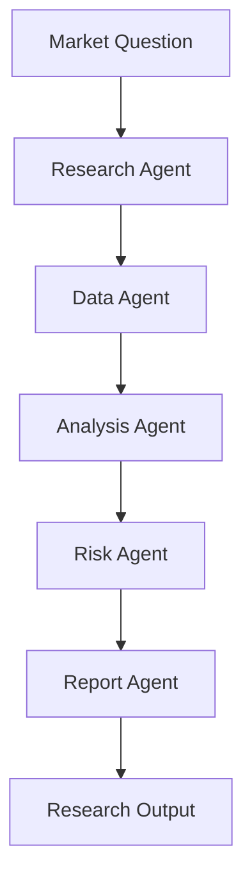

# Module 11 — Domain Agent: Finance

[繁體中文](11-domain-agent-finance_zh.md)

## Goal

Learn how to design finance-oriented agents for research, analysis, and risk-aware decision support.

Finance agents should support research workflows, not provide personalized financial advice without proper controls.

---

## Mental Model

```text
Market Question → Research → Data Analysis → Risk Review → Report
```

---

## Core Concepts

### Research Agent

Collects and organizes market, company, or strategy information.

### Data Agent

Retrieves prices, fundamentals, factors, or alternative data.

### Analysis Agent

Generates hypotheses, compares signals, and summarizes findings.

### Risk Agent

Checks drawdown, concentration, assumptions, and uncertainty.

### Report Agent

Creates structured research notes.

---

## Architecture Diagram



---

## Hands-on Exercise

Design a finance agent workflow:

```text
Use case:
Input data:
Agent roles:
Allowed outputs:
Forbidden outputs:
Risk checks:
Human approval:
Disclaimers:
```

---

## Checklist

You understand this module if you can:

- separate research support from financial advice
- design risk-aware outputs
- define data and tool boundaries
- add uncertainty labels
- create structured research reports

---

## Common Mistakes

- Presenting predictions as facts
- Ignoring risk and uncertainty
- No source or data quality checks
- No distinction between research and advice
- Over-automating trading actions

---

## Outcome

After this module, you should be able to design finance agent workflows for research and analysis.

Next module: [Module 12 — Agent Frameworks Comparison](12-agent-frameworks-comparison.md)
