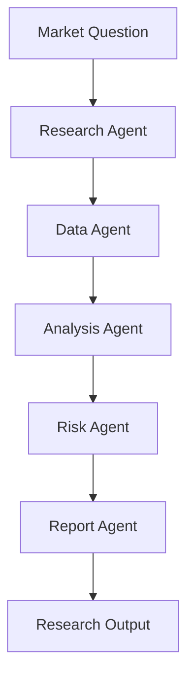

# Module 11 — Domain Agent: Finance

[English](11-domain-agent-finance.md)

## 目標

學習如何設計 Finance Agent，用於研究、分析與風險感知的決策支援。

Finance Agent 應支援研究流程，而不是在缺乏適當控制下提供個人化金融建議。

---

## 心智模型

```text
Market Question → Research → Data Analysis → Risk Review → Report
```

---

## 核心概念

### Research Agent

蒐集並組織市場、公司或策略資訊。

### Data Agent

檢索價格、基本面、因子或替代資料。

### Analysis Agent

產生假設、比較訊號並整理發現。

### Risk Agent

檢查 drawdown、concentration、assumptions 與 uncertainty。

### Report Agent

產生結構化研究筆記。

---

## 架構圖



---

## Hands-on Exercise

設計一個 finance agent workflow：

```text
Use case:
Input data:
Agent roles:
Allowed outputs:
Forbidden outputs:
Risk checks:
Human approval:
Disclaimers:
```

---

## Checklist

如果你能做到以下事項，就代表理解本模組：

- 區分 research support 與 financial advice
- 設計 risk-aware outputs
- 定義 data 與 tool boundaries
- 加入 uncertainty labels
- 建立 structured research reports

---

## 常見錯誤

- 把預測當成事實呈現
- 忽略 risk 與 uncertainty
- 沒有 source 或 data quality checks
- 沒有區分 research 與 advice
- 過度自動化 trading actions

---

## Outcome

完成本模組後，你應該能設計用於研究與分析的 finance agent workflows。

下一個模組：[Module 12 — Agent Frameworks Comparison](12-agent-frameworks-comparison.md)
