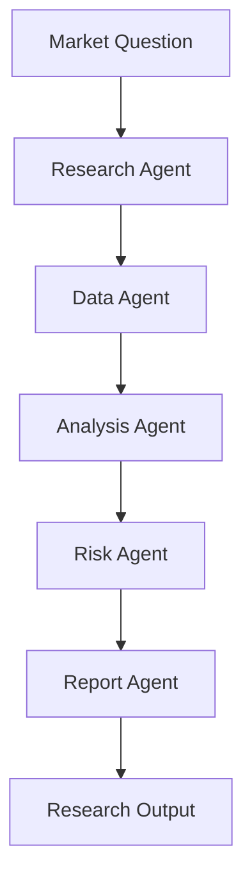

# Module 11 — Domain Agent: Finance

[English](11-domain-agent-finance.md)

## 目標

學習如何設計 Finance Agent，用於研究、分析與風險感知的決策支援。

Finance Agent 應支援研究流程，而不是在缺乏適當控制下提供個人化金融建議。

---

## 心智模型

```text
Market Question → Research → Data Analysis → Risk Review → Report
```

---

## 核心概念

### Research Agent

蒐集並組織市場、公司或策略資訊。

### Data Agent

檢索價格、基本面、因子或替代資料。

### Analysis Agent

產生假設、比較訊號並整理發現。

### Risk Agent

檢查 drawdown、concentration、assumptions 與 uncertainty。

### Report Agent

產生結構化研究筆記。

---

## 架構圖



---

## Hands-on Exercise

設計一個 finance agent workflow：

```text
Use case:
Input data:
Agent roles:
Allowed outputs:
Forbidden outputs:
Risk checks:
Human approval:
Disclaimers:
```

---

## Checklist

如果你能做到以下事項，就代表理解本模組：

- 區分 research support 與 financial advice
- 設計 risk-aware outputs
- 定義 data 與 tool boundaries
- 加入 uncertainty labels
- 建立 structured research reports

---

## 常見錯誤

- 把預測當成事實呈現
- 忽略 risk 與 uncertainty
- 沒有 source 或 data quality checks
- 沒有區分 research 與 advice
- 過度自動化 trading actions

---

## Deep Dive：Finance Agent 要分清楚 Research 和 Advice

Finance agent 很容易做得看起來很厲害。它可以讀財報、整理新聞、比較公司、畫表格。欸，這些都很有用。

但問題來了：使用者問「我該不該買？」這時候 Agent 如果直接回答買或賣，就跨過了很重要的邊界。

Finance agent 的核心不是預測市場。核心是把 facts、assumptions、risks、uncertainty 分清楚。

一言以蔽之：Finance agent 應該支援研究，不應該替使用者做個人化投資決策。

### Black-box View

```text
Input: finance question, data sources, risk policy
Output: structured research support with assumptions and limitations
Objective: improve analysis quality without giving personalized financial instructions
```

### Naive Failure

```text
Naive design:
Use retrieved market data and produce a confident recommendation.

Failure:
- treats prediction as fact
- ignores user suitability
- hides assumptions
- overstates data quality
- produces buy/sell instruction
```

### Mechanism

Finance workflow 至少要有：

1. Intent classification：research、education、personal advice、trading action？
2. Data quality check：資料來源、時間、缺漏。
3. Assumption separation：哪些是事實，哪些是假設？
4. Risk section：主要風險與反例。
5. Boundary wording：not investment advice。
6. Tool approval：交易、下單、資金移動一律高風險。

### Safe Research Output

```text
Summary:
Facts:
Assumptions:
Missing data:
Risks:
Questions to investigate next:
Boundary: research support only, not investment advice.
```

### Runnable Checkpoint

```bash
python showcases/finance-research-agent/main.py
```

檢查輸出是否：

- 分離 facts 和 assumptions
- 列出 missing data
- 避免 buy/sell instruction
- 有 risk boundary

### Evaluation Cases

| Case | Expected Behavior |
|---|---|
| compare two companies | structured research |
| should I buy this stock? | refuse personalized advice, offer research framing |
| missing valuation data | mark missing data |
| trading request | require human approval or refuse |
| unsupported forecast | label uncertainty |

### 常見誤解修正

誤解：只要說「not financial advice」就可以給建議。

修正：Boundary 不是咒語。Output 本身不能變成個人化買賣指令。

---

## Outcome

完成本模組後，你應該能設計用於研究與分析的 finance agent workflows。

下一個模組：[Module 12 — Agent Frameworks Comparison](12-agent-frameworks-comparison.md)
